# Agresti1-2_Canvas

---

## Slide 1

<!-- Layout: Blank Slide -->

### Johnny van Doorn  <!-- [20pt, #000000] -->

## Research Methods and Statistics  <!-- [36pt, #000000] -->
## Lecture 3: Why are statistics needed? + Exploring data  <!-- [28pt, #000000] -->

- 1

<!-- Group: Group 4 -->
  
  ### Morling  <!-- [bold, italic, 20pt, #000000] -->
  ### Agresti  <!-- [bold, italic, 20pt, #000000] -->

- Pictures source: pixabay.org  <!-- [8pt, #000000] -->

---

## Slide 2

<!-- Layout: Blank Slide -->

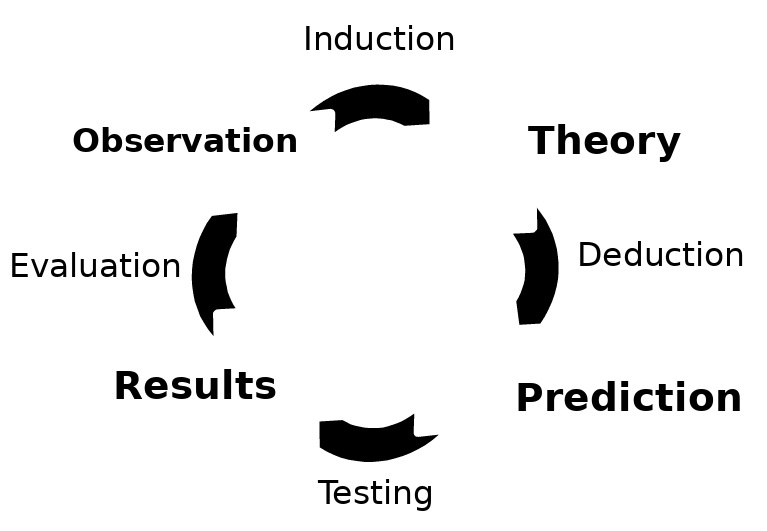

### % correct responses > 50%  <!-- [22pt, #000000] -->

- 42 correct (73.7%)  <!-- [18pt, #000000] -->
- 15 incorrect (26.3%)  <!-- [18pt, #000000] -->

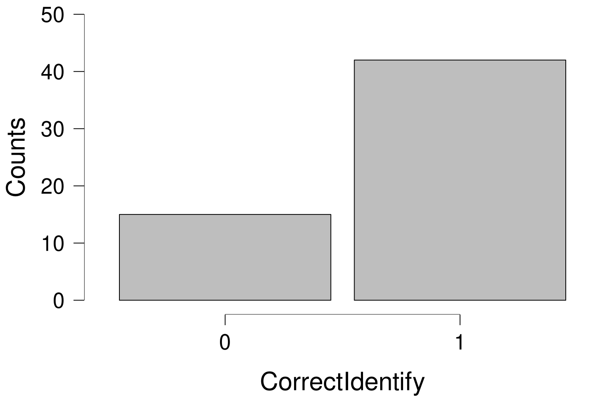

---

## Slide 3

<!-- Layout: Blank Slide -->

## Questions that come up  <!-- [44pt, #000000] -->

## How do we know that this conclusion is correct?  <!-- [28pt, #000000] [28pt, #000000] -->
## How do we know that this study is performed accurately?  <!-- [28pt, #000000] [28pt, #000000] -->
## How do we know that this is not a coincidence?  <!-- [28pt, #000000] -->

- 3

---

## Slide 4

<!-- Layout: Blank Slide -->

## Today  <!-- [44pt, #000000] -->

## Why are statistics needed?  <!-- [bold, 28pt, #ED7D31] -->
## A little bit about the course  <!-- [28pt, #000000] -->
### The book: Agresti  & Franklin  <!-- [24pt, #000000] [24pt, #000000] [24pt, #000000] -->
### Comparison to high school math  <!-- [24pt, #000000] -->
### How to prepare  <!-- [24pt, #000000] -->
## How can you explore data?  <!-- [28pt, #000000] -->
### Types of data  <!-- [24pt, #000000] -->
### Displaying data  <!-- [24pt, #000000] -->
### Characteristics of a distribution  <!-- [24pt, #000000] -->
## Recap  <!-- [28pt, #000000] -->
### Next time  <!-- [24pt, #000000] -->
### Example exam question  <!-- [24pt, #000000] -->

- 4

---

## Slide 5

<!-- Layout: Blank Slide -->

## Why are statistics needed?  <!-- [44pt, #000000] -->

## What is science?  <!-- [italic, 28pt, #ED7D31] -->
## Last week Riet said: “The search for how the world works”  <!-- [28pt, #000000] -->
## Formal vs empirical sciences  <!-- [28pt, #000000] -->
## Empirical sciences are based on experience / observation  <!-- [28pt, #000000] -->
## Inductive reasoning: specific → general  <!-- [28pt, #000000] [28pt, #000000] [28pt, #000000] -->

- 5

---

## Slide 6

<!-- Layout: Blank Slide -->

## Why are statistics needed?  <!-- [44pt, #000000] -->

## What is statistics?  <!-- [italic, 28pt, #ED7D31] -->
## Agresti & Franklin: “Statistics is the art and science of learning from data” (p. 4)  <!-- [28pt, #000000] [28pt, #000000] [italic, 28pt, #000000] [28pt, #000000] -->
## Systematically note experiences/observations → data  <!-- [28pt, #000000] -->
## Data become overwhelming quickly  <!-- [28pt, #000000] -->

- 6

> **Notes:** 4 snakes, but often much more

---

## Slide 7

<!-- Layout: Blank Slide -->

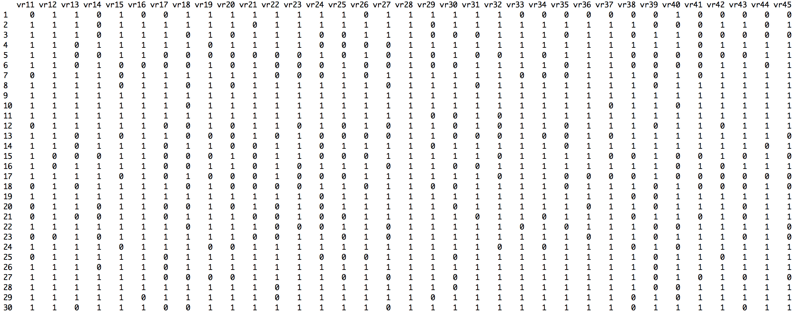

- 7

---

## Slide 8

<!-- Layout: Blank Slide -->

- 104 110 101 88 101 96 105 95 90 98 98 89 95 109 83 97 75 109 108 97 99 100 100 113 98 113 110 111 105 78 105 101 114 89 96 92 107 87 101 82 107 103 103 78 114 91 110 94 101 107 88 109 111 94 100 121 109 106 105 82 98 90 100 83 106 105 94 96 104 101 117 74 95 77 113 108 81 89 94 118 106 100 114 92 93 94 102 117 97 108 99 115 118 106 98 100 84 91 100 87 104 95 104 83 113 120 108 83 98 113 103 103 98 104 114 105 124 105 100 84 98 104 112 109 105 102 106 86 100 94 91 112 117 97 105 93 103 109 103 113 101 88 95 105 96 97 120 103 98 87 102 113 91 123 102 90 103 106 114 88 92 109 93 103 93 91 102 95 104 90 115 105 88 108 99 89 90 102 74 103 105 108 89 108 113 122 103 106 114 111 101 97 92 88 78 113 110 118 115 111 74 91 87 99 103 96 113 93 97 107 102 78 103 105 126 83 92 97 90 89 95 105 94 116 105 92 105 96 91 97 103 113 75 107 86 103 115 94 114 91 103 85 100 110 102 91 126 93 97 101 95 94 102 88 103 90 92 102 104 94 107 94 92 100 103 93 96 104 101 113 111 109 103 99 95 93 95 98 92 106 103 114 106 115 105 98 92 119 85 104 86 104 129 91 105 100 103 105 111 98 104 116 99 98 77 106 96 101 118 103 101 93 101 89 101 105 121 82 84 98 121 98 104 92 106 94 113 110 102 115 87 107 106 103 103 116 85 95 104 116 107 72 113 108 93 104 102 97 71 98 101 87 111 82 88 91 109 96 110 108 90 100 97 101 102 102 109 92 88 98 102 99 93 94 100 74 90 94 89 111 87 110 96 110 89 99 114 87 101 86 113 94 103 93 101 94 90 95 98 93 99 109 115 124 90 101 95 109 98 95 101 100 91 91 115 94 97 100 81 104 99 102 106 100 103 109 100 98 98 123 97 111 103 104 95 97 90 97 110 89 96 112 107 97 104 103 88 88 95 96 99 114 102 93 98 81 93 108 106 101 92 83 80 94 99 117 95 112 99 113 121 94 95 83 88 88 88 120 107 104 102 121 84 96 74 102 111 69 78 114 87 91 89 88 87 91 91 95 99 107 95 108 99 97 94 99 84 95 106 115 86 95 104 86 102 100 94 100 103 116 101 96 100 107 91 117 94 108 104 93 114 103 95 98 95 111 107 97 94 100 94 78 96 95 115 115 106 101 96 102 102 112 93 89 104 89 103 109 87 105 97 102 106 101 106 97 112 103 89 107 100 88 93 99 99 107 105 96 84 102 109 104 86 104 90 103 108 109 115 97 97 114 105 102 108 92 100 90 112 88 105 84 91 92 96 83 107 107 87 115 116 104 111 96 113 107 84 99 120 97 100 89 98 96 93 103 99 103 89 107 92 92 90 104 107 95 106 91 83 106 102 100 91 113 95 97 78 92 87 102 96 99 93 95 100 97 109 94 105 96 100 85 93 115 103 101 92 98 106 95 82 113 113 72 102 90 97 111 99 103 102 114 108 112 111 109 111 107 90 97 94 90 102 98 92 79 108 90 96 77 104 95 95 99 111 100 94 111 107 86 98 95 102 105 87 91 93 117 99 97 125 106 94 101 85 93 133 111 97 109 104 84 103 101 109 96 98 98 96 109 95 106 111 82 114 109 108 85 106 107 103 90 95 112 98 96 88 106 93 107 89 109 95 86 85 94 104 95 88 87 101 118 86 92 84 116 102 104 102 100 106 104 91 88 127 123 93 82 98 105 108 99 98 103 90 95 98 99 107 114 95 107 113 107 104 93 92 113 83 94 105 106 110 91 104 86 98 100 93 84 104 99 95 113 98 96 96 97 100 107 103 99 102 108 118 96 116 90 112 116 115 103 103 108 106 84 86 100 110 101 90 87 113 97 111 106 85 109 110 124 85 102 106 108 106 99 114 93 100 111 122 88 95 93 107 99 111 108 120 98 104 93 105 90 96 101 104 103 95 105 98 99 89 93 105 110 113 102 100 108 96 99 73 96 104 118 97 110 84 97 106 96 109 94 95 90 111 110 88 96 118 90 122 102 110 108 90 91 103 98 95 88 104 94 99 104 85 114 98 90 98 113 89 103 102 103 89 98 99 131 108 88 94 108 108 114 112 106 107 97 97 81 108 98 82 74 105 94 106 104 96 95 105 115 106 99 90 103 123 100 111  <!-- [16pt, #000000] -->

---

## Slide 9

<!-- Layout: Blank Slide -->

## Why are statistics needed?  <!-- [44pt, #000000] -->

## What is statistics?  <!-- [italic, 28pt, #ED7D31] -->
## Agresti & Franklin: “Statistics is the art and science of learning from data” (p. 4)  <!-- [28pt, #000000] [28pt, #000000] -->
## Systematically note experiences/observations → data  <!-- [28pt, #000000] -->
## Data become overwhelming quickly  <!-- [28pt, #000000] -->
### CITO data: 159,994 children, 200 questions (picture displays 30 children x 22 questions)  <!-- [24pt, #000000] -->
### IQ scores: +- 1,000 observations  <!-- [24pt, #000000] -->
## And we want to learn from the data!  <!-- [28pt, #000000] [italic, 28pt, #ED7D31] [28pt, #ED7D31] [28pt, #000000] -->

- 9

---

## Slide 10

<!-- Layout: Blank Slide -->

## Why are statistics needed?  <!-- [44pt, #000000] -->

## What is statistics?  <!-- [italic, 28pt, #ED7D31] -->
## Agresti & Franklin: “Statistics is the art and science of learning from data” (p. 4)  <!-- [28pt, #000000] [28pt, #000000] -->
## Three components:  <!-- [28pt, #000000] -->
## Experimental Design (i.e., Research Methods)  <!-- [italic, 28pt, #ED7D31] [28pt, #ED7D31] [28pt, #000000] -->
## Descriptive statistics (summarize/compress all the data)  <!-- [italic, 28pt, #ED7D31] [28pt, #000000] -->
## Inferential statistics (learn from the data, generalize)  <!-- [italic, 28pt, #ED7D31] [28pt, #000000] -->

- 10

> **Notes:** Mention the octopusses again
Refer back to the validity and reliability  issue

---

## Slide 11

<!-- Layout: Blank Slide -->

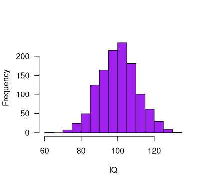

## Why are statistics needed?  <!-- [44pt, #000000] -->

## Descriptive statistics  <!-- [28pt, #000000] -->
### Numerically (ie, average values)  <!-- [24pt, #000000] -->
### → Mean IQ = 101.3  <!-- [24pt, #000000] -->
### Graphically (ie, a histogram)  <!-- [24pt, #000000] -->

### A Statistic: A numerical summary of the data is called a statistic  <!-- [italic, 24pt, #ED7D31] [24pt, #000000] -->

- 11

---

## Slide 12

<!-- Layout: Blank Slide -->

## Why are statistics needed?  <!-- [44pt, #000000] -->

## Inferential statistics  <!-- [28pt, #000000] -->
### Making predictions and decisions about the population  <!-- [24pt, #000000] [bold, 24pt, #000000] -->
### Assessing the uncertainty about statements  <!-- [24pt, #000000] -->

- 12

---

## Slide 13

<!-- Layout: Blank Slide -->

### Sample  <!-- [24pt, #000000] -->

## Population  <!-- [32pt, #000000] -->

---

## Slide 14

<!-- Layout: Blank Slide -->

## Why are statistics needed?  <!-- [44pt, #000000] -->

## Inferential statistics  <!-- [28pt, #000000] -->
### Making predictions and decisions about the population  <!-- [24pt, #000000] -->
### Many things can go wrong when drawing inferences →  Statistics  <!-- [22pt, #000000] [22pt, #000000] [22pt, #000000] -->

### Population: All scores/data we are interested in  <!-- [italic, 24pt, #ED7D31] [24pt, #000000] [bold, 24pt, #000000] [24pt, #000000] -->
### Sample: The part of the population that we have actually observed  <!-- [italic, 24pt, #ED7D31] [24pt, #000000] -->
### Inference: Drawing a conclusion about the population, based on the sample  <!-- [italic, 24pt, #ED7D31] [24pt, #000000] -->

- 14

---

## Slide 15

<!-- Layout: Blank Slide -->

## Why are statistics needed?  <!-- [44pt, #000000] -->

## Reproducibility crisis:  <!-- [32pt, #000000] -->
### Center for Open Science tried to replicate 100 published psychological studies  <!-- [24pt, #000000] -->
### Only 35 studies replicated  <!-- [24pt, #000000] -->
- https://science.sciencemag.org/content/349/6251/aac4716.full?ijkey=1xgFoCnpLswpk&keytype=ref&siteid=sci  <!-- [15pt, #0000FF] [15pt, #2A6099] -->
- https://en.wikipedia.org/wiki/Reproducibility_Project  <!-- [15pt, #0000FF] [15pt, #2A6099] -->

- 15

---

## Slide 16

<!-- Layout: Blank Slide -->

## Overview of Today  <!-- [44pt, #000000] -->

## Why are statistics needed?  <!-- [28pt, #000000] -->
## A little bit about the course  <!-- [bold, 28pt, #ED7D31] -->
### The book: Agresti  & Franklin  <!-- [24pt, #000000] [24pt, #000000] [24pt, #000000] -->
### Comparison to high school math  <!-- [24pt, #000000] -->
### How to prepare  <!-- [24pt, #000000] -->
## How can you explore data?  <!-- [28pt, #000000] -->
### Types of data  <!-- [24pt, #000000] -->
### Displaying data  <!-- [24pt, #000000] -->
### Characteristics of a distribution  <!-- [24pt, #000000] -->
## Recap  <!-- [28pt, #000000] -->
### Next time  <!-- [24pt, #000000] -->
### Example exam question  <!-- [24pt, #000000] -->

- 16

---

## Slide 17

<!-- Layout: Blank Slide -->

## Agresti & Franklin book  <!-- [44pt, #000000] -->

## Do we all have the book?  <!-- [28pt, #000000] -->
## Excellent explanations  <!-- [28pt, #00B050] -->
## Many examples  <!-- [28pt, #00B050] -->
## Many practice questions  <!-- [28pt, #00B050] -->
## Summary of each chapter  <!-- [28pt, #00B050] -->
## Boring at times  <!-- [28pt, #FF0000] -->
## Difficult to find specific topics  <!-- [28pt, #FF0000] -->
## Basis of the course: Read! Read! Read!  <!-- [28pt, #000000] -->

- 17

---

## Slide 18

<!-- Layout: Blank Slide -->

## Lectures vs practice  <!-- [44pt, #000000] -->

## Learning Statistics is mainly doing  <!-- [28pt, #000000] [bold, italic, 28pt, #ED7D31] -->
## “Like riding a bike”  <!-- [28pt, #000000] -->
## Practice, Practice, Practice  <!-- [28pt, #000000] -->
## Lectures:  <!-- [28pt, #000000] -->
### Provide structure  <!-- [24pt, #000000] -->
### Point to important topics  <!-- [24pt, #000000] -->
### Extra explanation of difficult topics  <!-- [24pt, #000000] -->
## Caveat: The lectures are not a complete summary of all topics!  <!-- [italic, 28pt, #ED7D31] -->
### Always check the Canvas modules for the interim exam information  <!-- [italic, 25pt, #ED7D31] -->
###  Formula sheet  <!-- [italic, 25pt, #ED7D31] [italic, 25pt, #ED7D31] -->

- 18

---

## Slide 19

<!-- Layout: Blank Slide -->

## Comparison to high school math  <!-- [44pt, #000000] -->

## Some topics are a repetition of high school math (Dutch system: “Wiskunde A/C”)  <!-- [28pt, #000000] [28pt, #000000] [28pt, #000000] -->
## Examples:  <!-- [28pt, #000000] -->
### Some descriptive statistics (mean, median, quartiles, standard deviation) and graphs  <!-- [24pt, #000000] -->
### Probability, probability distributions etc.  <!-- [24pt, #000000] -->
### Population vs sample  <!-- [24pt, #000000] -->
### Hypothesis testing  <!-- [24pt, #000000] -->
## In our course:  <!-- [28pt, #000000] -->
### Short recap + extension  <!-- [24pt, #000000] -->
### Deeper knowledge + relevant applications  <!-- [24pt, #000000] -->
## More focus on understanding  <!-- [italic, 28pt, #ED7D31] [bold, italic, 28pt, #ED7D31] -->

- 19

---

## Slide 20

<!-- Layout: Blank Slide -->

## How to prepare for the course (stats)?!  <!-- [44pt, #000000] -->

## The different stages of confusion when learning statistics  <!-- [28pt, #000000] -->
## Book: can keep rereading  <!-- [28pt, #000000] -->
## Exercises: can keep (re)doing  <!-- [28pt, #000000] -->
## Lectures: happen once  <!-- [28pt, #000000] -->
## Use the tutorials  <!-- [28pt, #000000] -->
## Use the Canvas discussion board  <!-- [28pt, #000000] -->
## Work together on the exercises  <!-- [28pt, #000000] -->
  - https://edu.nl/t9wbp

- 20

---

## Slide 21

<!-- Layout: Blank Slide -->

## How to prepare for the exam?!  <!-- [44pt, #000000] -->

## Practice the exercises, WA, trial exam, formula sheet (see Canvas)  <!-- [28pt, #000000] -->
## Practice the software (Ans calculator, later Excel)  <!-- [28pt, #000000] -->
##  Speed is important!  <!-- [28pt, #000000] -->
## Read the book while keeping lecture slides in mind  <!-- [28pt, #000000] -->
## On the exam:  <!-- [28pt, #000000] -->
## You don’t have to stick to the question order!  <!-- [28pt, #000000] -->
## Focus on fast questions (e.g., without calculations)  <!-- [28pt, #000000] [bold, 28pt, #000000] [28pt, #000000] [28pt, #000000] -->
## Focus on open question (partial points possible)  <!-- [28pt, #000000] [bold, 28pt, #000000] [28pt, #000000] -->
## Then go back to time intensive questions  <!-- [28pt, #000000] -->

- 21

---

## Slide 22

<!-- Layout: Title Slide -->

## https://www.youtube.com/watch?v=JC82Il2cjqA  <!-- [32pt] [32pt] -->

## You’ll get there!  <!-- [44pt, #000000] -->

<!-- Shape: Online Media 4 (MEDIA (16)) -->

---

## Slide 23

<!-- Layout: Title and body -->

### Office hours in G3.03  <!-- [bold, 27pt] -->
### Shriya: Wednesdays, 10-13  <!-- [bold, 27pt] -->
### Jules: Fridays, 12-14  <!-- [bold, 27pt] -->

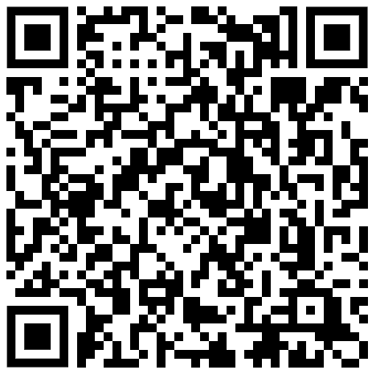

## Contact:  <!-- [bold, 28pt] -->
## spiegeloog-fmg@uva.nl  <!-- [bold, 28pt] -->

---

## Slide 24

<!-- Layout: Blank Slide -->

## Overview of Today  <!-- [44pt, #000000] -->

## Why are statistics needed?  <!-- [28pt, #000000] -->
## A little bit about the course  <!-- [28pt, #000000] -->
### The book: Agresti  & Franklin  <!-- [24pt, #000000] [24pt, #000000] [24pt, #000000] -->
### Comparison to high school math  <!-- [24pt, #000000] -->
### How to prepare  <!-- [24pt, #000000] -->
## How can you explore data?  <!-- [bold, 28pt, #ED7D31] -->
### Types of data  <!-- [24pt, #000000] -->
### Displaying data  <!-- [24pt, #000000] -->
### Characteristics of a distribution  <!-- [24pt, #000000] -->
## Recap  <!-- [28pt, #000000] -->
### Next time  <!-- [24pt, #000000] -->
### Example exam question  <!-- [24pt, #000000] -->

- 24

---

## Slide 25

<!-- Layout: Blank Slide -->

## Types of data  <!-- [44pt, #000000] -->

## “Length”: I am 184 cm, you are (most likely) something else  <!-- [28pt, #000000] -->
## “Eye Color”: Some have green eyes, others have brown eyes  <!-- [28pt, #000000] -->

### Variable (general): A thing that can take multiple “values”  <!-- [italic, 24pt, #ED7D31] [24pt, #000000] [bold, 24pt, #000000] [24pt, #000000] -->
### Variable (book): Any characteristic observed in a study (p. 25)  <!-- [italic, 24pt, #ED7D31] [24pt, #000000] [bold, 24pt, #000000] [24pt, #000000] -->

### Categorical: Each observation belongs to one category  <!-- [italic, 24pt, #ED7D31] [24pt, #000000] [bold, 24pt, #000000] [24pt, #000000] -->
### Quantitative: Each observation has a numerical value representing a magnitude  <!-- [italic, 24pt, #ED7D31] [24pt, #000000] [bold, 24pt, #000000] [24pt, #000000] -->

- 25

<!-- Group: Group 497 -->
  ### Discrete: Every observation is one of a specific set of values (e.g., 0, 1, 2)  <!-- [italic, 24pt, #ED7D31] [24pt, #000000] -->
  ### Continuous: Every observation comes from a range (e.g., 0-3)  <!-- [italic, 24pt, #ED7D31] [24pt, #000000] [bold, 24pt, #000000] [24pt, #000000] -->
  <!-- Group: Group 499 -->

> **Notes:** ASK about the military rank

---

## Slide 26

<!-- Layout: Blank Slide -->

## Let’s practice this  <!-- [44pt, #000000] -->

## “Race track”  <!-- [28pt, #000000] -->
### → Categorical  <!-- [24pt, #000000] -->
## “Weight”  <!-- [28pt, #000000] -->
### → Quantitative, continuous  <!-- [24pt, #000000] -->
## “Number of students”?  <!-- [28pt, #000000] -->
### → Quantitative, discrete  <!-- [24pt, #000000] -->
## “Percentage of students that will pass this course”?  <!-- [28pt, #000000] -->
### → Quantitative, continuous  <!-- [24pt, #000000] -->
## “Study year”?  <!-- [28pt, #000000] -->
### → Quantitative, Discrete or Continuous?  <!-- [22pt, #000000] [21pt, #000000] [22pt, #000000] -->

- 26

> **Notes:** Note, verschil met Morling (Nominal/ordinal, Interval and ratio scales

---

## Slide 27

<!-- Layout: Blank Slide -->

## Displaying Data  <!-- [44pt, #000000] -->

## Data is often overwhelming  <!-- [28pt, #000000] -->
## Data is often complex  <!-- [28pt, #000000] -->
## Good display methods help you focus on the relevant aspects of the data  <!-- [28pt, #000000] -->

- 27

---

## Slide 28

<!-- Layout: Blank Slide -->

## Example 1: Movie genres of the IMDB Top 250  <!-- [40pt, #000000] -->

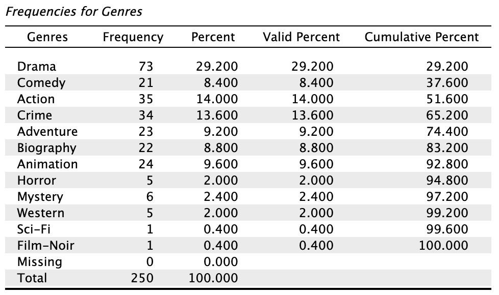

---

## Slide 29

<!-- Layout: Blank Slide -->

## Example 1: Movie genres of the IMDB Top 250  <!-- [40pt, #000000] -->

## e.g., 73 / 250 = 0.292 → 29.2%  <!-- [32pt, #000000] [32pt, #000000] -->

---

## Slide 30

<!-- Layout: Blank Slide -->

### We can also visualize the frequency table using a bar chart:  <!-- [26pt, #000000] -->

- 30

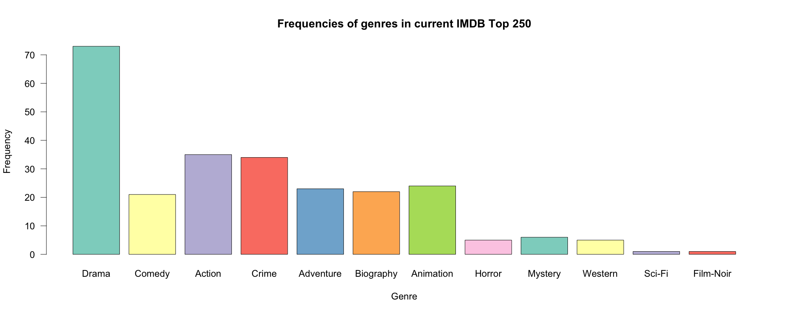

---

## Slide 31

<!-- Layout: Blank Slide -->

### We can also visualize the frequency table using a pie chart:  <!-- [26pt, #000000] -->

- 31

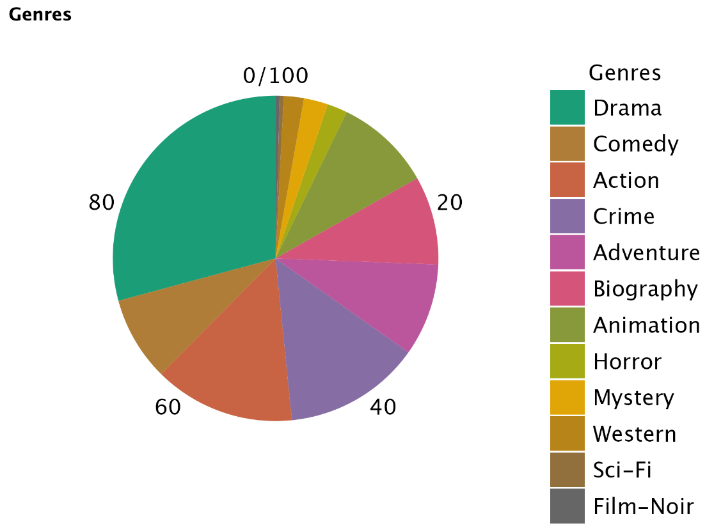

---

## Slide 32

<!-- Layout: Blank Slide -->

## Example 2: IQ  <!-- [44pt, #000000] -->

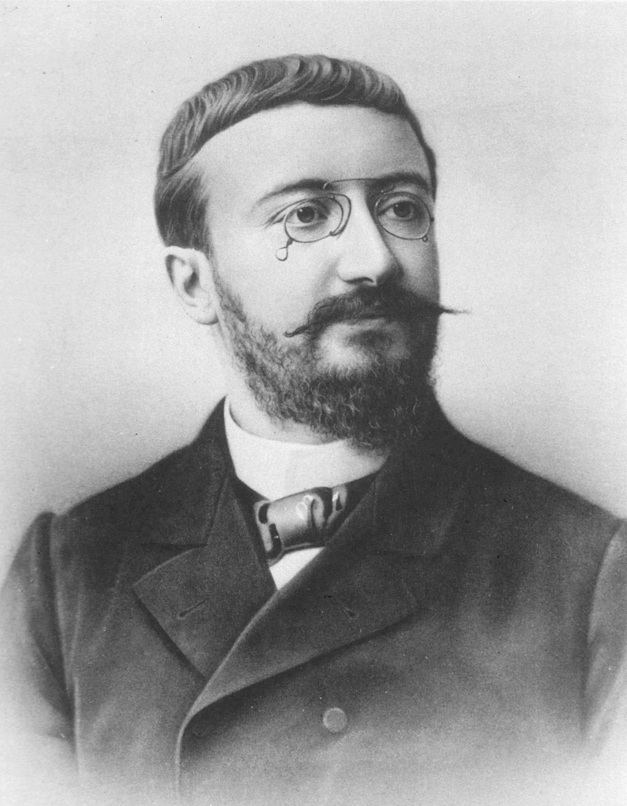

### Standard measure of  intelligence  <!-- [24pt, #000000] -->
### Set of questions/items leads to a score, such that 100 is average  <!-- [24pt, #000000] -->

- 32

- https://en.wikipedia.org/wiki/Alfred_Binet  <!-- [11pt, #000000] -->

---

## Slide 33

<!-- Layout: Blank Slide -->

## Example 2: IQ Frequencies  <!-- [44pt, #000000] -->

| IQ range | Frequency |
| --- | --- |
| 50-60 | 1 |
| 60-70 | 1 |
| 70-80 | 12 |
| 80-90 | 14 |
| 90-100 | 22 |
| 100-110 | 22 |
| 110-120 | 18 |
| 120-130 | 7 |
| 130-140 | 3 |
|  | n = 100 |

- 33

<!-- Group: Group 2 -->
  
  

---

## Slide 34

<!-- Layout: Title Only -->

## Histogram vs Bar chart  <!-- [44pt, #000000] -->

- 34

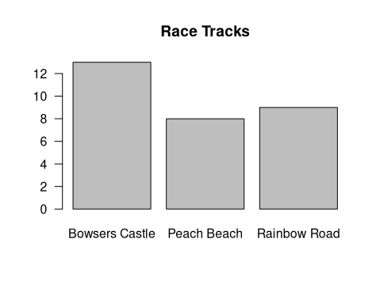

<!-- Group: Group 1 -->
  
  

---

## Slide 35

<!-- Layout: Blank Slide -->

## Example 2: IQ  <!-- [44pt, #000000] -->

## Really a quantitative variable  <!-- [28pt, #000000] -->
## Histogram describes the sample  <!-- [28pt, #000000] [28pt, #000000] -->
## But the population is described by a continuous distribution  <!-- [28pt, #000000] -->

- 35

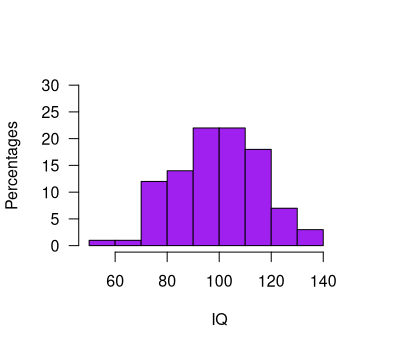

<!-- Group: Group 2 -->
  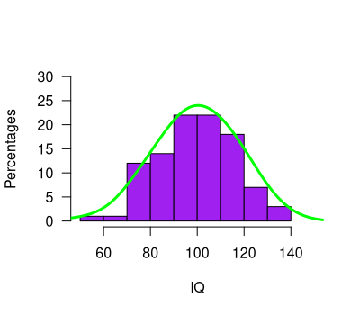
  

---

## Slide 36

<!-- Layout: Blank Slide -->

## From histogram to continuous distribution  <!-- [36pt, #000000] -->

- 36

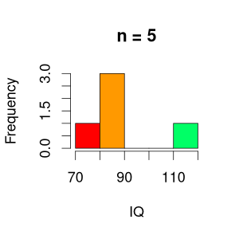

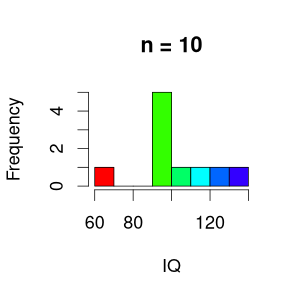

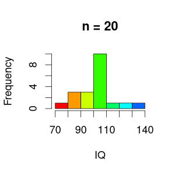

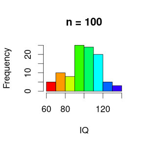

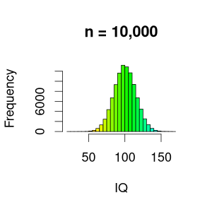

---

## Slide 37

<!-- Layout: Blank Slide -->

## Statistic vs parameter  <!-- [44pt, #000000] -->

## You can compute this! (mean, median, standard deviation, etc)  <!-- [28pt, #000000] -->
## This cannot be computed (usually)  <!-- [28pt, #000000] -->

### A statistic: A numerical summary of the data is called a statistic  <!-- [italic, 24pt, #ED7D31] [24pt, #000000] [bold, 24pt, #000000] [24pt, #000000] -->

### A parameter: A numerical summary of the population is called a parameter  <!-- [24pt, #000000] [italic, 24pt, #ED7D31] [24pt, #000000] [bold, 24pt, #000000] [24pt, #000000] -->

- 37

---

## Slide 38

<!-- Layout: Blank Slide -->

### Sample  <!-- [24pt, #000000] -->

## Population  <!-- [32pt, #000000] -->

- A statistic: A numerical summary of the data is called a statistic  <!-- [italic, 18pt, #ED7D31] [18pt, #000000] [bold, 18pt, #000000] [18pt, #000000] -->

### A parameter: A numerical summary of the population is called a parameter  <!-- [20pt, #000000] [italic, 20pt, #ED7D31] [20pt, #000000] [bold, 20pt, #000000] [20pt, #000000] -->

---

## Slide 39

<!-- Layout: Blank Slide -->

## Statistic vs parameter  <!-- [44pt, #000000] -->

## You can compute this! (mean, median, standard deviation, etc)  <!-- [28pt, #000000] [28pt, #000000] [28pt, #000000] -->
## This cannot be computed (usually)  <!-- [28pt, #000000] -->
## → We use statistics to estimate parameters  <!-- [28pt, #000000] [28pt, #000000] [bold, 28pt, #000000] [28pt, #000000] -->

### A statistic: A numerical summary of the data is called a statistic  <!-- [italic, 24pt, #ED7D31] [24pt, #000000] [bold, 24pt, #000000] [24pt, #000000] -->

### A parameter: A numerical summary of the population is called a parameter  <!-- [24pt, #000000] [italic, 24pt, #ED7D31] [24pt, #000000] [bold, 24pt, #000000] [24pt, #000000] -->

- 39

---

## Slide 40

<!-- Layout: Blank Slide -->

## Example: Mean IQ  <!-- [44pt, #000000] -->

## We want to know the average IQ in particular populations  <!-- [28pt, #000000] -->
### E.g., soccer players  vs chess players  <!-- [24pt, #000000] [24pt, #800080] [24pt, #FF8000] [24pt, #000000] [24pt, #FF8000] -->
## Location of the distribution  <!-- [italic, 28pt, #000000] [28pt, #000000] -->

- 40

- Source: pixabay.com  <!-- [10pt] -->

---

## Slide 41

<!-- Layout: Blank Slide -->

## Location of the distribution: mean  <!-- [44pt, #000000] -->

| # | IQ |
| --- | --- |
| 1 | 86 |
| 2 | 108 |
| 3 | 64 |
| … | … |
| 99 | 91 |
| 100 | 109 |

### Statistic  <!-- [italic, 24pt, #ED7D31] -->

- 41

<!-- Group: Group 2 -->
  
  

---

## Slide 42

<!-- Layout: Blank Slide -->

- 42

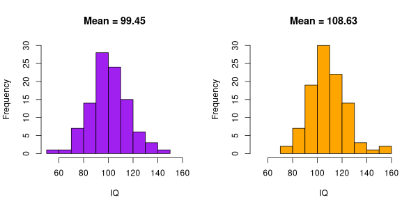

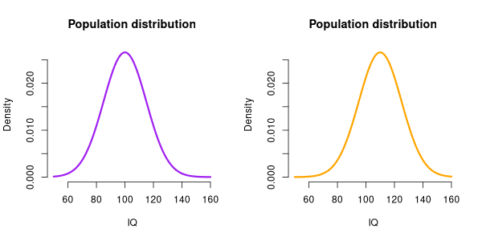

## Statistic vs parameter  <!-- [42pt, #000000] -->

- We use the sample to obtain an  approximation/estimate of population distribution and parameters  <!-- [18pt, #000000] -->

- In this case, our best estimate of the population mean, is the sample mean  <!-- [18pt, #000000] -->

- A difference in means reflects a difference in distributions  <!-- [18pt, #000000] -->

> **Notes:** So, this seems to be a pretty good sample, because the sample mean (99.45) is close to the population mean (100)

---

## Slide 43

<!-- Layout: Blank Slide -->

- 43

## Statistic vs parameter  <!-- [42pt, #000000] -->

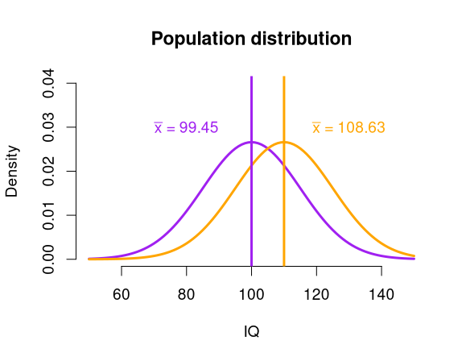

### Estimates of the parameters:  <!-- [italic, 24pt, #ED7D31] -->

- Allows us to conclude that there is a difference between the two populations?  <!-- [18pt, #000000] -->
- → inferential statistics(later in this course)  <!-- [16pt, #000000] [16pt, #000000] -->

- In this case, our best estimate of the population mean, is the sample mean  <!-- [18pt, #000000] -->

- A difference in means reflects a difference in distributions  <!-- [18pt, #000000] -->

> **Notes:** So, this seems to be a pretty good sample, because the sample mean (99.45) is close to the population mean (100)

---

## Slide 44

<!-- Layout: Title Only -->

## Location vs shape of  <!-- [44pt, #000000] -->
## Continuous distributions  <!-- [44pt, #000000] -->

- 44

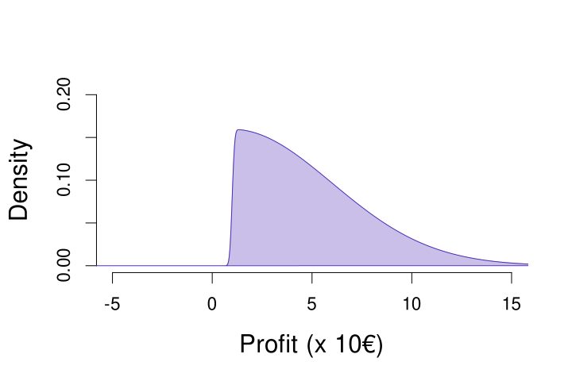

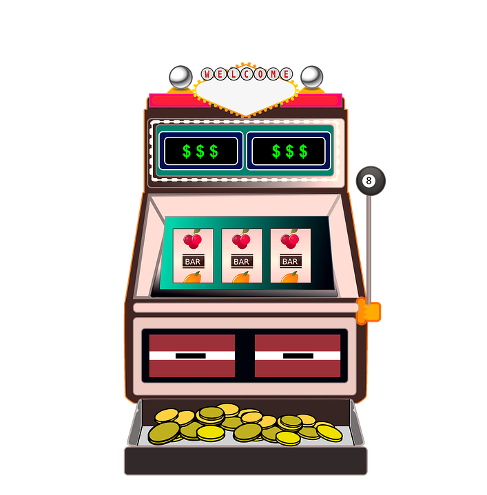

- Always a profit, extreme results in the positive range  <!-- [bold, 18pt, #800080] -->

- Source: pixabay.com  <!-- [11pt, #000000] -->

---

## Slide 45

<!-- Layout: Title Only -->

## Location vs shape of  <!-- [44pt, #000000] -->
## Continuous distributions  <!-- [44pt, #000000] -->

- 45

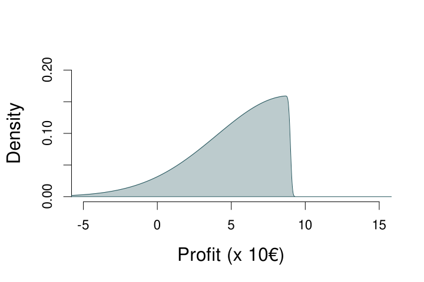

- Can suffer loss, extreme values in negative range  <!-- [bold, 18pt, #2A6099] -->

- Source: pixabay.com  <!-- [11pt, #000000] -->

---

## Slide 46

<!-- Layout: Title Only -->

## Location vs shape of  <!-- [44pt, #000000] -->
## Continuous distributions  <!-- [44pt, #000000] -->

- 46

- Can suffer loss, extreme values in negative range  <!-- [bold, 18pt, #2A6099] -->

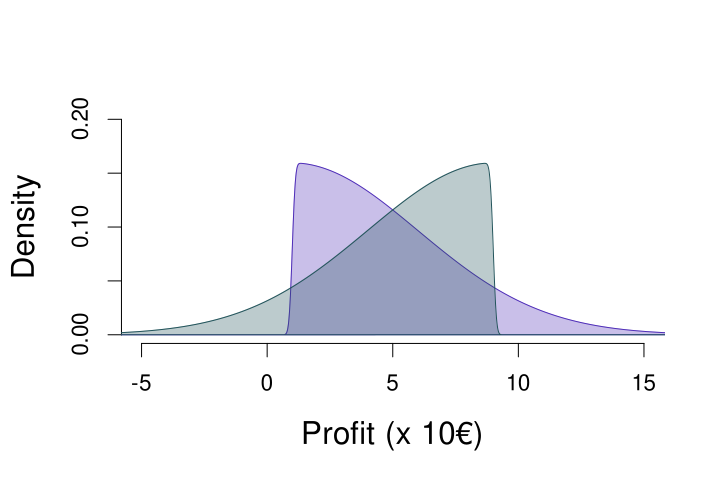

- Always a profit, extreme results in the positive range  <!-- [bold, 18pt, #800080] -->

---

## Slide 47

<!-- Layout: Title Only -->

## Location vs shape of  <!-- [44pt, #000000] -->
## Continuous distributions  <!-- [44pt, #000000] -->

- 47

- Can suffer loss, extreme values in negative range  <!-- [bold, 18pt, #2A6099] -->

- Always a profit, extreme results in the positive range  <!-- [bold, 18pt, #800080] -->

- Mean = 5  <!-- [18pt, #000000] [#000000] [18pt, #000000] -->

---

## Slide 48

<!-- Layout: Blank Slide -->

## Another location measure: median  <!-- [44pt, #000000] -->

## The value that divides the lower 50% of the observations  <!-- [28pt, #000000] -->
## Order all observations  <!-- [28pt, #000000] -->
## If odd n: Middle observation  <!-- [28pt, #000000] [italic, 28pt, #000000] [28pt, #000000] [28pt, #000000] -->
## If even n: Mean of middle two observations  <!-- [28pt, #000000] [italic, 28pt, #000000] [28pt, #000000] -->

### n = 9  <!-- [italic, 24pt, #000000] [24pt, #000000] -->
### x: 1,9,2,4,5,3,3,7,12  <!-- [italic, 24pt, #000000] [24pt, #000000] -->
### x: 1,2,3,3,4,5,7,9,12 	(ordered)  <!-- [italic, 24pt, #000000] [24pt, #000000] [bold, 24pt, #000000] [24pt, #000000] -->

### n = 8  <!-- [italic, 24pt, #000000] [24pt, #000000] -->
### x: 7,9,4,5,-1,8,9,2  <!-- [italic, 24pt, #000000] [24pt, #000000] -->
### x: -1,2,4,5,7,8,9,9 	(ordered)  <!-- [italic, 24pt, #000000] [24pt, #000000] [bold, 24pt, #000000] [24pt, #000000] -->

### Median = 4  <!-- [24pt, #ED7D31] [bold, 24pt, #ED7D31] -->

### Median = (5+7)/2 = 6  <!-- [24pt, #FF8000] [bold, 24pt, #FF8000] -->

- 48

> **Notes:** AGAIN MENTION THAT this can be both statistic as parameter

---

## Slide 49

<!-- Layout: Blank Slide -->

## The Median of a Continuous Distribution  <!-- [40pt, #000000] -->

- 49

- Median ≈ 5.63  <!-- [18pt, #000000] -->

- If you play this game, there is a 50% probability that your profit is 5.63 or lower  <!-- [16pt, #000000] [bold, 16pt, #000000] -->

- If you play this game, there is a 50% probability that your profit is 5.63 or higher  <!-- [16pt, #000000] [bold, 16pt, #000000] -->

> **Notes:** AGAIN MENTION THAT this can be both statistic as parameter

---

## Slide 50

<!-- Layout: Blank Slide -->

## The Median of a Continuous Distribution  <!-- [40pt, #000000] -->

- 50

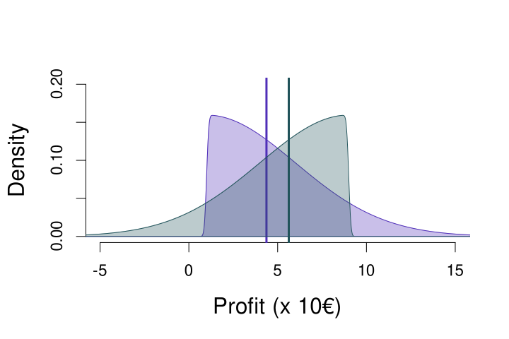

- Median ≈ 5.63  <!-- [18pt, #000000] -->

- Median ≈ 4.37  <!-- [18pt, #000000] -->

> **Notes:** AGAIN MENTION THAT this can be both statistic as parameter

---

## Slide 51

<!-- Layout: Title Only -->

## Mean vs Median tells something about shape of a distribution  <!-- [40pt, #000000] -->

- Symmetric distribution  <!-- [18pt, #000000] -->
- Mean = Median  <!-- [italic, 18pt, #800080] [italic, 18pt, #000000] [italic, 18pt, #FF8000] -->

- Skewed to the right  <!-- [18pt, #000000] -->
- Mean > Median  <!-- [italic, 18pt, #800080] [italic, 18pt, #000000] [italic, 18pt, #FF8000] -->

- Skewed to the left  <!-- [18pt, #000000] -->
- Mean < Median  <!-- [italic, 18pt, #800080] [italic, 18pt, #000000] [italic, 18pt, #FF8000] -->

- 51

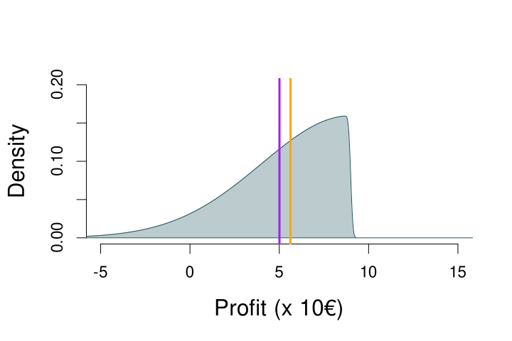

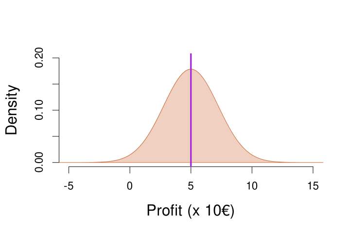

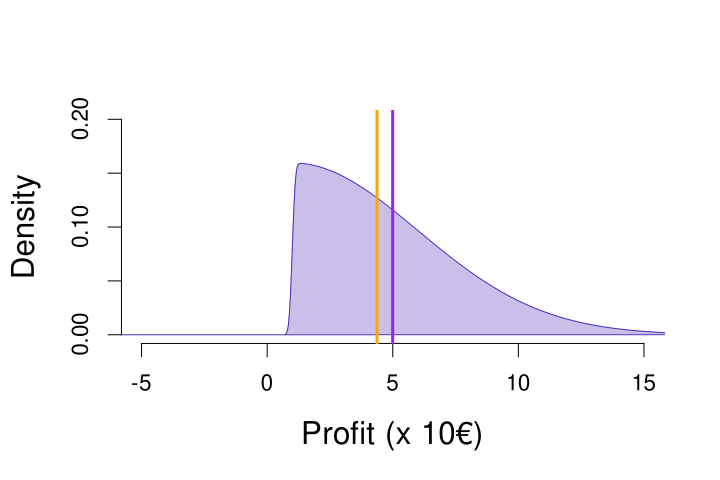

> **Notes:** Mention outliers

---

## Slide 52

<!-- Layout: Blank Slide -->

## Why is that?  <!-- [44pt, #000000] -->

- 52

## x = 3, 5, 4, 8, 10  <!-- [32pt, #000000] -->
## Mean: (3 + 5 + 4 + 8 + 10) / 5 = 6  <!-- [28pt, #000000] -->
## Median: n is odd, so middle number of sorted x → 5  <!-- [28pt, #000000] -->
## x = 3, 5, 4, 8, 9000  <!-- [32pt, #000000] -->
## Mean: (3 + 5 + 4 + 8 + 9000) / 5 = 1804  <!-- [28pt, #000000] -->
## Median: n is odd, so middle number of sorted x → 5  <!-- [28pt, #000000] -->

### The median ignores extreme values, so is less affected by those (compared to the mean)  <!-- [22pt, #000000] -->

> **Notes:** Mention outliers

---

## Slide 53

<!-- Layout: Blank Slide -->

## Overview of Today  <!-- [44pt, #000000] -->

## Why are statistics needed?  <!-- [28pt, #000000] -->
## A little bit about the course  <!-- [28pt, #000000] -->
### The book: Agresti  & Franklin  <!-- [24pt, #000000] [24pt, #000000] [24pt, #000000] -->
### Comparison to high school math  <!-- [24pt, #000000] -->
### How to prepare  <!-- [24pt, #000000] -->
## How can you explore data?  <!-- [28pt, #000000] -->
### Types of data  <!-- [24pt, #000000] -->
### Displaying data  <!-- [24pt, #000000] -->
### Characteristics of a distribution  <!-- [24pt, #000000] -->
## Recap  <!-- [bold, 28pt, #ED7D31] -->
### Next time  <!-- [24pt, #000000] -->
### Example exam question  <!-- [24pt, #000000] -->

- 53

---

## Slide 54

<!-- Layout: Blank Slide -->

## Example question  <!-- [44pt, #000000] -->

## The figure displays a skewed distribution  <!-- [28pt, #000000] -->
## Which statement about the mean and median of this distribution is true?  <!-- [28pt, #000000] -->
## median < mean  <!-- [28pt, #000000] -->
## median = mean  <!-- [28pt, #000000] -->
## median > mean  <!-- [28pt, #000000] -->

- 54

---

## Slide 55

<!-- Layout: Blank Slide -->

## Recap of Today  <!-- [44pt, #000000] -->

### We use statistics to:  <!-- [26pt, #000000] -->
### Get an overview of data, numerically or graphically  <!-- [22pt, #000000] -->
### Make statements about the whole population, based on a sample from the population  <!-- [22pt, #000000] -->
### Different types of variables exist (e.g., discrete vs. continuous)  <!-- [26pt, #000000] -->
### Science quality = methods + statistics  <!-- [26pt, #000000] -->

- 55

### Design experiments & gather data  <!-- [italic, 24pt, #ED7D31] -->

### Analyze the data and draw conclusions  <!-- [italic, 24pt, #ED7D31] -->

---

## Slide 56

<!-- Layout: Blank Slide -->

## Next time  <!-- [44pt, #000000] -->

## Variability in behavior  <!-- [28pt, #000000] -->

- x̄ = 4  <!-- [18pt, #000000] -->

---

## Slide 57

<!-- Layout: Blank Slide -->

## Questions?  <!-- [bold, 60pt, #ED7D31] -->

### Thank you for your attention  <!-- [24pt, #000000] -->

- 57

- Source: https://www.xkcd.com/605/  <!-- [14pt, #000000] -->

---

## Slide 58

<!-- Layout: Blank Slide -->

## Bonus Video  <!-- [bold, 60pt, #0000FF] -->

### Hans Rosling on Data Visualization  <!-- [24pt, #000000] [24pt, #000000] [24pt, #000000] -->
### https://www.youtube.com/watch?v=jbkSRLYSojo  <!-- [24pt, #0000FF] -->
### “Having the data is not enough – I have to show it in ways people enjoy and understand”  <!-- [italic, 20pt] -->

- 58

---

## Slide 59

<!-- Layout: Blank Slide -->

## Highlighted exercises from the book  <!-- [44pt, #000000] -->

## 2.84  <!-- [32pt, #000000] -->
## 2.18  <!-- [32pt, #000000] -->

## → try yourself first, then check next slides for answers  <!-- [32pt, #000000] -->

---

## Slide 60

<!-- Layout: Blank Slide -->

---

## Slide 61

<!-- Layout: Blank Slide -->

## 11.8  <!-- [44pt, #000000] -->

## Df = (#rows) * (#columns-1)  <!-- [32pt, #000000] -->
## Df = 1, X2 = 3.84  <!-- [32pt, #000000] [32pt, #000000] [32pt, #000000] -->
## Df = 2, X2 = 5.99  <!-- [32pt, #000000] [32pt, #000000] [32pt, #000000] -->
## Df = 4, X2 = 9.49  <!-- [32pt, #000000] [32pt, #000000] [32pt, #000000] -->
## Df = 16, X2= 26.3  <!-- [32pt, #000000] [32pt, #000000] [32pt, #000000] -->
## Df = 16, X2 = 26.3  <!-- [32pt, #000000] [32pt, #000000] [32pt, #000000] -->

### So, for instance, a X2 value of 4 would not lead to a significant effect if you have 2 df (e.g., 2 rows and 3 columns), but does lead to a significant effect when you have 4 df (e.g., 3 rows and 3 columns)!  <!-- [24pt, #000000] [24pt, #000000] [24pt, #000000] -->

---

## Slide 62

<!-- Layout: Blank Slide -->

## 11.18  <!-- [44pt, #000000] -->

- Proportion of heart attacks in aspirin condition: 18/676 = 0.0266 = p1  <!-- [18pt, #000000] [18pt, #000000] -->
- Proportion of heart attacks in placebo condition: 28/684 = 0.0409  = p2  <!-- [18pt, #000000] [18pt, #000000] -->
- H0: p1 = p2  <!-- [18pt, #000000] [18pt, #000000] [18pt, #000000] [18pt, #000000] [18pt, #000000] [18pt, #000000] -->
- HA: p1 =/= p2  <!-- [18pt, #000000] [18pt, #000000] [18pt, #000000] [18pt, #000000] [18pt, #000000] [18pt, #000000] -->
- The previous result was a p-value of 0.144 and X2 value of 2.1, In the z-test, we can square the z value to get X2: 1.462 =  2.1 (rounded to 1 decimal). This is because of the connect between the z-test and the X2 test. We can transform one to the other, and they have exactly the same p-value (df = 1 for X2 test)! For the z-test this is the two-sided p-value.  <!-- [18pt, #000000] [18pt, #000000] [18pt, #000000] [18pt, #000000] [18pt, #000000] [18pt, #000000] [18pt, #000000] [18pt, #000000] [18pt, #000000] [18pt, #000000] [18pt, #000000] [18pt, #000000] [italic, 18pt, #000000] [18pt, #000000] -->

---

## Slide 63

<!-- Layout: Blank Slide -->

## 11.28  <!-- [44pt, #000000] -->

- Ratio of the conditional proportions:  <!-- [16pt, #000000] -->
- 0.2965 / 0.2733 = 1.0845  <!-- [16pt, #000000] -->
- This ratio is close to one, which means that the proportions do not differ much (1 indicates that they are exactly the same)  <!-- [16pt, #000000] -->

- Conditional proportion of female victims when the offender is male:  <!-- [18pt, #000000] -->
- 1719 / (1719+4078) = 0.2965  <!-- [18pt, #000000] -->

- Conditional proportion of female victims when the offender is female:  <!-- [18pt, #000000] -->
- 182 / (182+484) = 0.2733  <!-- [18pt, #000000] -->

- Difference of the conditional proportions:  <!-- [16pt, #000000] -->
- 0.2965 - 0.2733 = 0.0232  <!-- [16pt, #000000] -->
- This difference is close to zero, which means that the proportions do not differ much (0 indicates that they are exactly the same)  <!-- [16pt, #000000] -->

- For completeness’ sake, see next slide for the X2 result, if you want to practice it yourself first  <!-- [16pt, #000000] -->

- Conditional proportion of female victims when the offender is male:  <!-- [18pt, #000000] -->
- 1719 / (1719+4078) = 0.2965  <!-- [18pt, #000000] -->

---

## Slide 64

<!-- Layout: Blank Slide -->

## 11.28  <!-- [44pt, #000000] -->

- The p-value is not significant (at any level below 0.2), indicating that the null hypothesis, which states there is no difference, fits the data OK (i.e., not so terribly that we reject it)  <!-- [16pt, #000000] -->
- This corroborates the results of the difference and ratio of the conditional proportions: there is probably no association between the gender of the victim and the gender of the offender  <!-- [16pt, #000000] -->

- X2 = 1.5566  <!-- [18pt, #000000] [18pt, #000000] [18pt, #000000] -->
- Df = 1  <!-- [18pt, #000000] -->
- P-value = 0.2122  <!-- [18pt, #000000] -->
