# Bayes1_Johnny

---

## Slide 1

<!-- Layout: Blank Slide -->

<!-- Group: Group 1 -->
  - Pictures source: pixabay  <!-- [8pt, #000000] -->
  <!-- Group: Group 3 -->
    
    ### Morling  <!-- [bold, italic, 20pt, #000000] -->
    ### Agresti  <!-- [bold, italic, 20pt, #000000] -->

- Johnny van Doorn  <!-- [18pt, #000000] -->

## Research Methods and Statistics  <!-- [36pt, #000000] -->
## Lecture 20: Introduction to Bayesian Statistics  <!-- [28pt, #000000] -->

---

## Slide 2

<!-- Layout: Blank Slide -->

## What Are We Doing?  <!-- [44pt] -->

### We set an alpha (i.e., desired type 1 risk) and determine the hypotheses  <!-- [20pt, #000000] [20pt, #000000] [20pt, #000000] -->

### p < α  <!-- [20pt, #000000] -->

### p > α  <!-- [20pt, #000000] -->

<!-- Group: Group 803 -->
  ### We observe data, compute  test statistic and corresponding p-value  <!-- [20pt, #000000] -->

### Black/white reasoning is dangerous and arbitrary (see bonus slide of lecture 16)  <!-- [20pt, #000000] -->
### We cannot gain evidence for H0 (i.e., evidence of absence)  <!-- [20pt, #000000] [bold, 20pt, #000000] [20pt, #000000] [20pt, #000000] [20pt, #000000] -->

<!-- Group: Group 807 -->
  ### Fail to reject H0  <!-- [20pt, #000000] [20pt, #000000] -->

<!-- Group: Group 810 -->
  ### = absence of evidence  <!-- [20pt, #000000] -->

<!-- Group: Group 813 -->
  ### Reject H0  <!-- [20pt, #000000] [20pt, #000000] -->

<!-- Group: Group 816 -->
  ### = evidence against H0  <!-- [20pt, #000000] [20pt, #000000] -->

---

## Slide 3

<!-- Layout: Title Slide -->

## “… is associated with a myriad of negative consequences including reduced optimism and task performance (Porath & Erez, 2007), reduced working memory and attention (Erez et al., 2015), and higher levels of stress (Adams & Webster, 2013).”  <!-- [32pt] [32pt] [32pt] [32pt] [32pt] [32pt] -->
- Anna Kaminska & Devin G. Ray (2023) Interpersonal memory failure in the workplace: The effect of memory and hierarchy on employee’s affective commitment, The Journal of Social Psychology  <!-- [16pt] [16pt] [16pt] -->

---

## Slide 4

<!-- Layout: Title Slide -->

---

## Slide 5

<!-- Layout: Blank Slide -->

## The Next 3 Lectures  <!-- [44pt, #000000] -->

## Today (Chapters 1-4)  <!-- [32pt, #000000] -->
### Introduction to Bayesian Estimation of a Proportion  <!-- [22pt, #000000] -->
## Thursday Dec 4 (Chapters 1-4)  <!-- [32pt, #000000] -->
### Bayesian Hypothesis Testing of a Proportion  <!-- [22pt, #000000] -->
## Thursday Dec 11(Chapter 5)  <!-- [32pt, #000000] -->
### Bayesian Inference for Correlation and T-Test  <!-- [22pt, #000000] -->
### Statistics in the Wild  <!-- [22pt, #000000] -->

- van Doorn, J. (2024). A Brief Introduction to Bayesian Inference: From Tea to Beer.

---

## Slide 6

<!-- Layout: Blank Slide -->

## Two important notes  <!-- [44pt, #000000] -->

## Tuesday Dec 9: No lecture due to the demonstration  <!-- [32pt, #000000] -->
### Lecture recording on Canvas, adjusted exam material  <!-- [22pt, #000000] -->
## Thursday Dec 11: Different lecture location  <!-- [32pt, #000000] -->
### Pathe Tuschinschki  <!-- [22pt, #000000] [22pt, #000000] -->

---

## Slide 7

<!-- Layout: Blank Slide -->

## Today  <!-- [44pt, #000000] -->

## Bayesian statistics  <!-- [32pt, #000000] -->
### What are models?  <!-- [22pt, #000000] -->
### How do models learn from data?  <!-- [22pt, #000000] -->
### Live demonstration  <!-- [22pt, #000000] -->
## Recap  <!-- [32pt, #000000] -->
### Practical stuff & next week  <!-- [20pt, #000000] -->
### Example exam question  <!-- [20pt, #000000] -->

---

## Slide 8

<!-- Layout: Blank Slide -->

- Source: https://news.stanford.edu/pr/2004/diaconis-69.html  <!-- [18pt, #000000] [18pt, #0563C1] [18pt, #000000] -->

- Fair Coins Tend To Land On The Same Side They Started: Evidence From 350,757 Flips  <!-- [18pt] -->

---

## Slide 9

<!-- Layout: Blank Slide -->

## What is Bayesian Inference?  <!-- [44pt, #000000] -->
## What are the tools we need?  <!-- [44pt, #000000] -->

---

## Slide 10

<!-- Layout: Title, Content -->

- What is Bayesian Inference?  <!-- [#000000] -->

- An alternative framework to “frequentist statistics”
  - Not based on studying what happens on repeated sampling
- Different way of parameter estimation and hypothesis testing

---

## Slide 11

<!-- Layout: Blank Slide -->

## What are Statistical Models?  <!-- [44pt, #000000] -->

### A statistical model is a combination of a general statistical model (e.g., the binomial model) and a statement about a parameter value that describe a certain phenomenon  <!-- [20pt, #000000] [bold, 20pt, #000000] [20pt, #000000] -->

### For instance, for flipping a coin:  <!-- [22pt, #000000] -->
### A binomial model with θ = 0.5  <!-- [22pt, #000000] -->

### What is the theoretical implication of this model?  <!-- [21pt, #000000] -->

### The general binomial model describes a series of chance-based events with a binary outcome, and is governed by a single parameter θ  <!-- [22pt, #000000] [22pt, #000000] -->

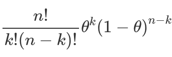

---

## Slide 12

<!-- Layout: Blank Slide -->

## What are Statistical Models?  <!-- [44pt, #000000] -->

### A binomial model with θ = 0.5  <!-- [22pt, #000000] -->

### We can reflect a model’s statement by means of a probability distribution  <!-- [20pt, #000000] -->

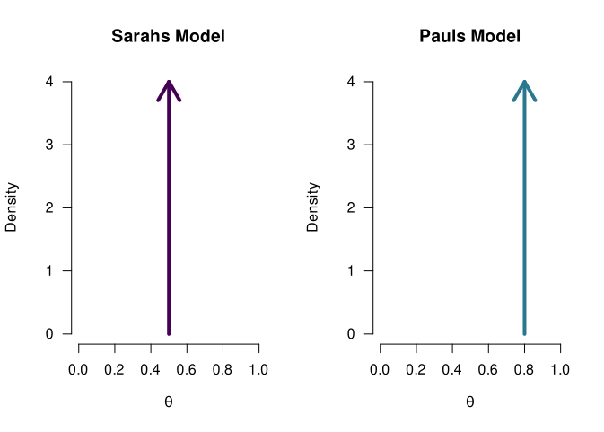

---

## Slide 13

<!-- Layout: Blank Slide -->

## What are Statistical Models?  <!-- [44pt, #000000] -->

### A binomial model with θ = 0.8  <!-- [22pt, #000000] -->

### We can reflect a model’s statement by means of a probability distribution  <!-- [20pt, #000000] -->

---

## Slide 14

<!-- Layout: Blank Slide -->

## Statistical Models Make Predictions  <!-- [44pt, #000000] -->

### Based on what these models claim about θ, certain outcomes are more/less likely  <!-- [20pt, #000000] -->

<!-- Group: Group 479 -->
  
  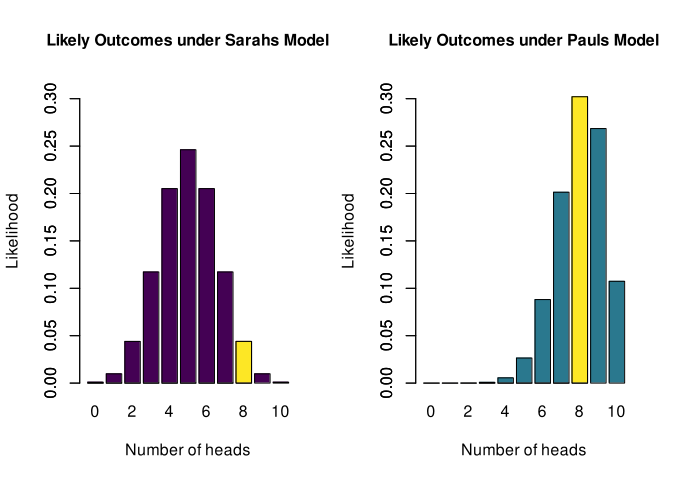

- The yellow bar indicates how likely an outcome of 8/10 heads is, under Sarah’s model  <!-- [#000000] -->

### To create this figure, we take the binomial formula, and fill in θ = 0.5  <!-- [20pt, #000000] -->

### For instance, for an outcome of k=8 heads, the formula gives 0.0439  <!-- [20pt, #000000] -->

---

## Slide 15

<!-- Layout: Blank Slide -->

## Statistical Models Make Predictions  <!-- [44pt, #000000] -->

### Based on what these models claim about θ, certain outcomes are more/less likely  <!-- [20pt, #000000] -->

<!-- Group: Group 490 -->
  
  

- The yellow bar indicates how likely an outcome of 8/10 heads is, under Paul’s model  <!-- [#000000] -->

### To create this figure, we take the binomial formula, and fill in θ = 0.8  <!-- [20pt, #000000] -->

### For instance, for an outcome of k=8 heads, the formula gives 0.302  <!-- [20pt, #000000] -->

---

## Slide 16

<!-- Layout: Blank Slide -->

## Statistical Models Make Predictions  <!-- [44pt, #000000] -->

<!-- Group: Group 500 -->
  
  

<!-- Group: Group 504 -->
  
  

### Based on what these models claim about θ, certain outcomes are more/less likely  <!-- [20pt, #000000] -->

---

## Slide 17

<!-- Layout: Blank Slide -->

## Models Can Also State a Range of Values  <!-- [44pt, #000000] -->

### Introducing the beta distribution:  <!-- [26pt, #000000] -->
### It ranges from 0 to 1  <!-- [20pt, #000000] -->
### Its shape is determined by two values: a and b  <!-- [20pt, #000000] -->
### If a and b equal 1, it is uniform  <!-- [20pt, #000000] -->

### We use the beta distribution here because:  <!-- [26pt, #000000] -->
### A proportion is also between 0 and 1  <!-- [20pt, #000000] -->
### We can create many different shapes, which allows us to reflect many different prior ideas  <!-- [20pt, #000000] [20pt, #000000] -->

### We can reflect a model’s statement by means of a probability distribution  <!-- [20pt, #000000] -->

---

## Slide 18

<!-- Layout: Blank Slide -->

## Models Can Also State a Range of Values  <!-- [44pt, #000000] -->

### Introducing the beta distribution:  <!-- [26pt, #000000] -->
### It ranges from 0 to 1  <!-- [20pt, #000000] -->
### Its shape is determined by two values: a and b  <!-- [20pt, #000000] -->
### If a and b equal 1, it is uniform  <!-- [20pt, #000000] -->

## Some apps that let you shape a beta distribution  <!-- [28pt, #000000] -->
## https://researchmethodsuva.shinyapps.io/test/  <!-- [28pt, #0563C1] [28pt, #000000] -->
## https://maglit.me/antivichmfy  <!-- [28pt, #0563C1] [28pt, #000000] -->

---

## Slide 19

<!-- Layout: Blank Slide -->

## Models Can Also State a Range of Values  <!-- [44pt, #000000] -->

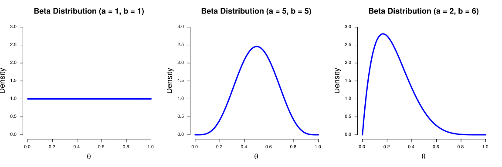

- A model that reflects the idea that all values of the proportion are equally plausible - we call this an uninformative model  <!-- [16pt, #000000] [italic, 16pt, #000000] -->

- A model that reflects the idea that values close to 0.5 are more plausible  <!-- [16pt, #000000] -->

- A prior distribution that reflects the idea that values below 0.5 are more plausible (i.e., the coin is biased towards tails)  <!-- [16pt, #000000] -->

---

## Slide 20

<!-- Layout: Blank Slide -->

## Beta Distribution Interpretation  <!-- [44pt, #000000] -->

- In the context of a prior distribution for a proportion, the a and b can be interpreted as previously observed heads and tails.  <!-- [14pt, #000000] -->

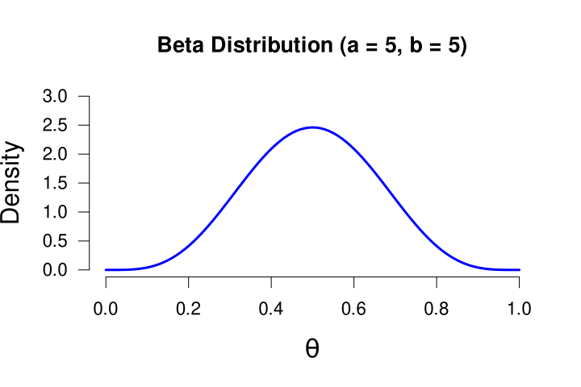

- We cannot start with an empty distribution (a and b cannot be 0), no matter how clueless you are about something, there will always be starting point (e.g., a = b = 1)  <!-- [14pt, #000000] -->

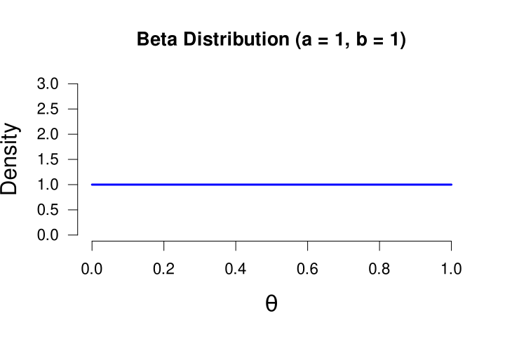

- Models that go all in on a single value have a very strong conviction:Sarah believes as if she has seen infinitely many heads and tails already!  <!-- [16pt, #000000] [16pt, #000000] -->

---

## Slide 21

<!-- Layout: Blank Slide -->

## Models Can Also State a Range of Values  <!-- [44pt, #000000] -->

### We can reflect a model’s statement by means of a probability distribution  <!-- [20pt, #000000] -->

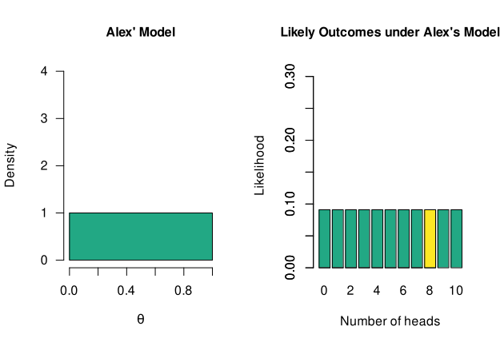

- It is truncated below 0.5, so Davids model only postulates values > 0.5  <!-- [16pt, #000000] -->

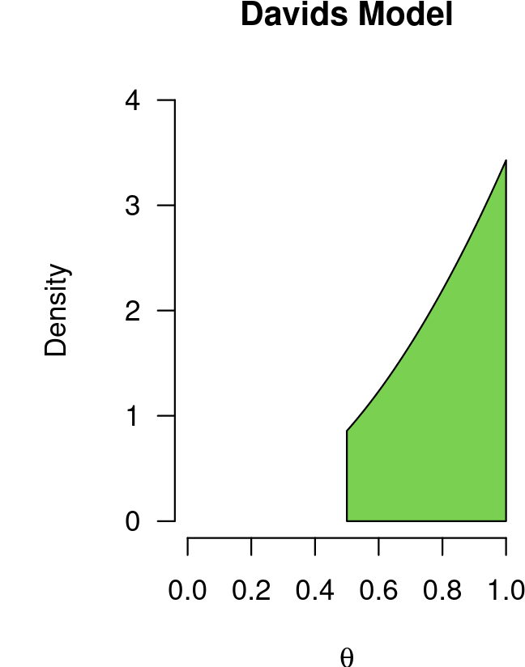

- What are the theoretical implications of these models?  <!-- [18pt, #000000] -->

---

## Slide 22

<!-- Layout: Blank Slide -->

## So, We Have All Sorts of Models...  <!-- [44pt] -->

<!-- Group: Group 544 -->
  
  
  

### On Thursday we discuss comparing these models to each other  <!-- [21pt, #000000] -->

### Now we focus on a single model, and how they learn from data  <!-- [21pt, #000000] -->

---

## Slide 23

<!-- Layout: Blank Slide -->

## So, We Have All Sorts of Models...  <!-- [44pt] -->

### These models reflect prior knowledge/beliefs  <!-- [21pt, #000000] -->

### We will update this prior knowledge with data  <!-- [21pt, #000000] -->

### To end up with posterior knowledge  <!-- [21pt, #000000] -->

---

## Slide 24

<!-- Layout: Blank Slide -->

## Today  <!-- [44pt, #000000] -->

## Bayesian statistics  <!-- [32pt, #000000] -->
### What are models?  <!-- [22pt, #000000] -->
### How do models learn from data?  <!-- [bold, 22pt, #FF8000] -->
### Live demonstration  <!-- [22pt, #000000] -->
## Recap  <!-- [32pt, #000000] -->
### Practical stuff & next week  <!-- [20pt, #000000] -->
### Example exam question  <!-- [20pt, #000000] -->

---

## Slide 25

<!-- Layout: Blank Slide -->

## Bayes’ Theorem  <!-- [44pt, #000000] -->

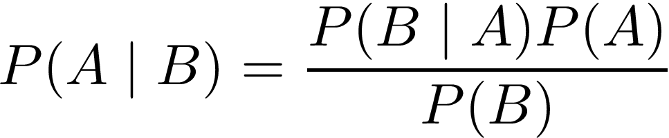

---

## Slide 26

<!-- Layout: Blank Slide -->

## Applying Bayes’ Theorem to Statistical Inference  <!-- [40pt, #000000] -->

## We can replace “A” and “B”, with parameter value “θ” and observed “data”  <!-- [32pt, #000000] [italic, 32pt, #000000] [32pt, #000000] -->

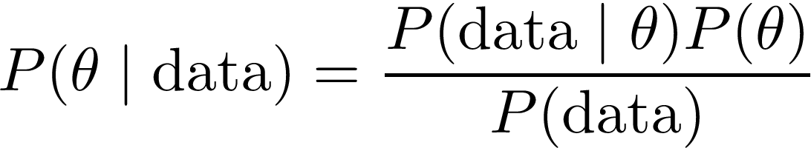

---

## Slide 27

<!-- Layout: Blank Slide -->

## We can rewrite the theorem slightly:  <!-- [32pt, #000000] -->

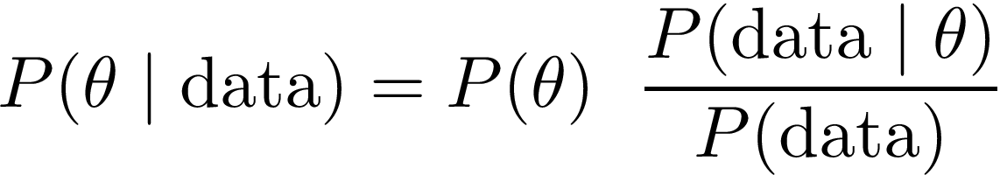

## Applying Bayes’ Theorem to Statistical Inference  <!-- [40pt, #000000] -->

---

## Slide 28

<!-- Layout: Blank Slide -->

### Our knowledge about θ, before seeing the data  <!-- [24pt, #000000] [italic, 24pt, #000000] [bold, 24pt, #000000] [24pt, #000000] -->
### Also known as the “prior beliefs”  <!-- [italic, 24pt, #000000] -->

## Applying Bayes’ Theorem to Statistical Inference  <!-- [40pt, #000000] -->

---

## Slide 29

<!-- Layout: Blank Slide -->

### Our knowledge about θ, after seeing the data  <!-- [24pt, #000000] [italic, 24pt, #000000] [24pt, #000000] [bold, 24pt, #000000] [24pt, #000000] -->
### Also known as the “posterior beliefs”  <!-- [italic, 24pt, #000000] -->

## Applying Bayes’ Theorem to Statistical Inference  <!-- [40pt, #000000] -->

---

## Slide 30

<!-- Layout: Blank Slide -->

### How well did each value of θ predict the data, compared to all other values of theta?  <!-- [20pt, #000000] [20pt, #000000] [20pt, #000000] -->
### Also known as the “predictive updating factor”  <!-- [italic, 20pt, #000000] -->

## Applying Bayes’ Theorem to Statistical Inference  <!-- [40pt, #000000] -->

---

## Slide 31

<!-- Layout: Blank Slide -->

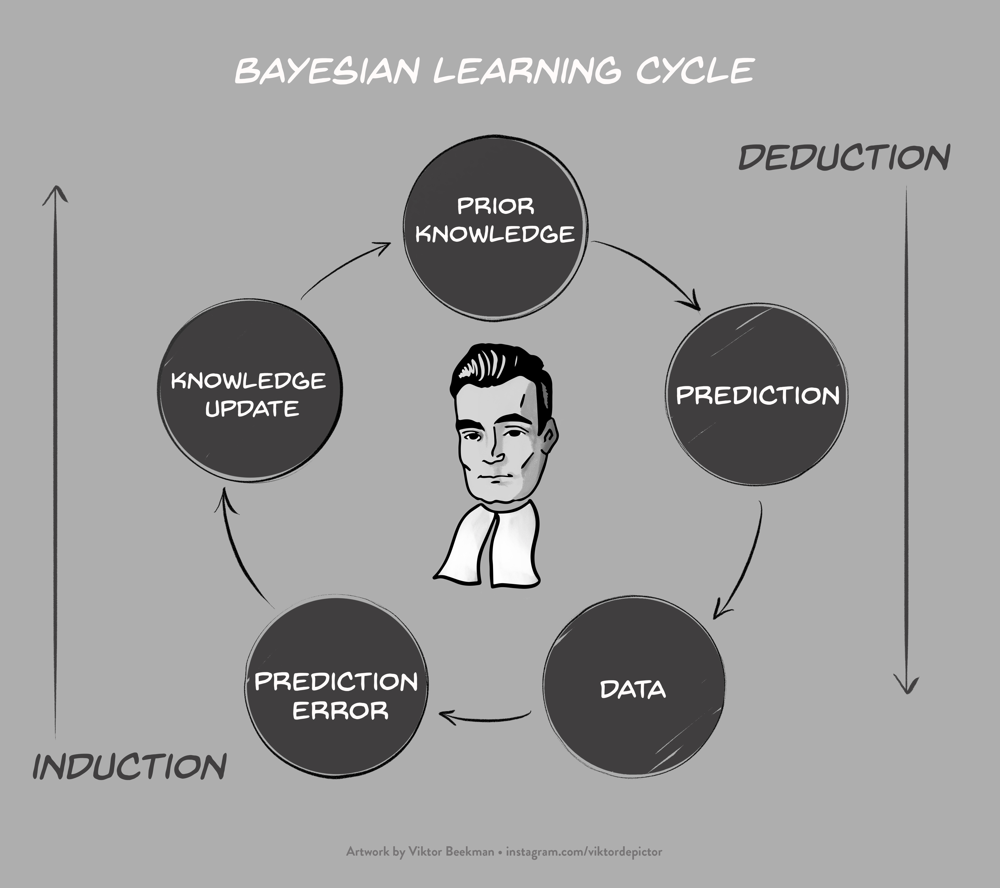

- Source:  <!-- [10pt, #000000] -->
- https://www.bayesianspectacles.org  <!-- [10pt, #000000] -->

---

## Slide 32

<!-- Layout: Blank Slide -->

## Estimating a Proportion: Prior Distribution  <!-- [44pt, #000000] -->

## The prior distribution reflects our beliefs about the parameter, before observing the data  <!-- [32pt, #000000] [bold, 32pt, #000000] [32pt, #000000] [32pt, #000000] -->
## In other words, one of the models we have seen so far!  <!-- [32pt, #000000] -->
## For now, we focus on Alex’ model  <!-- [32pt, #000000] -->

---

## Slide 33

<!-- Layout: Blank Slide -->

## Estimating a Proportion: Data  <!-- [44pt, #000000] -->

## We observe the following data (n = 10):  <!-- [28pt, #000000] -->
## 2 tails  <!-- [28pt, #000000] -->
## 8 heads  <!-- [28pt, #000000] -->
## Our statistic is the observed proportion: 8/10 = 0.8  <!-- [28pt, #000000] [italic, 28pt, #000000] [28pt, #000000] -->

---

## Slide 34

<!-- Layout: Blank Slide -->

## Estimating a Proportion: Predictive Updating Factor  <!-- [36pt, #000000] -->

<!-- Group: Group 3 -->
  - The likelihood of the data, given a certain value of θ  <!-- [16pt, #000000] [bold, 16pt, #000000] [16pt, #000000] -->

<!-- Group: Group 6 -->
  - The marginal likelihood, across all values of θ  <!-- [16pt, #000000] [bold, 16pt, #000000] [16pt, #000000] -->

<!-- Group: Group 9 -->
  - This tells us something about how well a specific value of θ predicted the data (i.e., it is the quality of the prediction for this specific  value)  <!-- [16pt, #000000] -->

<!-- Group: Group 12 -->
  - This tells us something how well θ predicted the data, averaged over all possible values of θ (i.e., it is the average quality of the prediction of the model)  <!-- [14pt, #000000] [14pt, #000000] [14pt, #000000] [bold, 14pt, #000000] [14pt, #000000] [14pt, #000000] [14pt, #000000] -->

- Taken together, this ratio tells us how well each value of θ predicted the data, relative to all other values!  <!-- [18pt, #000000] [bold, 18pt, #000000] [18pt, #000000] -->

---

## Slide 35

<!-- Layout: Blank Slide -->

## Estimating a Proportion: Predictive Updating Factor  <!-- [36pt, #000000] -->

- The likelihood of the data, given a certain value of θ  <!-- [16pt, #000000] [bold, 16pt, #000000] [16pt, #000000] -->

- For instance, how likely is our observed data, if θ equals 0.7?  <!-- [16pt, #000000] [16pt, #000000] [16pt, #000000] -->

- This is again determined by the general binomial model  <!-- [16pt, #000000] -->

---

## Slide 36

<!-- Layout: Blank Slide -->

### We take the binomial formula, and fill in θ = 0.7  <!-- [20pt, #000000] -->

## Estimating a Proportion: Predictive Updating Factor  <!-- [36pt, #000000] -->

- The likelihood of the data, given a certain value of θ  <!-- [16pt, #000000] [bold, 16pt, #000000] [16pt, #000000] -->

<!-- Group: Group 628 -->
  - For instance, how likely is our observed data, if θ equals 0.7?  <!-- [16pt, #000000] [16pt, #000000] [16pt, #000000] -->

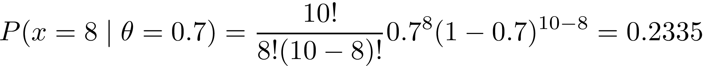

---

## Slide 37

<!-- Layout: Blank Slide -->

## Estimating a Proportion: Predictive Updating Factor  <!-- [36pt, #000000] -->

- The likelihood of the data, given a certain value of θ  <!-- [16pt, #000000] [bold, 16pt, #000000] [16pt, #000000] -->

<!-- Group: Group 638 -->
  - For instance, how likely is our observed data, if θ equals 0.7?  <!-- [16pt, #000000] [16pt, #000000] [16pt, #000000] -->

---

## Slide 38

<!-- Layout: Blank Slide -->

## Estimating a Proportion: Predictive Updating Factor  <!-- [36pt, #000000] -->

- The likelihood of the data, given a certain value of θ  <!-- [16pt, #000000] [bold, 16pt, #000000] [16pt, #000000] -->

<!-- Group: Group 648 -->
  - For instance, how likely is our observed data, if θ equals 0.7?  <!-- [16pt, #000000] [16pt, #000000] [16pt, #000000] -->

---

## Slide 39

<!-- Layout: Blank Slide -->

## Estimating a Proportion: Predictive Updating Factor  <!-- [36pt, #000000] -->

- The likelihood of the data, given a certain value of θ  <!-- [16pt, #000000] [bold, 16pt, #000000] [16pt, #000000] -->

<!-- Group: Group 657 -->
  - For instance, how likely is our observed data, if θ equals 0.7?  <!-- [16pt, #000000] -->

---

## Slide 40

<!-- Layout: Blank Slide -->

## Estimating a Proportion: Predictive Updating Factor  <!-- [36pt, #000000] -->

- The likelihood of the data, given a certain value of θ  <!-- [16pt, #000000] [bold, 16pt, #000000] [16pt, #000000] -->

<!-- Group: Group 666 -->
  - For instance, how likely is our observed data, if θ equals 0.7?  <!-- [16pt, #000000] [16pt, #000000] [16pt, #000000] -->

## We do this for each possible value of θ (i.e., between 0 and 1)  <!-- [40pt, #000000] -->

---

## Slide 41

<!-- Layout: Blank Slide -->

## Estimating a Proportion: Predictive Updating Factor  <!-- [36pt, #000000] -->

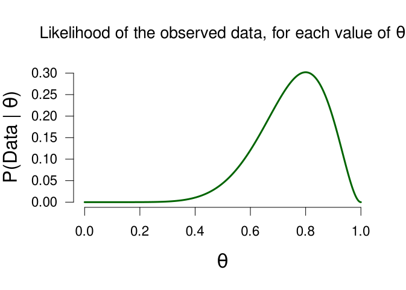

---

## Slide 42

<!-- Layout: Blank Slide -->

## Estimating a Proportion: Predictive Updating Factor  <!-- [36pt, #000000] -->

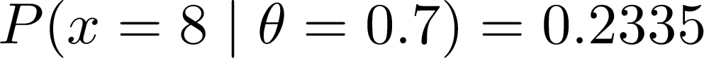

---

## Slide 43

<!-- Layout: Blank Slide -->

## Estimating a Proportion: Predictive Updating Factor  <!-- [36pt, #000000] -->

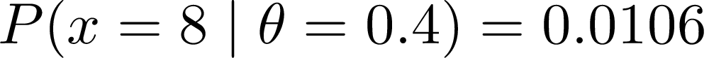

---

## Slide 44

<!-- Layout: Blank Slide -->

## Estimating a Proportion: Predictive Updating Factor  <!-- [36pt, #000000] -->

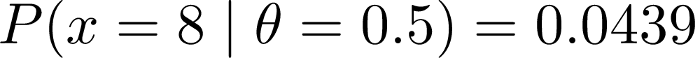

---

## Slide 45

<!-- Layout: Blank Slide -->

## Estimating a Proportion: Predictive Updating Factor  <!-- [36pt, #000000] -->

## The likelihood is not a probability distribution!  <!-- [32pt, #000000] -->
## E.g., its surface area does not sum to 1  <!-- [32pt, #000000] -->

---

## Slide 46

<!-- Layout: Blank Slide -->

## Estimating a Proportion: Predictive Updating Factor  <!-- [36pt, #000000] -->

<!-- Group: Group 704 -->
  

<!-- Group: Group 7 -->
  ### Both figures give the likelihood, but differ in their x-axis  <!-- [20pt, #000000] -->

<!-- Group: Group 8 -->
  - This figure fixes k (heads = 8) and varies θ  <!-- [16pt, #000000] [16pt, #000000] -->

<!-- Group: Group 10 -->
  - This figure fixes θ (θ =0.5) and varies k  <!-- [16pt, #000000] -->

---

## Slide 47

<!-- Layout: Blank Slide -->

## Estimating a Proportion: Predictive Updating Factor  <!-- [36pt, #000000] -->

<!-- Group: Group 3 -->
  - The marginal likelihood, across all values of θ  <!-- [16pt, #000000] [bold, 16pt, #000000] [16pt, #000000] -->

<!-- Group: Group 6 -->
  - This tells us something how well θ predicted the data, averaged over all possible values of θ (i.e., it is the average quality of the prediction of the model)  <!-- [14pt, #000000] [14pt, #000000] [14pt, #000000] [bold, 14pt, #000000] [14pt, #000000] [14pt, #000000] [14pt, #000000] -->

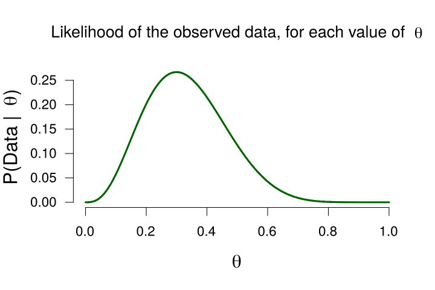

<!-- Group: Group 9 -->
  - Usually this is very difficult and we need computers to compute this. In our case, the marginal likelihood equals 0.091  <!-- [16pt, #000000] -->

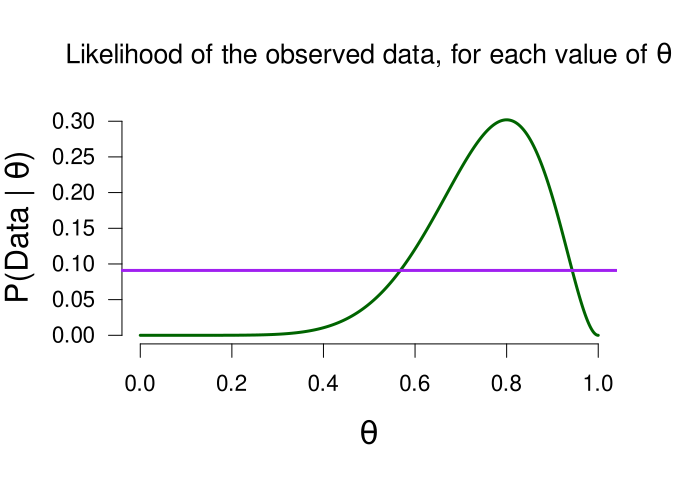

---

## Slide 48

<!-- Layout: Blank Slide -->

## Estimating a Proportion: Predictive Updating Factor  <!-- [36pt, #000000] -->

<!-- Group: Group 3 -->
  - The likelihood of the data, given a certain value of θ  <!-- [16pt, #000000] [bold, 16pt, #000000] [16pt, #000000] -->

<!-- Group: Group 6 -->
  - The marginal likelihood, across all values of θ  <!-- [16pt, #000000] [bold, 16pt, #000000] [16pt, #000000] -->

- Taken together, this ratio tells us how well each value of θ predicted the data, relative to all other values!  <!-- [18pt, #000000] [bold, 18pt, #000000] [18pt, #000000] -->

- Now we know that the marginal (i.e., average) likelihood is 0.091. This means that when the likelihood of the data for a specific value of θ is greater than 0.091, that value of θ has predicted the data above average.  <!-- [18pt, #000000] -->
- If that is the case, the predictive updating factor is > 1. If a specific value of θ predicted the data worse than average, that ratio is < 1.  <!-- [18pt, #000000] -->

---

## Slide 49

<!-- Layout: Blank Slide -->

## Estimating a Proportion: Predictive Updating Factor  <!-- [36pt, #000000] -->

<!-- Group: Group 2 -->
  - The marginal likelihood, across all values of θ (= 0.091)  <!-- [16pt, #000000] [bold, 16pt, #000000] [16pt, #000000] -->

---

## Slide 50

<!-- Layout: Blank Slide -->

## Estimating a Proportion: Predictive Updating Factor  <!-- [36pt, #000000] -->

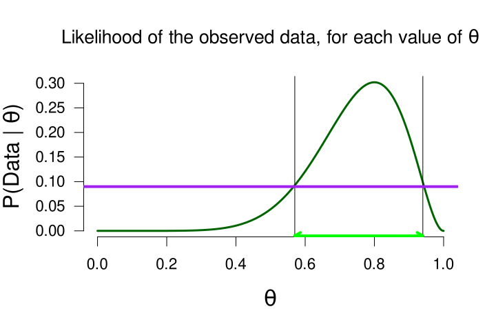

<!-- Group: Group 4 -->
  - The marginal likelihood, across all values of θ (= 0.091)  <!-- [16pt, #000000] [bold, 16pt, #000000] [16pt, #000000] -->

- Values of θ that predicted the data better than average (i.e., their likelihoods are greater than the marginal likelihood)  <!-- [16pt, #000000] [bold, 16pt, #000000] [16pt, #000000] -->

---

## Slide 51

<!-- Layout: Blank Slide -->

## Estimating a Proportion: Predictive Updating Factor  <!-- [36pt, #000000] -->

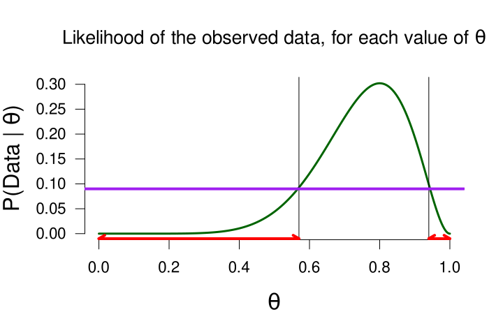

<!-- Group: Group 5 -->
  - The marginal likelihood, across all values of θ (= 0.091)  <!-- [16pt, #000000] [bold, 16pt, #000000] [16pt, #000000] -->

- Values of θ that predicted the data worse than average (i.e., their likelihoods are less than the marginal likelihood)  <!-- [16pt, #000000] [bold, 16pt, #000000] [16pt, #000000] -->

---

## Slide 52

<!-- Layout: Blank Slide -->

## Estimating a Proportion: Posterior Distribution  <!-- [36pt, #000000] -->

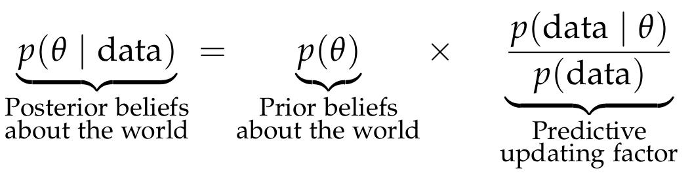

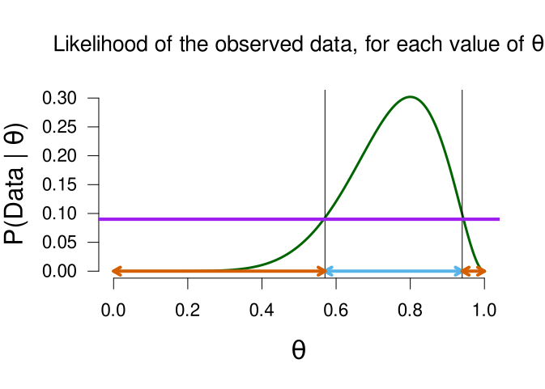

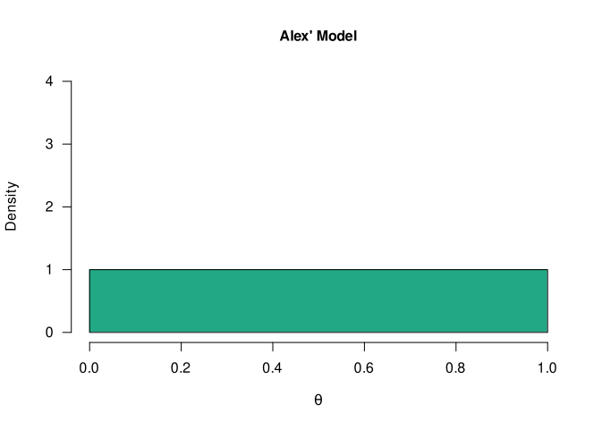

---

## Slide 53

<!-- Layout: Blank Slide -->

- We start with our prior beliefs  <!-- [16pt, #000000] -->

- We update those with data  <!-- [16pt, #000000] -->

- We end with our posterior beliefs  <!-- [16pt, #000000] -->

- Values of θ that predicted the data worse than average receive a penalty in plausibility (i.e., their updating ratio < 1  <!-- [16pt, #000000] -->

- Values of θ that predicted the data better than average receive a boost in plausibility (i.e., their updating ratio >1  <!-- [16pt, #000000] -->

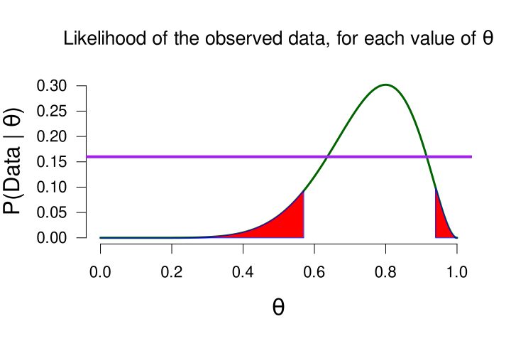

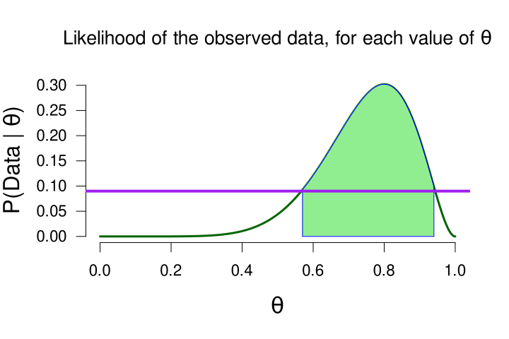

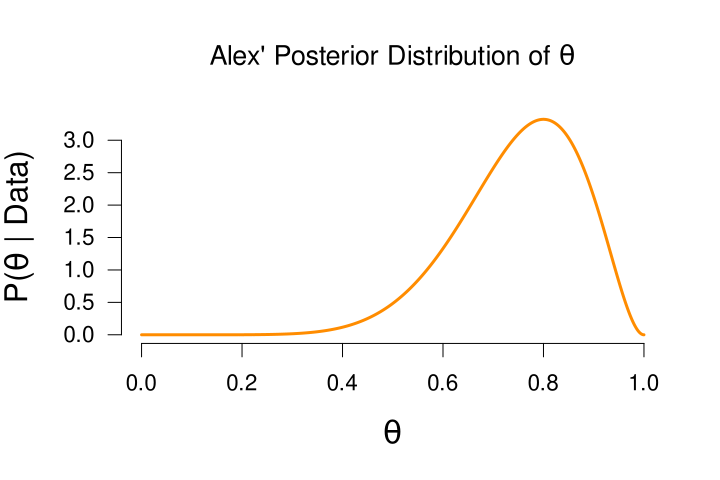

---

## Slide 54

<!-- Layout: Blank Slide -->

## Estimating a Proportion: Posterior Distribution  <!-- [36pt, #000000] -->

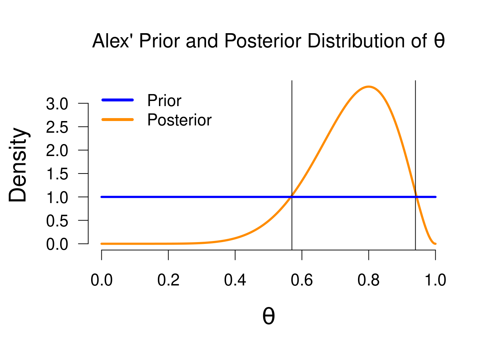

- Same lines as on slide 48/49! It shows which values of theta received a decrease/increase in plausibility, because of the data  <!-- [18pt, #000000] -->

---

## Slide 55

<!-- Layout: Blank Slide -->

## Estimating a Proportion: Posterior Distribution  <!-- [36pt, #000000] -->

- The posterior distribution is a probability distribution!  <!-- [16pt, #000000] -->

---

## Slide 56

<!-- Layout: Blank Slide -->

## Estimating a Proportion: Posterior Distribution  <!-- [36pt, #000000] -->

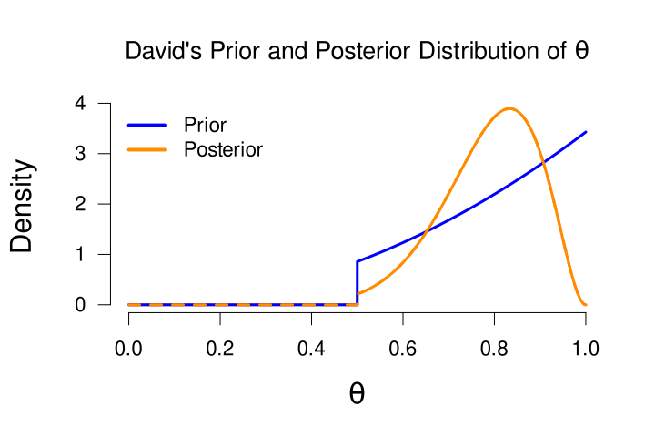

- David’s Model (a = 3, b = 1, truncated)  <!-- [16pt, #000000] -->
- Because all prior mass below 0.5 is set to 0, also all posterior mass below 0.5 will be equal to 0  <!-- [16pt, #000000] -->

- What about other models/prior distributions?  <!-- [18pt, #000000] -->

---

## Slide 57

<!-- Layout: Blank Slide -->

## Estimating a Proportion: Posterior Distribution  <!-- [36pt, #000000] -->

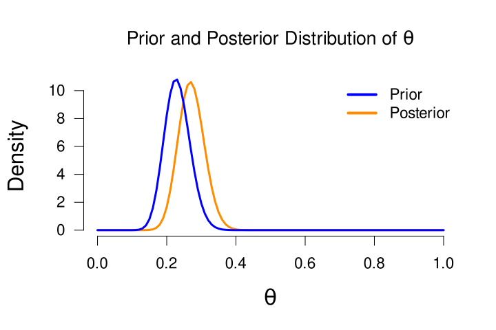

- A = 30, b = 100  <!-- [16pt, #000000] -->
- A very strong prior that assigned more mass to values < 0.5 (coin biased to tails). The prior conviction is so strong that the data cannot overthrow this conviction: the posterior is still situated at values > 0.5  <!-- [16pt, #000000] -->

- What about other models/prior distributions?  <!-- [18pt, #000000] -->

- This highlights an important feature of learning: strong beliefs need a lot of data to be convinced otherwise!  <!-- [15pt, #000000] -->
- This also makes Sarah and Paul very poor learners: they are so convinced of their value that there is no updating  <!-- [15pt, #000000] -->

---

## Slide 58

<!-- Layout: Blank Slide -->

## Estimating a Proportion: Posterior Distribution  <!-- [36pt, #000000] -->

- What about the other models/prior distributions?  <!-- [18pt, #000000] -->

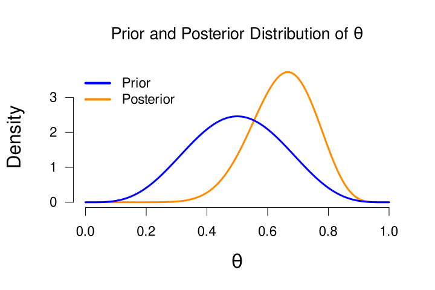

- a = b = 5  <!-- [16pt, #000000] -->
- A model that was more certain that the coin is fair  <!-- [16pt, #000000] -->

---

## Slide 59

<!-- Layout: Blank Slide -->

## Estimating a Proportion: Posterior Distribution  <!-- [36pt, #000000] -->

## If we start with a prior Beta distribution, then the posterior distribution will also be a Beta distribution, with: a = a + #successes (in our case, #heads)b = b + #failures (in our case, #tails)  <!-- [32pt, #000000] [32pt, #000000] [32pt, #000000] -->

- Easy way of computing the posterior, if we are working with proportions and the beta distribution  <!-- [18pt, #000000] -->

---

## Slide 60

<!-- Layout: Blank Slide -->

## Estimating a Proportion: Posterior Distribution  <!-- [36pt, #000000] -->

- This is a beta distribution with a  = 1 + 8  <!-- [18pt, #000000] -->
- b  = 1 + 2  <!-- [18pt, #000000] -->

- Easy way of computing the posterior, if we are working with proportions and the beta distribution  <!-- [18pt, #000000] -->

---

## Slide 61

<!-- Layout: Blank Slide -->

## Estimating a Proportion  <!-- [40pt, #000000] -->

- Now that we have a posterior distribution, we can do estimation!  <!-- [18pt, #000000] [bold, 18pt, #000000] [18pt, #000000] -->

---

## Slide 62

<!-- Layout: Blank Slide -->

## Estimating a Proportion  <!-- [40pt, #000000] -->

- We can make a point estimate, and take the posterior median or mean  <!-- [18pt, #000000] [bold, 18pt, #000000] -->

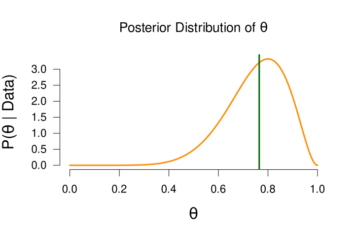

- Median = 0.764  <!-- [18pt, #000000] -->

---

## Slide 63

<!-- Layout: Blank Slide -->

## Estimating a Proportion  <!-- [40pt, #000000] -->

- We can make an interval estimate, and take the central Credible Interval  <!-- [18pt, #000000] [bold, 18pt, #000000] [18pt, #000000] [bold, 18pt, #000000] -->

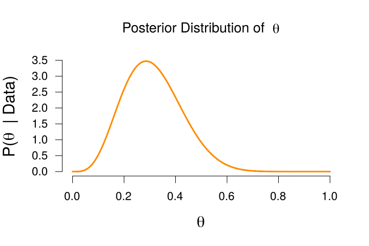

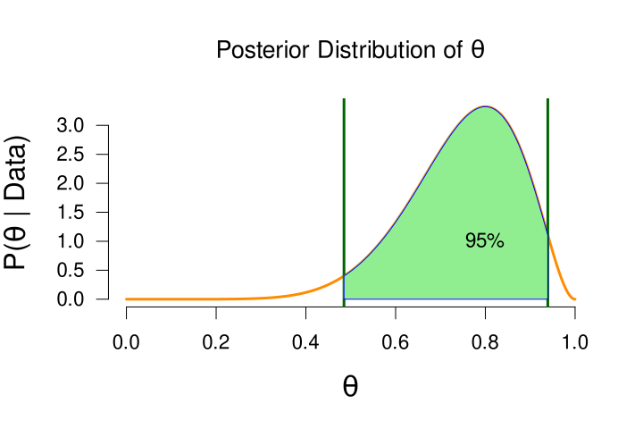

- 95% Credible interval = (0.49, 0.94)  <!-- [18pt, #000000] -->

- To obtain the x% central credible interval, we take x% of the most central posterior mass, and see which 2 points are the thresholds  <!-- [16pt, #000000] -->

---

## Slide 64

<!-- Layout: Blank Slide -->

## Estimating a Proportion  <!-- [40pt, #000000] -->

- We can make an interval estimate, and take the central Credible Interval  <!-- [18pt, #000000] [bold, 18pt, #000000] [18pt, #000000] [bold, 18pt, #000000] -->

- How to interpret a 95% central credible interval?  <!-- [16pt, #000000] -->
- Under Alex’ model, there is a 95% probability that the true proportion is between 0.49 and 0.94  <!-- [italic, 16pt, #000000] -->

- 95% Credible interval = (0.49, 0.94)  <!-- [18pt, #000000] -->

---

## Slide 65

<!-- Layout: Blank Slide -->

## Today  <!-- [44pt, #000000] -->

## Bayesian statistics  <!-- [32pt, #000000] -->
### What are models?  <!-- [22pt, #000000] -->
### How do models learn from data?  <!-- [22pt, #000000] -->
### Live demonstration  <!-- [bold, 22pt, #FF8000] -->
## Recap  <!-- [32pt, #000000] -->
### Practical stuff  <!-- [20pt, #000000] -->
### Example exam question  <!-- [20pt, #000000] -->

---

## Slide 66

<!-- Layout: Blank Slide -->

## Sinterklaastimation!!  <!-- [44pt, #000000] -->

- Source:  <!-- [10pt, #000000] -->
- Pixabay.com  <!-- [10pt, #000000] -->

---

## Slide 67

<!-- Layout: Blank Slide -->

## Binomial Analysis in JASP  <!-- [44pt] -->

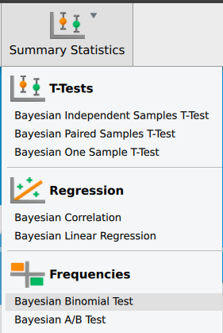

### Enable this extra module first by clicking on the big       in the top right corner  <!-- [20pt, #000000] -->

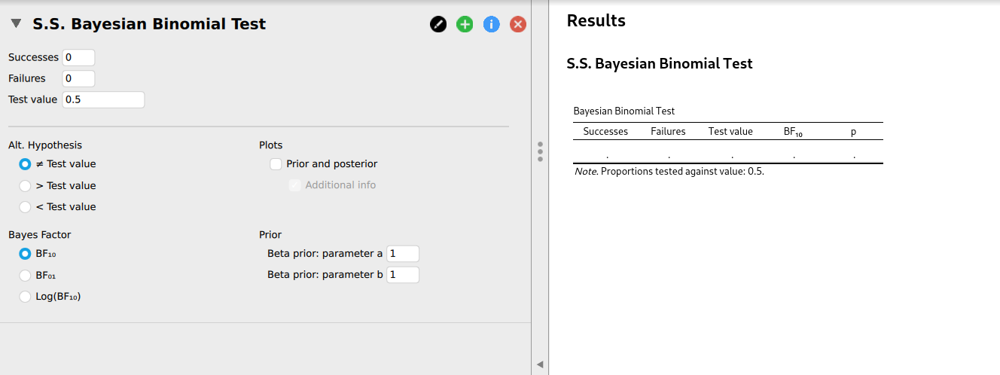

---

## Slide 68

<!-- Layout: Blank Slide -->

## Binomial Analysis in JASP  <!-- [44pt] -->

### Enable these extra modules first by clicking on the big “+” in the top right corner  <!-- [20pt, #000000] -->

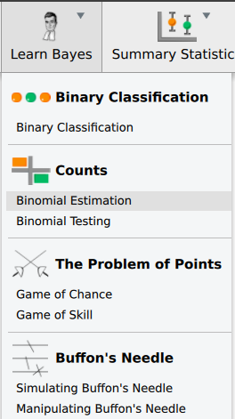

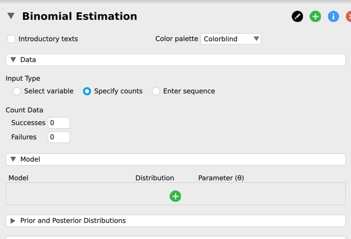

### Click “+” to add models (like Alex’, Sarah’s, Paul’s)  <!-- [20pt, #000000] -->

### “Specify counts” to input the data yourself  <!-- [20pt, #000000] -->

---

## Slide 69

<!-- Layout: Blank Slide -->

## Recap  <!-- [44pt, #000000] -->

## We have some prior knowledge about a phenomenon  <!-- [28pt, #000000] -->
## We formalize this knowledge in the form of a probability distribution  <!-- [28pt, #000000] -->
## Then we update this with the information in the data to form posterior knowledge  <!-- [28pt, #000000] -->
## A central term here is “predictive quality”: how well does each possible value of the parameter predict the observed data, compared to the other values  <!-- [28pt, #000000] [italic, 28pt, #000000] -->

---

## Slide 70

<!-- Layout: Blank Slide -->

- Source:  <!-- [10pt, #000000] -->
- https://www.bayesianspectacles.org  <!-- [10pt, #000000] -->

---

## Slide 71

<!-- Layout: Blank Slide -->

## Practical Stuff  <!-- [44pt, #000000] -->

## Course literature:  <!-- [28pt, #000000] -->
### van Doorn, J. (2024). A Brief Introduction to Bayesian Inference: From Tea to Beer. Free at https://johnnydoorn.github.io/IntroductionBayesianInference/  <!-- [24pt] [24pt] [24pt] [24pt] -->

---

## Slide 72

<!-- Layout: Blank Slide -->

## Practical Stuff  <!-- [44pt, #000000] -->

## New software:  <!-- [28pt] -->
### JASP 0.95.4 – Free at https://jasp-stats.org/download/  <!-- [24pt] [24pt] [24pt] -->
### Also available on library computers and https://apps.uva.nl/  <!-- [20pt] [20pt] [20pt] [24pt] -->
### Instructions included in Exercise chapter and in WA  <!-- [20pt] -->
### Exercises  <!-- [24pt] -->
### The book and WA include practice in JASP (but also include output, if you just want to practice with interpreting output)  <!-- [20pt] -->
### Exam  <!-- [24pt] -->
### On the exam you only need to be able to work with the “Summary Statistics” Module (binomial test, t-test, correlation)  <!-- [20pt] [20pt] [20pt] [20pt] [20pt] [20pt] [20pt] -->
### For example, Question 6 in WA15, Question 6.4 in book  <!-- [20pt] [20pt] -->
### Other questions will provide JASP output and ask you to interpret  <!-- [20pt] -->

---

## Slide 73

<!-- Layout: Blank Slide -->

## Practical Stuff  <!-- [44pt, #000000] -->

## Exam questions Bayes: more conceptual than calculating  <!-- [32pt, #000000] -->
### Interpret Bayesian results/JASP output  <!-- [20pt, #000000] -->
### Obtain prior/posterior/Bayes factor in JASP’s Summary Statistics module  <!-- [20pt, #000000] -->
### Proportional to lectures: about 60% of exam will be Bayes  <!-- [20pt, #000000] [20pt, #000000] -->
## Weekly assignment: next week will include Bayes  <!-- [32pt, #000000] -->
### The literature contains exercises in the back  <!-- [20pt, #000000] -->
### Week 16 (trial exam) will contain old Bayesian exam questions  <!-- [20pt, #000000] -->
## Exam material: Slides + course literature  <!-- [32pt, #000000] -->

---

## Slide 74

<!-- Layout: Blank Slide -->

## Example Exam Question  <!-- [44pt, #000000] -->

## Which of the following is a probability distribution:  <!-- [32pt, #000000] -->
## Posterior distribution  <!-- [32pt, #000000] -->
## Likelihood  <!-- [32pt, #000000] -->
## Both  <!-- [32pt, #000000] -->

---

## Slide 75

<!-- Layout: Blank Slide -->

## Example Exam Question  <!-- [44pt, #000000] -->

## Which of the following is a probability distribution:  <!-- [32pt, #000000] -->
## Posterior distribution  <!-- [32pt, #000000] -->
## Likelihood  <!-- [32pt, #000000] -->
## Both  <!-- [32pt, #000000] -->

---

## Slide 76

<!-- Layout: Title Slide -->

- Bayesian Hypothesis Testing
  - Sneak peek: https://www.youtube.com/watch?v=9TDjifpGj-k

---

## Slide 77

<!-- Layout: Blank Slide -->

## Questions?  <!-- [bold, 60pt, #ED7D31] -->

### Thank you for your attention  <!-- [24pt, #000000] -->

- https://xkcd.com/2059/  <!-- [10pt, #000000] -->

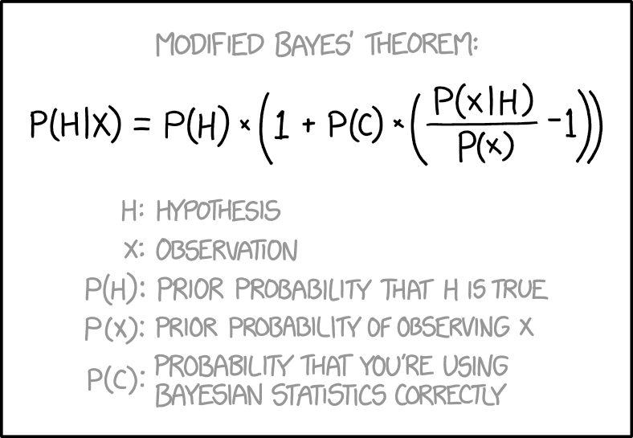

---

## Slide 78

<!-- Layout: Blank Slide -->

## Bonus Book  <!-- [bold, 60pt, #0563C1] -->

### One of my colleagues has written a very introductory text book to introduce some core Bayesian concepts. And it features dinosaurs!  <!-- [24pt, #000000] [bold, 24pt, #000000] [24pt, #000000] -->

