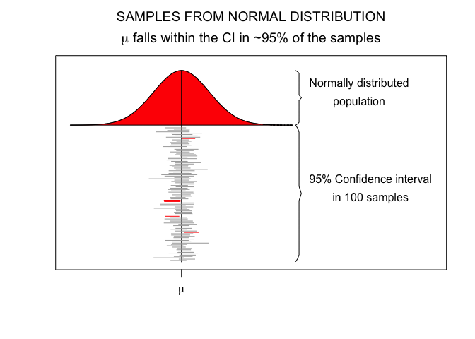
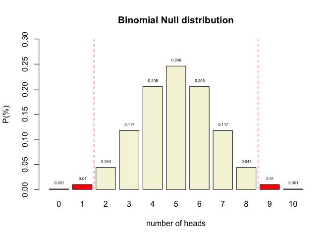
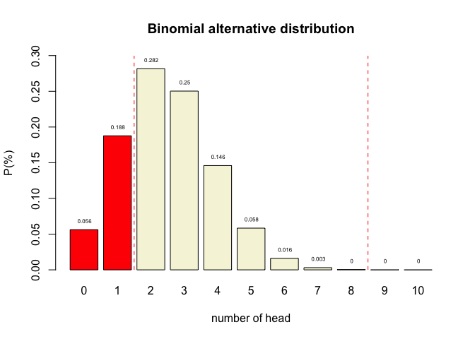
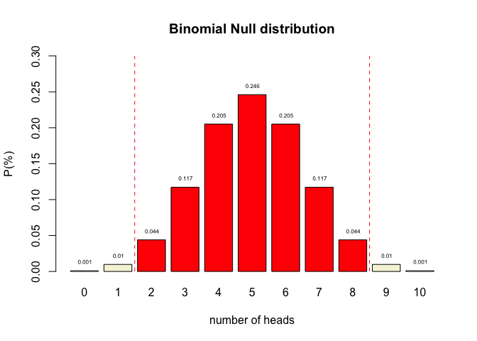
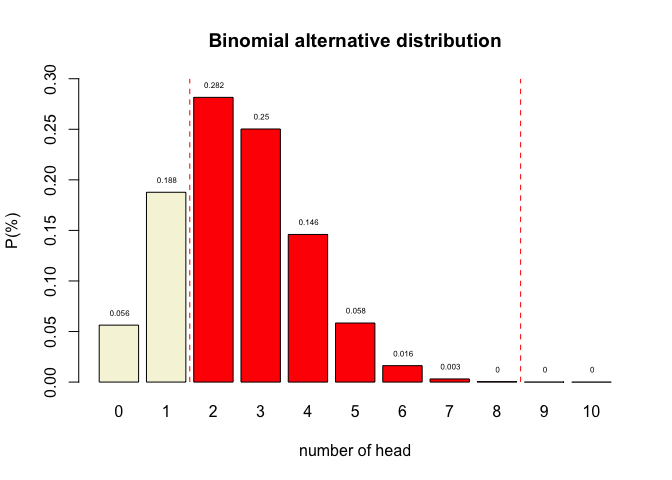
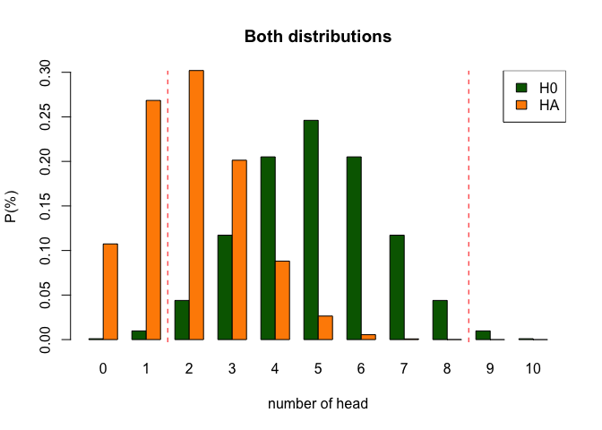
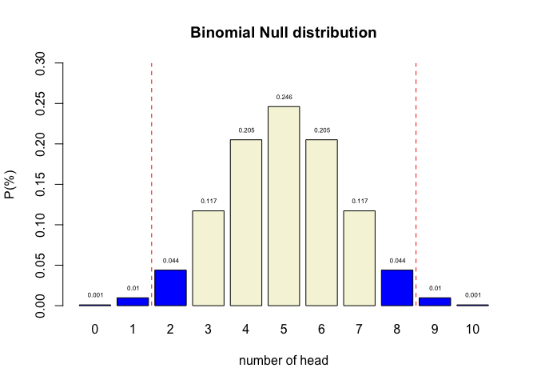

= 4. Statistical Reasoning
Johnny van Doorn
2025-09-09
:stem: latexmath

In this lecture we aim to:

* Introduce the S in SSR
* Repeat some stats concepts from RMS
** "`Logic`" behind common hypothesis testing
** Four scenario’s in statistical decision making

Reading: Chapters 1, 2, 3

== Learning

== About SSR

* Book: Discovering Statistics Using JASP
** Many pages, but light content
** Difficulty indications in each section (A/B/C/D)
** Theory in first half, application in JASP in second half
* https://discoverjasp.com[Companion website of book] - Data sets

== 

* Lectures
** Slightly erratic
** Starts with conceptual understanding
** Ends with JASP demonstration
** Confused?
*** Read the chapter first
*** Rewatch lecture
*** Ask questions (during lecture, on discussion board)

== 

* Practice:
** Tutorials, WA in Ans
** Smart Alex tasks
** Labcoat Leni examples
** Self-test

== Software

* JASP: main tool for analyses, data management
** Freely available at www.jasp-stats.org
* R: very flexible, very optional
** Freely available at https://cran.r-project.org/
** Want a nicer environment for coding? Try https://posit.co/download/rstudio-desktop/[Rstudio]
** Will be available during exam, but not required to use (can also use Ans calculator)

== The Research Process

image:../../images/research_process.png[../../images/research_process]

== Sampling Variability

image:../../images/sampling_variability.png[../../images/sampling_variability]

== Null HypothesisSignificance Testing

=== Neyman-Pearson Paradigm

image:https://upload.wikimedia.org/wikipedia/commons/8/8e/Jerzy_Neyman2.jpg[https://upload.wikimedia.org/wikipedia/commons/8/8e/Jerzy_Neyman2,height=300]

image:https://upload.wikimedia.org/wikipedia/en/a/a2/Egon_Pearson.jpg[https://upload.wikimedia.org/wikipedia/en/a/a2/Egon_Pearson,height=300]

https://en.wikipedia.org/wiki/Jerzy_Neyman[Neyman] - https://en.wikipedia.org/wiki/Egon_Pearson[Pearson]

=== Two hypotheses

latexmath:[H_0]

* Skeptical point of view
* No effect
* No preference
* No Correlation
* No difference

latexmath:[H_A]

* Refute Skepticism
* Effect
* Preference
* Correlation
* Difference

=== Frequentist probability

* Objective Probability
* Relative frequency in the long run

=== Standard Error

____
95% confidence interval
____

[latexmath]
++++
SE = \frac{\text{Standard deviation}}{\text{Square root of sample size}} = \frac{s}{\sqrt{n}}
++++

* Lowerbound = latexmath:[\bar{x} - 1.96 \times SE]
* Upperbound = latexmath:[\bar{x} + 1.96 \times SE]

=== Standard Error

n₁ =

n₂ =

Your browser does not support the canvas element.

=== 

=== Binomial latexmath:[H_0] distribution

[source,r,cell-code]
----
n <- 10   # Sample size
k <- 0:n  # Discrete probability space
p <- .5   # Probability of head

coin <- 0:1

permutations <- factorial(n) / ( factorial(k) * factorial(n-k) )
# permutations

p_k  <- p^k * (1-p)^(n-k)  # Probability of single event
p_kp <- p_k * permutations # Probability of event times 
# the occurrence of that event

title <- "Binomial Null distribution"

# col=c(rep("red",2),rep("beige",7),rep("red",2))

barplot( p_kp, 
         main=title, 
         names.arg=0:n, 
         xlab="number of heads", 
         ylab="P(%)", 
         col='beige',
         ylim=c(0,.3) )

# abline(v = c(2.5,10.9), lty=2, col='red')

text(.6:10.6*1.2,p_kp,round(p_kp,3),pos=3,cex=.5)
----

image:2.-intro-statistics_files/figure-asciidoctor/unnamed-chunk-6-1.png[2.-intro-statistics_files/figure-asciidoctor/unnamed-chunk-6-1]

=== Binomial latexmath:[H_A] distributions

image:2.-intro-statistics_files/figure-asciidoctor/unnamed-chunk-7-1.png[2.-intro-statistics_files/figure-asciidoctor/unnamed-chunk-7-1]

=== Decision table

[[dectable]]
H0 = TRUE H0 = FALSE Decide to reject H0 Decide to not reject H0 Alpha α Beta β 1 - α Power 1 - β

=== Alpha latexmath:[\alpha]

* Incorrectly reject latexmath:[H_0]
* Type I error
* False Positive
* Criteria often 5%
* Distribution depends on sample size

[[alpha]]
H0 = TRUE H0 = FALSE Decide to reject H0 Decide to not reject H0 Alpha α Beta β 1 - α Power 1 - β

=== 

=== Power

* Correctly reject latexmath:[H_0]
* True positive
* Power equal to: 1 - Beta
* Beta is Type II error
* Criteria often 80%
* Depends on sample size

[[power]]
H0 = TRUE H0 = FALSE Decide to reject H0 Decide to not reject H0 Alpha α Beta β 1 - α Power 1 - β

=== 

=== One minus alpha

* Correctly accept latexmath:[H_0]
* True negative

[[oneminalpha]]
H0 = TRUE H0 = FALSE Decide to reject H0 Decide to not reject H0 Alpha α Beta β 1 - α Power 1 - β

=== 

=== Beta

* Incorrectly accept latexmath:[H_0]
* Type II error
* False Negative
* Criteria often 20%
* Distribution depends on sample size

[[beta]]
H0 = TRUE H0 = FALSE Decide to reject H0 Decide to not reject H0 Alpha α Beta β 1 - α Power 1 - β

=== 

=== 

=== P-value

____
Conditional probability of the found test statistic or more extreme assuming the null hypothesis is true.
____

Reject latexmath:[H_0] when:

* latexmath:[p]-value latexmath:[\leq] latexmath:[\alpha]

=== P-value in latexmath:[H_{0}] distribution

=== Test statistics

Some common test statistics

* Number of heads
* Sum of dice
* Difference
* latexmath:[t]-statistic
* latexmath:[F]-statistic
* latexmath:[\chi^2]-statistic
* etc…

=== Decision Table

https://statisticalreasoning-uva.shinyapps.io/NHST_Binomial/[Play around with this app to get an idea of the probabilities]

=== Reasoning Scheme

image:../../images/NHST_decision_scheme.png[../../images/NHST_decision_scheme]

=== Next Time

* Visualization in JASP
* Correlation
** Hypothesis testing using p-values
** Estimation using confidence intervals

=== Bored?

* https://discoverjasp.com/pages/smart_alex#task-1.1[Exercise 1.1]
* https://discoverjasp.com/pages/smart_alex#task-2.2[Exercise 2.2], https://discoverjasp.com/pages/smart_alex#task-2.6[Exercise 2.6], https://discoverjasp.com/pages/smart_alex#task-2.7[Exercise 2.7]
* https://discoverjasp.com/pages/smart_alex#task-3.1[Exercise 3.1], https://discoverjasp.com/pages/smart_alex#task-3.4[Exercise 3.4]

== End

=== Contact

ln.AvU@nrooDnav.B.J

JohnnyDoorn

.CC BY-NC-SA 4.0
[#fig-anonymous-1]
http://creativecommons.org/licenses/by-nc-sa/4.0/[image:https://licensebuttons.net/l/by-nc-sa/4.0/88x31.png[https://licensebuttons.net/l/by-nc-sa/4.0/88x31]]
