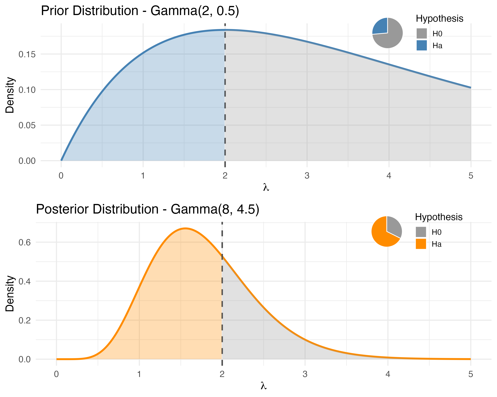
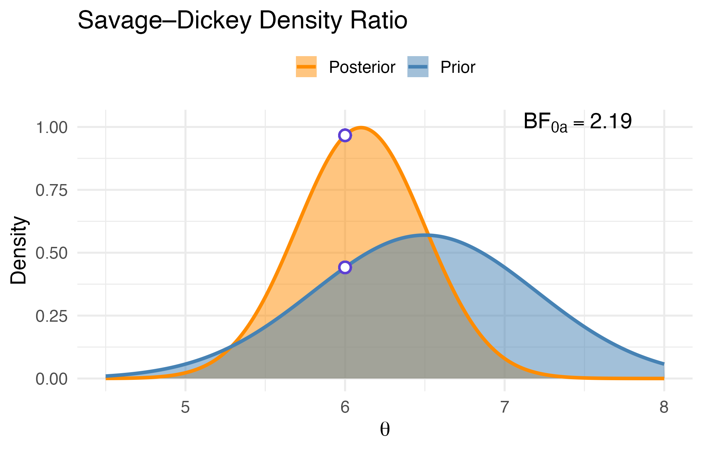
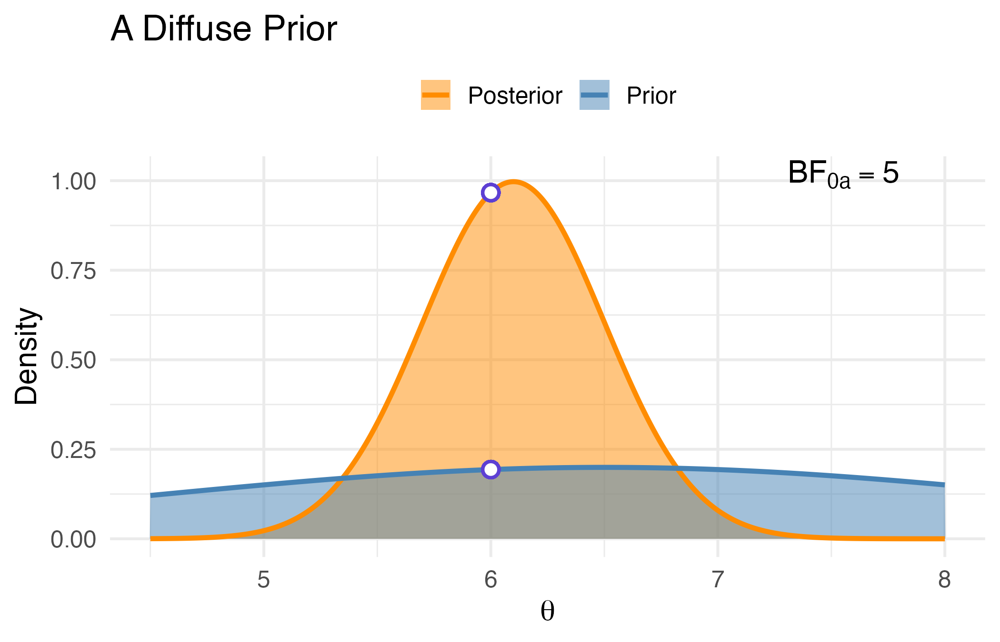
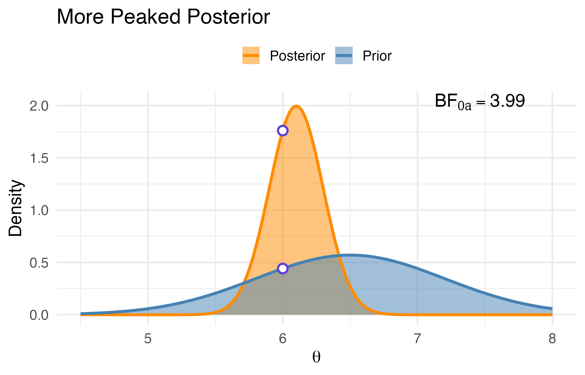

```{r setup, include=FALSE}
knitr::opts_chunk$set(echo = TRUE)
library(ggplot2)
library(bayesrules)
library(gridExtra)
library(dplyr)
library(tidyr)
library(coda)
```


::: goals

By the end of this lecture, you will be able to:

- Summarise a posterior distribution using point estimates (mean, median, mode) and credible intervals (ETI and HPD)
- Construct the **posterior predictive distribution** and use it to generate forecasts for future data
- Evaluate **interval hypotheses** using posterior probabilities and Bayes factors
- Assess **point hypotheses** using the Savage–Dickey density ratio
- Reason about how prior choice affects each of these quantities
:::

::: setup
**Recommended Reading**

- *Bayes Rules!* — Chapter 8 (Posterior inference; posterior estimation; hypothesis testing)
- Course addendum: *Testing Point Hypotheses* (Bayes factors and Savage–Dickey)

**R Environment**
Before we begin, load the following packages:
```r
library(bayesrules)
library(coda)
library(dplyr)
library(ggplot2)
library(gridExtra)
library(tidyr)
```
:::

::: {.describe}
**Review**

So far, we've laid the groundwork for making principled inferences under uncertainty:

- **Bayesian Foundations (Ch. 1–3)** — prior, likelihood, posterior, and Bayes' Rule:
  $${\text{Posterior}} \propto {\text{Likelihood}} \times {\text{Prior}}$$
- **Sequential Updating & Prior Sensitivity (Ch. 4)** — incorporating new data over time and seeing how the prior shapes the posterior.
- **Conjugate Models (Ch. 5)** — Beta–Binomial, Gamma–Poisson, and Normal–Normal pairs that give closed-form posteriors.
- **Obtaining the Posterior (Ch. 6 & 7 — last lecture)** — grid approximation and MCMC for the (very common) case where conjugacy isn't available.

---

**Today**, we put posteriors to work — turning a distribution over the parameter into the kind of answer you'd actually report in a paper:

- Summarise the posterior with **point estimates** and **credible intervals**
- Generate forecasts via the **posterior predictive distribution**
- Test interval and point **hypotheses** using **Bayes factors** and the **Savage–Dickey** shortcut

Every code chunk below uses the **Dutch Railways** running example from last lecture — same NS signal-failure rate $\lambda$, same prior Gamma(2, 0.5), same data.
:::


# A Quick Bayesian Refresher

Let’s revisit the key ideas from Chapters 1–5: the Bayesian toolkit we’re carrying into today’s work.

::: {.describe}

**Four Core Ingredients of Bayesian Analysis**

Every Bayesian model is built on four fundamental components:

1. **Prior Model**  
   We begin with a parameter of interest — say, $\pi$ — and specify what we believe about it *before* seeing any data:  
   $$
   f(\pi)
   $$  
   A common choice for a proportion is the Beta distribution:  
   $$
   f(\pi) = \frac{\Gamma(\alpha + \beta)}{\Gamma(\alpha)\Gamma(\beta)} \pi^{\alpha - 1}(1 - \pi)^{\beta - 1}
   $$

2. **Data Model**  
   We assume our observed data arise from a known model governed by $\pi$.  
   For example, in $n$ Bernoulli trials:  
   $$
   Y \sim \text{Binomial}(n, \pi)
   $$

3. **Likelihood Function**  
   After observing $Y = y$, the likelihood tells us how compatible different values of $\pi$ are with the data:  
   $$
   L(\pi \mid y) \propto \pi^y (1 - \pi)^{n - y}
   $$  
   *(Note: the data are fixed here — it’s $\pi$ that varies.)*

4. **Posterior Model**  
   Finally, we update our beliefs using Bayes’ Rule:  
   $$
   f(\pi \mid y) \propto f(y \mid \pi) \cdot f(\pi)
   $$

:::

The **posterior distribution** is the heart of Bayesian analysis. It tells us what we believe about $\pi$ *after* seeing data, and it's the foundation for all the inferential tools we'll build today.

But there’s a catch:  
Computing the posterior **can be hard**. Bayes' Rule is conceptually simple, but that denominator — the **marginal likelihood** $f(y)$ — is often intractable.

---

### Conjugate Models to the Rescue

::: {.describe}

**Conjugate Models**

To simplify updates, we can use **conjugate priors**, priors that pair naturally with a likelihood to give a posterior in the same distribution family.

This eliminates the need to compute the normalizing constant directly.

Here are some common conjugate pairs, and one challenge row left blank for you:

| Likelihood                    | Prior                      | Posterior                               |
|------------------------------|----------------------------|------------------------------------------|
| Binomial($n$, $\pi$)         | Beta($\alpha$, $\beta$)    | Beta($\alpha + y$, $\beta + n - y$)     |
| Poisson($\lambda$)           | Gamma($s$, $r$)            | Gamma($s + \sum y_i$, $r + n$)          |
| Normal($\mu$, known $\sigma^2$) | Normal($m_0$, $s_0^2$)   | Normal($m_n$, $s_n^2$)                  |
| Exponential($\lambda$)        | Gamma($s$, $r$)   | ???                                      |

Where:  
- $s_n^2 = \left( \frac{n}{\sigma^2} + \frac{1}{s_0^2} \right)^{-1}$  
- $m_n = s_n^2 \left( \frac{n \bar{y}}{\sigma^2} + \frac{m_0}{s_0^2} \right)$

:::

---

## Practice: Prior to Posterior with the Dutch Railways

::: {.describe}
**Scenario**

You’re a data scientist for the Dutch Railway Service. Your task: analyze the rate of monthly signal failures on a 10 km stretch of track.

Failures are recorded monthly. Your goal is to estimate the **average failure rate** — and eventually assess whether the situation is improving.
:::

::: {.panel-tabset}

### Exercise

You express your belief that failures are relatively rare with a Gamma prior:  
$\lambda \sim \text{Gamma}(2, 0.5)$

After observing 4 months of failure counts:  
$y = (2, 0, 3, 1)$

Find the posterior distribution using the Gamma–Poisson conjugate update.

```r
# Prior parameters
s <- 2
r <- 0.5

# Data
y <- c(2, 0, 3, 1)

# Posterior parameters
s_post <- ___   
r_post <- ___   

# Print posterior
cat("Posterior: Gamma(", s_post, ",", r_post, ")\n")
```

### Try it

You may check your result using the `bayesrules` package if needed.

```r
summarize_gamma_poisson(
  shape = s,
  rate = r,
  sum_y = _____,
  n = _____
)
```

### Solution

- $\sum y = 6$, $n = 4$
- Posterior: $\lambda \mid y \sim \text{Gamma}(8, 4.5)$

```r
# Prior parameters
s <- 2
r <- 0.5

# Data
y <- c(2, 0, 3, 1)

# Posterior parameters
s_post <- s + sum(y)
r_post <- r + length(y)

# Plotposterior
summarize_gamma_poisson(
  shape = s,
  rate = r,
  sum_y = sum(y),
  n = length(y)
)
```
:::

## Extending the Example: Sequential vs. Full Updates

Let’s now extend the previous example: what happens if we receive data in stages instead of all at once?

::: {.panel-tabset}

### Exercise

Starting from a Gamma($2$, $0.5$) prior, we observed the four datapoints $y_1 = (2, 0, 3, 1)$, and updated to a Gamma($8$, $4.5$) posterior distribution of the failure rate. 
Now, we observe six more data points $y_2 = (2, 3, 0, 1, 2, 1)$.

Use the posterior you obtained after observing the first four observations as a new prior, and update with the new data: 

```r
# Prior parameters
s <- 2
r <- 0.5

# Data
y1 <- c(2, 0, 3, 1)
y2 <- c(2, 3, 0, 1, 2, 1)

# Posterior parameters after observing the first four datapoints
s_post1 <- 8   
r_post1 <- 4.5   

# Posterior parameters after observing the next six datapoints
s_post2 <- _____   
r_post2 <- _____   
```

Meanwhile, your colleague was late to the party.  
Starting from the same Gamma($2$, $0.5$) prior, they now want the posterior using **all 10 data points at once**:  
$y = (2, 0, 3, 1, 2, 3, 0, 1, 2, 1)$

```r
# Prior parameters
s <- 2
r <- 0.5

# Data
y_all <- c(2, 0, 3, 1, 2, 3, 0, 1, 2, 1)

# Posterior parameters after observing all ten datapoints
s_post_all <- ____
r_post_all <- ____   
```

### Try it

Use the `bayesrules` package to confirm your result.

```r
# Check your posterior
summarize_gamma_poisson(
  shape = s_post1,
  rate = r_post1,
  sum_y = _____,
  n = _____
)

# Check their posterior
summarize_gamma_poisson(
  shape = _____,
  rate = _____,
  sum_y = _____,
  n = 10
)
```

### Solution

**Your sequential updates:**  

- After $y_1$: shape = $2 + 6 = 8$, rate = $0.5 + 4 = 4.5$
- After $y_2$: shape = $8 + 9 = 17$, rate = $4.5 + 6 = 10.5$

**Colleague's single update:**  
- shape = $2 + 16 = 17$, rate = $0.5 + 10 = 10.5$

```r
# Prior parameters
s <- 2
r <- 0.5

# Data
y1 <- c(2, 0, 3, 1)
y2 <- c(2, 3, 0, 1, 2, 1)
y_all <- c(2, 0, 3, 1, 2, 3, 0, 1, 2, 1)

# Posterior parameters after observing the first four datapoints
s_post1 <- 8   
r_post1 <- 4.5   

# Posterior parameters after observing the next six datapoints
s_post2 <- s_post1 + sum(y2)
r_post2 <- r_post1 + length(y2)

# Check your posterior
summarize_gamma_poisson(
  shape = s_post1,
  rate = r_post1,
  sum_y = sum(y2),
  n = length(y2)
)

# Posterior parameters after observing all ten datapoints
s_post_all <- s + sum(y_all)
r_post_all <- r + length(y_all)  

# Check their posterior
summarize_gamma_poisson(
  shape = s,
  rate = r,
  sum_y = sum(y_all),
  n = length(y_all)
)
```
:::

These two exercises reinforce two key ideas:

- **Conjugate models** simplify posterior computation
- **Bayesian updating is coherent** — results are consistent whether we learn all at once or in stages

With that foundation in place, we now turn to the next question:  
**What can we do with the posterior?**  
We’ll begin by learning how to summarize posterior uncertainty and test hypotheses using tools like credible intervals and Bayes factors.

# Posterior Inference & Hypothesis Testing

We've now built and updated posterior distributions. But how do we *use* them to draw conclusions?

In this section, we'll explore two main applications of the posterior: **estimation** and **hypothesis testing**.

::: {.callout-note title="What’s Ahead"}

We'll cover:  
- How to summarize a posterior with point estimates and credible intervals  
- How to test both interval and point hypotheses using tail areas and Bayes factors
:::


## Posterior Estimation (Ch. 8.1)
  
::: goals

After this section, you will be able to:

- Summarize a posterior distribution using key statistics such as the mean, mode, and standard deviation  
- Construct central credible intervals using quantile functions  
- Interpret credible intervals in a Bayesian framework as statements about parameter uncertainty
:::

When we finish a Bayesian analysis, we don’t just want a plot, we want answers.

- What's our best guess for the parameter?
- How uncertain are we?
- What values are most plausible?

To answer these questions, we turn to **posterior summaries**: key numbers that condense the full posterior distribution into interpretable insights.

---

### Measures of Location

Let’s start with where the posterior “centers.” What’s our best guess?

The **posterior mean**, **mode**, and **median** all describe central tendency, but they don’t always agree. For symmetric posteriors, they often align. But when the posterior is **skewed**, they can differ, sometimes significantly.

> When might the **median** be preferred over the mean?

Often, in skewed posteriors, the mean gets pulled toward the tail. You might even suspect a bug in your code, but it’s just the structure of the posterior density. In such cases, the **median** can give a more representative summary of what’s typical.

---

### Measures of Spread

But summaries aren’t just about the center, we also want to express uncertainty.

A common measure of spread is the **posterior standard deviation**. It tells us how tightly our beliefs are concentrated around the mean.

- A small SD = tight concentration = high certainty
- A large SD = wide spread = greater uncertainty

This works well for symmetric, unimodal posteriors, but breaks down when things get skewed or heavy-tailed. That's why we often complement with **credible intervals**.

<div class="describe">

**Posterior Credible Interval**

A **credible interval** gives us a direct probabilistic interpretation:

> "There’s a 95% posterior probability the parameter lies between X and Y."

Formally, for a parameter $\theta$ with posterior distribution $f(\theta \mid y)$, a $100(1 - \alpha)\%$ **central credible interval** is:

You can compute it using quantiles:

```r
qnorm(c(0.025, 0.975), mean = posterior_mean, sd = posterior_sd)
```

</div>

---

Let’s revisit the railroad failure example and see this in action.

::: {.panel-tabset}

### Exercise

You're working with a Gamma($8$, $4.5$) posterior for the failure rate $\lambda$.
Compute:

1. Posterior mean, mode, and standard deviation  
2. 95% central credible interval  
3. 50% and 99% central credible intervals

```r
s <- 8
r <- 4.5

# Fill in the blanks
mean_lambda <- ___
mode_lambda <- ___
sd_lambda <- ___

alpha_95 <- ___
ci_95 <- qgamma(c(alpha_95 / 2, 1 - alpha_95 / 2), shape = s, rate = r)

alpha_50 <- ___
ci_50 <- qgamma(c(alpha_50 / 2, 1 - alpha_50 / 2), shape = s, rate = r)

alpha_99 <- ___
ci_99 <- qgamma(c(alpha_99 / 2, 1 - alpha_99 / 2), shape = s, rate = r)
```

### Try it

Use these formulas to check your work:

- Mean = $s / r$
- Mode = $(s - 1) / r$ (if $s > 1$)
- SD = $\sqrt{s} / r$

You can also visualize the posterior and highlight the 95% credible interval:

```r
curve(dgamma(x, shape = s, rate = r), from = 0, to = 3,
      ylab = "Density", xlab = expression(lambda),
      main = "Posterior Distribution: Gamma(8, 4.5)")
abline(v = mean_lambda, col = "red", lty = 2)
abline(v = ci_95, col = "blue", lty = 3)
legend("topright", legend = c("Mean", "95% CI"), 
       col = c("red", "blue"), lty = c(2, 3))
```

### Solution

```r
s <- 8
r <- 4.5

mean_lambda <- s / r        # 1.78
mode_lambda <- (s - 1) / r  # 1.55
sd_lambda <- sqrt(s) / r    # 0.63

alpha_95 <- 0.05
ci_95 <- qgamma(c(0.025, 0.975), shape = s, rate = r)

alpha_50 <- 0.50
ci_50 <- qgamma(c(0.25, 0.75), shape = s, rate = r)

alpha_99 <- 0.01
ci_99 <- qgamma(c(0.005, 0.995), shape = s, rate = r)
```
:::

---

Now let’s visualize this posterior and highlight the 95% credible interval.

```{r}
# Parameters
s <- 8
r <- 4.5
lambda_vals <- seq(0, 4, length.out = 1000)  # Extended range

# Density values
dens_df <- data.frame(
  lambda = lambda_vals,
  density = dgamma(lambda_vals, shape = s, rate = r)
)

# 95% credible interval
ci <- qgamma(c(0.025, 0.975), shape = s, rate = r)
mean_val <- s / r

# Plot
ggplot(dens_df, aes(x = lambda, y = density)) +
  geom_line(linewidth = 1, color = "black") +
  geom_area(data = subset(dens_df, lambda >= ci[1] & lambda <= ci[2]),
            aes(x = lambda, y = density), fill = "skyblue", alpha = 0.5) +
  geom_vline(xintercept = mean_val, linetype = "dashed", color = "red", linewidth = 1) +
  geom_vline(xintercept = ci, linetype = "dotted", color = "blue", linewidth = 1) +
  labs(
    title = "Posterior Distribution: Gamma(8, 4.5)",
    x = expression(lambda),
    y = "Density"
  ) +
  theme_minimal(base_size = 14) +
  theme(
    plot.title = element_text(face = "bold", size = 16),
    axis.title.x = element_text(size = 16),
    axis.title.y = element_text(size = 14)
  ) +
  annotate("text", x = mean_val + 0.05, y = 0.9, label = "Mean", color = "red",
           hjust = 0, size = 5) +
  annotate("text", x = ci[1] - 0.02, y = 0.4, label = "2.5%", color = "blue",
           hjust = 1, size = 5) +
  annotate("text", x = min(ci[2] + 0.02, max(lambda_vals) - 0.1), y = 0.4,
           label = "97.5%", color = "blue", hjust = 0, size = 5)
```

Let’s interpret:

- **Mean ($\lambda = 1.78$)** is our best point estimate (is it though?)
- **Skewed shape** → mean ≠ median ≠ mode
- **95% CI** (approx. 0.77–3.2) gives us plausible range

---

<div class="describe">

**Highest Posterior Density (HPD) Interval**

Unlike central intervals, an **HPD interval**:

- Contains the most probable region of the posterior
- Is the **narrowest possible interval** with the desired coverage

Especially useful when posteriors are **skewed** or **irregular**.

```r
library(coda)
posterior_samples <- rgamma(100000, shape = 8, rate = 4.5)
HPDinterval(as.mcmc(posterior_samples), prob = 0.95)
```
</div>

You can also compare them side-by-side with plots; central interval vs. HPD:

```{r fig-hpd-vs-central, fig.width=10, fig.height=4, echo=FALSE}
library(ggplot2)
library(coda)
library(gridExtra)

s <- 8
r <- 4.5
x <- seq(0, 4, length.out = 1000)  # Extended range
density_vals <- dgamma(x, shape = s, rate = r)
max_density <- max(density_vals)

# Central CI and mean
ci_95 <- qgamma(c(0.025, 0.975), shape = s, rate = r)
mean_val <- s / r

p1 <- ggplot(data.frame(x, y = density_vals), aes(x, y)) +
  geom_line(color = "black", linewidth = 1) +
  geom_area(data = subset(data.frame(x, y = density_vals), x >= ci_95[1] & x <= ci_95[2]),
            aes(x, y), fill = "#BDD7EE") +
  geom_vline(xintercept = mean_val, linetype = "dashed", color = "#D95319", linewidth = 1) +
  annotate("text", x = mean_val + 0.1, y = max_density + 0.12,
           label = "Mean", color = "#D95319", size = 5, hjust = 0) +
  annotate("text", x = min(ci_95[2] + 0.05, max(x) - 0.1), y = 0.15,
           label = "97.5%", color = "#0072B2", size = 4, hjust = 0) +
  annotate("text", x = ci_95[1] - 0.05, y = 0.15,
           label = "2.5%", color = "#0072B2", size = 4, hjust = 1) +
  labs(title = "Central 95% CI (with Mean)", x = expression(lambda), y = "Density") +
  theme_minimal(base_size = 14)

# HPD and mode
mode_val <- (s - 1) / r
samples <- rgamma(100000, shape = s, rate = r)
hpd <- HPDinterval(as.mcmc(samples), prob = 0.95)

p2 <- ggplot(data.frame(x, y = density_vals), aes(x, y)) +
  geom_line(color = "black", linewidth = 1) +
  geom_area(data = subset(data.frame(x, y = density_vals), x >= hpd[1] & x <= hpd[2]),
            aes(x, y), fill = "#F9CB9C") +
  geom_vline(xintercept = mode_val, linetype = "dashed", color = "#E69F00", linewidth = 1) +
  annotate("text", x = mode_val + 0.1, y = max_density + 0.12,
           label = "Mode", color = "#E69F00", size = 5, hjust = 0) +
  annotate("text", x = min(hpd[2] + 0.05, max(x) - 0.1), y = 0.15,
           label = "End", color = "#E69F00", size = 4, hjust = 0) +
  annotate("text", x = hpd[1] - 0.05, y = 0.15,
           label = "Start", color = "#E69F00", size = 4, hjust = 1) +
  labs(title = "95% HPD Interval (with Mode)", x = expression(lambda), y = "Density") +
  theme_minimal(base_size = 14)

gridExtra::grid.arrange(p1, p2, ncol = 2)
```

---

## Posterior Prediction

Summarising the posterior is one thing; **predicting future observations** is another. The posterior tells us about $\lambda$, the latent rate — but if you're standing in front of an NS engineer, the question they actually care about is:

> *How many signal failures should we plan for next month?*

That's a question about **a new observation $\tilde Y$**, not the parameter. Bayesian prediction handles it cleanly: average the data-generating distribution $f(\tilde Y \mid \lambda)$ over our current posterior beliefs about $\lambda$.

::: {.describe}

**The posterior predictive distribution**

$$
f(\tilde y \mid y) \;=\; \int f(\tilde y \mid \lambda)\, f(\lambda \mid y)\, d\lambda
$$

Read this as: "the predictive probability of $\tilde y$ is its sampling probability under each value of $\lambda$, weighted by how plausible that value is *given the data we've already seen*."

:::

For the Gamma–Poisson model, this integral has a closed-form solution: $\tilde Y \mid y \sim \text{Negative Binomial}\!\bigl(\text{size} = s_{\text{post}}, \text{prob} = r_{\text{post}}/(r_{\text{post}}+1)\bigr)$. But we can also just simulate — and the simulation works for **any** model, conjugate or not.

```{r posterior-predictive}
set.seed(2026)

# Posterior parameters from earlier: Gamma(8, 4.5)
s_post <- 8
r_post <- 4.5

# Step 1: draw lambda from the posterior
lambda_draws <- rgamma(1e4, shape = s_post, rate = r_post)

# Step 2: for each lambda, draw a single future observation y_tilde ~ Poisson(lambda)
y_tilde <- rpois(1e4, lambda = lambda_draws)

cat("Predictive mean :", round(mean(y_tilde), 3), "\n")
cat("P(Y* = 0 | y)   :", round(mean(y_tilde == 0), 3), "\n")
cat("P(Y* >= 3 | y)  :", round(mean(y_tilde >= 3), 3), "\n")

# Compare to the closed-form Negative Binomial
p_nb <- r_post / (r_post + 1)
cat("\nClosed-form check (NegBin(", s_post, ",", round(p_nb, 3), ")):\n")
cat("  P(Y* = 0)  :", round(dnbinom(0, size = s_post, prob = p_nb), 3), "\n")
cat("  P(Y* >= 3) :", round(1 - pnbinom(2, size = s_post, prob = p_nb), 3), "\n")
```

```{r posterior-predictive-plot}
df_pred <- data.frame(y_tilde = y_tilde)

ggplot(df_pred, aes(x = y_tilde)) +
  geom_bar(aes(y = ..prop..), fill = "#0b7285", colour = "white") +
  scale_x_continuous(breaks = 0:max(y_tilde)) +
  labs(title = "Posterior predictive distribution of future monthly failures",
       x = expression(tilde(Y)), y = "Predictive probability") +
  theme_minimal(base_size = 13)
```

::: {.describe}

**Why predict, not estimate?**

- A **credible interval for $\lambda$** tells you about the long-run *mean* rate of failures. It's narrow when you have lots of data.
- A **predictive interval for $\tilde Y$** tells you about the *next single month*. It is always wider, because it folds Poisson sampling noise on top of posterior uncertainty.

Reporting the credible interval for $\lambda$ when stakeholders want the predictive interval for $\tilde Y$ is a classic Bayesian-communication mistake.

:::

### Exercise: predictive vs estimation intervals

::: {.callout-note}
1. Compute a 90% **credible interval for $\lambda$** using the Gamma(8, 4.5) posterior.
2. Compute a 90% **predictive interval for $\tilde Y$** using the simulated draws above.
3. Sketch what each is telling you in words. Which is wider, and why?
:::

::: {.callout-tip collapse=true}
## Solution

```{r pred-interval-solution}
ci_lambda <- qgamma(c(0.05, 0.95), shape = s_post, rate = r_post)
cat("90% credible interval for lambda :",
    round(ci_lambda, 3), "\n")

pi_ytilde <- quantile(y_tilde, c(0.05, 0.95))
cat("90% predictive interval for Y*    :",
    pi_ytilde, "\n")
```

The credible interval is narrow because we have moderate information about $\lambda$. The predictive interval is much wider because *even if we knew $\lambda$ exactly*, the next month's failure count would still be a Poisson draw.

:::

---

Now, with both estimation and prediction in our toolkit, we can take the third step: **testing specific claims** about $\lambda$. We start with interval claims like "Is the failure rate below 2/month?"

## Hypothesis Testing

::: goals
After this section, you will be able to:

- Distinguish between interval and point hypotheses, and understand when each is appropriate  
- Evaluate both types of hypotheses using Bayes factors, computed from prior/posterior odds or the Savage–Dickey method  
- Interpret Bayes factors as measures of evidence that quantify how data shift our beliefs  
:::

Bayesian inference is not only about estimating parameters; it also allows us to evaluate specific claims about those parameters.

Broadly speaking, Bayesian hypothesis testing addresses two types of questions:

> **What is the probability that a parameter lies within a certain range?**  
> *(e.g., Is the treatment effect greater than 0?)*

> **How much support do the data provide for a specific parameter value?**  
> *(e.g., Is the effect exactly 0?)*

We refer to these as:

- **Interval hypotheses**: claims about a range of values
- **Point hypotheses**: claims about a precise value

Both can be evaluated using **Bayes factors**, but the way we compute them differs:

- For interval hypotheses, we compare **posterior and prior probabilities** of a region to form odds.
- For point hypotheses, we use the **Savage–Dickey density ratio**, which compares the density of the prior and posterior at a single value.

Let’s begin with interval hypotheses.


### Interval Hypotheses (Ch. 8.2)

Let’s return to our running example. We’re modeling the monthly failure rate $\lambda$ on a stretch of railway, and we want to evaluate the claim:

> "The average failure rate is below 2 failures per month."

This is a **one-sided hypothesis** test:

- $H_0$: $\lambda \geq 2$
- $H_a$: $\lambda < 2$

Earlier, we used the prior:

$$
\lambda \sim \text{Gamma}(2, 0.5)
$$

After observing the **first four months** of data ($\sum y = 6$), we updated to:

$$
\lambda \mid y_1 \sim \text{Gamma}(8, 4.5)
$$


We want to test:

$$
H_a: \lambda < 2 \quad \text{vs.} \quad H_0: \lambda \geq 2
$$

To do this, we’ll compute the **Bayes factor**, which compares the **posterior odds to the prior odds**, quantifying how the data have updated our belief in favor of $H_a$ relative to $H_0$.

We begin by calculating the **prior odds**: Our belief in $H_a$ versus $H_0$ *before* seeing any data:

```r
prior_prob <- pgamma(2, shape = 2, rate = 0.5)
prior_odds <- prior_prob / (1 - prior_prob)
#> prior_odds
#[1] 0.3591409
```

This tells us how strongly we favored $H_a$ over $H_0$ based on the prior alone. In this case, a prior odds value of **0.36** means that before seeing any data, we believed $H_a$ was **less than half as likely** as $H_0$.

Next, we calculate the **posterior odds**: Our updated belief *after* seeing the data:

```r
post_prob <- pgamma(2, shape = 8, rate = 4.5)
post_odds <- post_prob / (1 - post_prob)
#> post_odds
#[1] 2.087402
```

This reflects how much more likely we now believe $H_a$ is relative to $H_0$, based on the observed data. A posterior odds value of **2.09** means that, after seeing the first 4 months of data, we believe $H_a$ is **about twice as likely** as $H_0$.


Finally, we compute the **Bayes factor**, which quantifies **how much the data have updated our odds** in favor of $H_a$ over $H_0$.

```r
BF <- post_odds / prior_odds
#> BF
#[1] 5.812208
```

This tells us how strongly the data have shifted our beliefs in favor of $H_a$ over $H_0$. A Bayes factor of **5.81** means the observed data have made $H_a$ nearly **six times more plausible** than it was under our prior beliefs.

This represents **substantial evidence** in favor of the alternative hypothesis, according to conventional interpretive scales.


::: {.describe}
**Bayes Factor**

The Bayes factor compares how much more the data support one hypothesis over another, by comparing how our odds changed from prior to posterior:

$$
\text{BF}_{a0} = \frac{\text{Posterior odds}}{\text{Prior odds}} = 
\frac{P(H_a \mid y)/P(H_0 \mid y)}{P(H_a)/P(H_0)}
$$

- $\text{BF}_{a0} > 1$: evidence supports $H_a$
- $\text{BF}_{a0} < 1$: evidence supports $H_0$
- $\text{BF}_{a0} = 1$: data are uninformative

:::


---

```{r interval_hypothesis_plot, include=FALSE}
library(ggplot2)
library(dplyr)
library(tidyr)
library(gridExtra)
library(ggforce)

# Parameters
prior_shape <- 2
prior_rate <- 0.5
post_shape <- 8
post_rate <- 4.5
threshold <- 2

# Generate values
lambda_vals <- seq(0, 5, length.out = 500)
df <- data.frame(
  lambda = lambda_vals,
  Prior = dgamma(lambda_vals, shape = prior_shape, rate = prior_rate),
  Posterior = dgamma(lambda_vals, shape = post_shape, rate = post_rate)
)

prior_prob <- pgamma(threshold, shape = prior_shape, rate = prior_rate)
post_prob <- pgamma(threshold, shape = post_shape, rate = post_rate)

# Define function to create a plot with inset pizza
make_density_with_pizza <- function(df_density, dist_name, fill_colors, title_text, prob_value) {
  df_density <- df_density |> rename(Density = all_of(dist_name))

  # Base plot
  base <- ggplot(df_density, aes(x = lambda, y = Density)) +
    geom_line(color = fill_colors["Ha"], size = 1.3) +
    geom_vline(xintercept = threshold, linetype = "dashed", color = "gray30", linewidth = 1) +
    geom_area(data = subset(df_density, lambda < threshold), fill = fill_colors["Ha"], alpha = 0.3) +
    geom_area(data = subset(df_density, lambda >= threshold), fill = fill_colors["H0"], alpha = 0.3) +
    labs(title = title_text, x = expression(lambda), y = "Density") +
    theme_minimal(base_size = 16) +
    theme(legend.position = "top", legend.key.size = unit(0.7, "cm"))

  # Pizza plot
  pizza_df <- data.frame(
    Hypothesis = factor(c("H0", "Ha"), levels = c("H0", "Ha")),
    Prob = c(1 - prob_value, prob_value)
  ) |> 
    mutate(
      end = 2 * pi * cumsum(Prob),
      start = lag(end, default = 0)
    )

  pizza <- ggplot(pizza_df) +
    geom_arc_bar(aes(x0 = 0, y0 = 0, r0 = 0, r = 1.8,
                     start = start, end = end, fill = Hypothesis), color = "white") +
    coord_fixed(xlim = c(-1.6, 2.6), ylim = c(-1.6, 1.7)) +
    theme_void(base_size = 14) +
    scale_fill_manual(values = fill_colors)

  # Embed pizza slightly smaller, higher to avoid overlap and legend
  library(grid)
  grob_pizza <- ggplotGrob(pizza)
  base + annotation_custom(grob_pizza, xmin = 3.3, xmax = 5.4, ymin = 0.86 * max(df_density$Density), ymax = 1.1 * max(df_density$Density))
}

fill_prior <- c("H0" = "gray60", "Ha" = "steelblue")
fill_post <- c("H0" = "gray60", "Ha" = "darkorange")

p1 <- make_density_with_pizza(df, "Prior", fill_prior, "Prior Distribution - Gamma(2, 0.5)", prior_prob)
p2 <- make_density_with_pizza(df, "Posterior", fill_post, "Posterior Distribution - Gamma(8, 4.5)", post_prob)

ggsave("interval_hypothesis_plot.png", grid.arrange(p1, p2, nrow = 2), width = 10, height = 8, dpi = 300, limitsize = FALSE)
```



This plot shows the prior and posterior distributions. The shaded regions under each curve represent the probability mass supporting the alternative hypothesis ($\lambda < 2$). The embedded pie charts show those probabilities visually.

> Was there a shift in beliefs from prior to posterior?

---

Let’s now see how our evidence changes when we update with **additional data**.

In the next exercise, you’ll work with the **full 10 months** of data:  
$\sum y = 15$, leading to the posterior:

$$
\lambda \mid y \sim \text{Gamma}(17, 10.5)
$$

How does the Bayes factor change? Has the evidence for $H_a$ strengthened?

---


::: {.panel-tabset}

### Exercise

You’ve updated your model with 10 months of data ($\sum y = 15$), giving a posterior:  
$\lambda \mid y \sim \text{Gamma}(17, 10.5)$

Using the original prior ($\text{Gamma}(2, 0.5)$), compute the Bayes factor for:

$$
H_a: \lambda < 2 \quad \text{vs.} \quad H_0: \lambda \geq 2
$$

Fill in the blanks:

```r
# Posterior
post_prob <- _____(_____, _____, _____)
post_odds <- _____ / (1 - _____)

# Prior
prior_prob <- _____(_____, _____, _____)
prior_odds <- _____ / (1 - _____)

# Bayes factor
BF <- _____ / _____
```

### Try it

Use this scaffold to compute the components:

```r
# Compute posterior probability and odds
post_prob <- pgamma(2, shape = 17, rate = 10.5)
post_odds <- post_prob / (1 - post_prob)
cat("Posterior probability:", round(post_prob, 3), "\n")
cat("Posterior odds:", round(post_odds, 3), "\n")

# Compute prior probability and odds
prior_prob <- pgamma(2, shape = 2, rate = 0.5)
prior_odds <- prior_prob / (1 - prior_prob)
cat("Prior probability:", round(prior_prob, 3), "\n")
cat("Prior odds:", round(prior_odds, 3), "\n")

# Now use these to compute the Bayes factor in the exercise above
```


### Solution

```r
# Posterior
post_prob <- pgamma(2, shape = 17, rate = 10.5)
post_odds <- post_prob / (1 - post_prob)

# Prior
prior_prob <- pgamma(2, shape = 2, rate = 0.5)
prior_odds <- prior_prob / (1 - prior_prob)

# Bayes factor
BF <- post_odds / prior_odds
BF
```

:::


The Bayes factor based on the full dataset is approximately **14.3**, indicating **strong support for the alternative hypothesis** ($\lambda < 2$) over the null ($\lambda \geq 2$).

Notably, this **strengthens** the conclusion we reached after just 4 months of data, when the Bayes factor already modestly favored $H_a$. 

In this case, the full dataset provides **substantial to strong** evidence that the failure rate is indeed below the target threshold. We now turn to a different type of hypothesis — one that asks whether a parameter equals a *specific value*.


### Testing Point Hypotheses

In the previous section, we tested **interval hypotheses** like:

> "Is the failure rate $\lambda$ below 2?"

We did this by computing posterior and prior odds, and comparing them via the **Bayes factor**. But what if we want to evaluate a **point hypothesis** like:

> "Is the average number of failures per month *exactly* 2?"

This question falls outside the scope of the tools we've used so far. Under a continuous prior and posterior, the probability that a parameter equals *any exact value* is zero.

So how do we assess a point hypothesis?

#### A Shift in Perspective

Testing point hypotheses requires a different mindset. Instead of assessing the *posterior probability* of a value (which is zero), we reframe the problem as a **model comparison**:

* $H_0$: The parameter equals a specific value (e.g., $\theta = \theta_0$)
* $H_1$: The parameter is unknown and follows a continuous prior (e.g., $\theta \sim \text{Normal}(m_0, s_0^2)$)

We then use the **Bayes factor** to compare how well each model explains the data.

#### Enter the Savage–Dickey Density Ratio

The Savage–Dickey method provides an elegant shortcut for computing the Bayes factor **without** calculating marginal likelihoods.

If:

* $H_0$ is nested within $H_1$ (e.g., $\theta = \theta_0$ is a special case of $\theta \sim \text{Normal}$),
* The prior is continuous at $\theta_0$, and
* We can compute both the prior and posterior densities at $\theta_0$,

Then:

$$
\text{BF}_{01} = \frac{f(\theta = \theta_0 \mid y)}{f(\theta = \theta_0)}
$$

This approach may seem surprising: in interval testing, we emphasized that the probability of a single point under a continuous distribution is zero. But here, we're comparing **densities**, not probabilities, which is a crucial distinction.

Let's visualize what this really means.

```{r savage_dickey_plot_1, include=FALSE}
library(ggplot2)
library(tidyr)

# Example 1: Baseline
theta_vals <- seq(4.5, 8, length.out = 500)
prior_mean <- 6.5
prior_sd <- 0.7
post_mean <- 6.1
post_sd <- 0.4
theta0 <- 6

prior_dens <- dnorm(theta_vals, mean = prior_mean, sd = prior_sd)
post_dens <- dnorm(theta_vals, mean = post_mean, sd = post_sd)
prior_height <- dnorm(theta0, mean = prior_mean, sd = prior_sd)
post_height <- dnorm(theta0, mean = post_mean, sd = post_sd)
BF_value <- round(post_height / prior_height, 2)

plot_df <- data.frame(theta = theta_vals, Prior = prior_dens, Posterior = post_dens)
plot_long <- pivot_longer(plot_df, cols = c("Prior", "Posterior"), names_to = "Distribution", values_to = "Density")

p1 <- ggplot(plot_long, aes(x = theta, y = Density, fill = Distribution)) +
  geom_area(alpha = 0.5, position = "identity", color = NA) +
  geom_line(aes(color = Distribution), linewidth = 1.2) +
  geom_point(aes(x = theta0, y = prior_height), color = "#5D3FD3", size = 3, shape = 21, stroke = 1.2, fill = "white") +
  geom_point(aes(x = theta0, y = post_height), color = "#5D3FD3", size = 3, shape = 21, stroke = 1.2, fill = "white") +
  annotate("text", x = 7.8, y = max(c(prior_dens, post_dens)) * 1.02,
           label = paste0("BF[0*a] == ", BF_value), parse = TRUE, size = 5.5, hjust = 1) +
  scale_fill_manual(values = c("Prior" = "steelblue", "Posterior" = "darkorange")) +
  scale_color_manual(values = c("Prior" = "steelblue", "Posterior" = "darkorange")) +
  labs(x = expression(theta), y = "Density", title = "Savage–Dickey Density Ratio") +
  theme_minimal(base_size = 15) +
  theme(legend.position = "top", legend.title = element_blank(), legend.key.size = unit(0.6, "cm"))

ggsave("savage_dickey_plot_1.png", p1, width = 7, height = 4.5, dpi = 300)


# Example 2: Jeffreys–Lindley Paradox (diffuse prior)
prior_sd <- 2  # more diffuse prior
prior_dens <- dnorm(theta_vals, mean = prior_mean, sd = prior_sd)
prior_height <- dnorm(theta0, mean = prior_mean, sd = prior_sd)
BF_value <- round(post_height / prior_height, 2)

plot_df$Prior <- prior_dens
plot_long <- pivot_longer(plot_df, cols = c("Prior", "Posterior"), names_to = "Distribution", values_to = "Density")

p2 <- ggplot(plot_long, aes(x = theta, y = Density, fill = Distribution)) +
  geom_area(alpha = 0.5, position = "identity", color = NA) +
  geom_line(aes(color = Distribution), linewidth = 1.2) +
  geom_point(aes(x = theta0, y = prior_height), color = "#5D3FD3", size = 3, shape = 21, stroke = 1.2, fill = "white") +
  geom_point(aes(x = theta0, y = post_height), color = "#5D3FD3", size = 3, shape = 21, stroke = 1.2, fill = "white") +
  annotate("text", x = 7.8, y = max(c(prior_dens, post_dens)) * 1.02,
           label = paste0("BF[0*a] == ", BF_value), parse = TRUE, size = 5.5, hjust = 1) +
  scale_fill_manual(values = c("Prior" = "steelblue", "Posterior" = "darkorange")) +
  scale_color_manual(values = c("Prior" = "steelblue", "Posterior" = "darkorange")) +
  labs(x = expression(theta), y = "Density", title = "A Diffuse Prior") +
  theme_minimal(base_size = 15) +
  theme(legend.position = "top", legend.title = element_blank(), legend.key.size = unit(0.6, "cm"))

ggsave("savage_dickey_plot_2.png", p2, width = 7, height = 4.5, dpi = 300)


# Example 3: More certain posterior
prior_mean <- 6.5
prior_sd <- 0.7
post_mean <- 6.1
post_sd <- 0.2
prior_dens <- dnorm(theta_vals, mean = prior_mean, sd = prior_sd)
post_dens <- dnorm(theta_vals, mean = post_mean, sd = post_sd)
prior_height <- dnorm(theta0, mean = prior_mean, sd = prior_sd)
post_height <- dnorm(theta0, mean = post_mean, sd = post_sd)
BF_value <- round(post_height / prior_height, 2)

plot_df$Prior <- prior_dens
plot_df$Posterior <- post_dens
plot_long <- pivot_longer(plot_df, cols = c("Prior", "Posterior"), names_to = "Distribution", values_to = "Density")

p3 <- ggplot(plot_long, aes(x = theta, y = Density, fill = Distribution)) +
  geom_area(alpha = 0.5, position = "identity", color = NA) +
  geom_line(aes(color = Distribution), linewidth = 1.2) +
  geom_point(aes(x = theta0, y = prior_height), color = "#5D3FD3", size = 3, shape = 21, stroke = 1.2, fill = "white") +
  geom_point(aes(x = theta0, y = post_height), color = "#5D3FD3", size = 3, shape = 21, stroke = 1.2, fill = "white") +
  annotate("text", x = 7.8, y = max(c(prior_dens, post_dens)) * 1.02,
           label = paste0("BF[0*a] == ", BF_value), parse = TRUE, size = 5.5, hjust = 1) +
  scale_fill_manual(values = c("Prior" = "steelblue", "Posterior" = "darkorange")) +
  scale_color_manual(values = c("Prior" = "steelblue", "Posterior" = "darkorange")) +
  labs(x = expression(theta), y = "Density", title = "More Peaked Posterior") +
  theme_minimal(base_size = 15) +
  theme(legend.position = "top", legend.title = element_blank(), legend.key.size = unit(0.6, "cm"))

ggsave("savage_dickey_plot_3.png", p3, width = 7, height = 4.5, dpi = 300)
```







<div class="describe">
**Why It Works (Don't worry, this won't be on the test)**

We start with the posterior density under $H_1$:

$$
f(\theta \mid y) = \frac{f(y \mid \theta) f(\theta)}{f(y \mid H_1)}
$$

Solving for $f(y \mid H_1)$ and evaluating at $\theta = \theta_0$:

$$
f(y \mid H_1) = \frac{f(y \mid \theta_0) f(\theta_0)}{f(\theta_0 \mid y)}
$$

Under $H_0$, we assume $\theta = \theta_0$, so:

$$
f(y \mid H_0) = f(y \mid \theta_0)
$$

Taking the ratio:

$$
\text{BF}_{01} = \frac{f(y \mid H_0)}{f(y \mid H_1)} = \frac{f(y \mid \theta_0)}{\frac{f(y \mid \theta_0) f(\theta_0)}{f(\theta_0 \mid y)}} = \frac{f(\theta_0 \mid y)}{f(\theta_0)}
$$

Boom.

</div>

Let’s now apply this to a scenario inspired by real work at the Dutch Railway Service.

::: {.panel-tabset}

### Exercise

Your safety team tracks **monthly signal failures** across a critical 10 km stretch. Historically, the failure rate has been assumed to be exactly **2 failures per month**, which serves as a threshold in staffing models.

After recent maintenance upgrades, you want to test whether this long-standing benchmark still holds:

$$
H_0: \lambda = 2 \quad \text{vs.} \quad H_1: \lambda \ne 2
$$

Suppose:

* Prior: $\lambda \sim \text{Gamma}(2, 0.5)$
* Posterior: $\lambda \mid y \sim \text{Gamma}(17, 10.5)$

Let’s compute the Bayes factor using the **Savage–Dickey ratio**.

1. Compute the prior and posterior densities at $\lambda = 2$
2. Use Savage–Dickey to compute the Bayes factor $\text{BF}_{01}$

```r
# Prior
shape_prior <- 2
rate_prior <- 0.5

# Posterior: Gamma(shape = ____, rate = ____) 
shape_post <- _____
rate_post <- _____

# Evaluate densities at lambda0 = 2
prior_dens <- dgamma(_____, shape = shape_prior, rate = rate_prior)
post_dens <- dgamma(_____, shape = shape_post, rate = rate_post)

# Compute Bayes factor
BF_01 <- _____ / _____
```

### Try it

You can verify your result visually:

```r
lambda_vals <- seq(0, 5, length.out = 500)
prior_vals <- dgamma(lambda_vals, shape = shape_prior, rate = rate_prior)
post_vals <- dgamma(lambda_vals, shape = shape_post, rate = rate_post)

plot_df <- data.frame(lambda = lambda_vals, Prior = prior_vals, Posterior = post_vals)
plot_long <- tidyr::pivot_longer(plot_df, cols = c("Prior", "Posterior"), names_to = "Dist", values_to = "Density")

library(ggplot2)

ggplot(plot_long, aes(x = lambda, y = Density, color = Dist, fill = Dist)) +
  geom_area(alpha = 0.4, position = "identity") +
  geom_line(linewidth = 1.2) +
  geom_point(aes(x = 2, y = dgamma(2, shape = shape_prior, rate = rate_prior)), shape = 21, fill = "white", color = "steelblue", size = 3) +
  geom_point(aes(x = 2, y = dgamma(2, shape = shape_post, rate = rate_post)), shape = 21, fill = "white", color = "darkorange", size = 3) +
  theme_minimal(base_size = 14) +
  labs(title = "Visual Check: Savage–Dickey Ratio", x = expression(lambda)) +
  scale_color_manual(values = c("Prior" = "steelblue", "Posterior" = "darkorange")) +
  scale_fill_manual(values = c("Prior" = "steelblue", "Posterior" = "darkorange"))
```

### Solution

```r
# Prior
shape_prior <- 2
rate_prior <- 0.5

# Posterior: Gamma(17, 10.5)
shape_post <- 17
rate_post <- 10.5

# Densities
prior_dens <- dgamma(2, shape = shape_prior, rate = rate_prior)
post_dens <- dgamma(2, shape = shape_post, rate = rate_post)

# Bayes factor
BF_01 <- post_dens / prior_dens
BF_01
```

:::

In our example, the Bayes factor computed via the Savage–Dickey method is approximately **3**, indicating **modest evidence in favor of the point hypothesis** $\lambda = 2$ over the continuous alternative.

Thus, we can assess **point hypotheses** by comparing the posterior and prior **densities** at a specific parameter value. The Savage–Dickey method provides a direct, interpretable way to quantify evidence for precise claims — all without computing full marginal likelihoods.

Bayes factors, whether for interval or point hypotheses, offer a unified framework for evaluating claims in light of data. As always, interpreting them requires context, not just a threshold, but an understanding of the models and prior assumptions involved.


## Understanding Bayes Factors

Bayes factors quantify how the data have updated our beliefs between two competing hypotheses. Specifically, the Bayes factor is the ratio of how likely the observed data are under one hypothesis compared to another:

$$
\text{BF}_{01} = \frac{p(y \mid H_0)}{p(y \mid H_1)}
$$

A Bayes factor of 5 means the data are 5 times more likely under $H_0$ than under $H_1$. A Bayes factor of 0.2 means the data are 5 times more likely under $H_1$ than under $H_0$.

To interpret Bayes factors in practice, we often use this scale from Kass & Raftery (1995):

| Bayes Factor (BF) | Evidence for $H_0$      |
| ----------------- | ----------------------- |
| 1 to 3            | Barely worth mentioning |
| 3 to 10           | Substantial             |
| 10 to 30          | Strong                  |
| 30 to 100         | Very strong             |
| > 100             | Decisive                |

> 📚 **Reference**: Kass, R. E., & Raftery, A. E. (1995). *Bayes Factors*. Journal of the American Statistical Association, 90(430), 773–795.

These are guidelines, not rules. The strength of evidence needed to shift beliefs can vary by context and domain. Bayesian inference gives us a **continuous scale of evidence**; these categories help us summarize that evidence clearly.

But context matters. A Bayes factor of 10 might offer compelling evidence in a routine analysis — yet barely register when prior odds are extremely low. In extraordinary claims like precognition, even a seemingly strong BF may be overwhelmed by a skeptical prior. Inference depends on **posterior odds**, and the Bayes factor is just one part of that update.

---

### Coherence: Sequential Bayes Factors

Bayes factors not only offer a measure of evidence — they also maintain **coherence** when applied in stages. This means we can accumulate evidence gradually and consistently over time.

Suppose we observe data in two batches and update our beliefs sequentially. The total Bayes factor from the full data is then the product of:

- The Bayes factor after the first batch, and
- The Bayes factor based on the second batch *given* the first.

Formally:

$$
\text{BF}_{01}(y_1, y_2) = \text{BF}_{01}(y_1) \times \text{BF}_{01}(y_2 \mid y_1)
$$

This mirrors the coherence of Bayesian updating more generally.

Let’s walk through an example.

```r
# Sequential Bayes Factor illustration

# Prior: Gamma(2, 0.5)
prior_shape <- 2
prior_rate <- 0.5

# Batch 1 (first 4 months): sum y = 6
shape_1 <- prior_shape + 6
rate_1 <- prior_rate + 4

# Batch 2 (next 6 months): sum y = 9
shape_2 <- shape_1 + 9
rate_2 <- rate_1 + 6

# Threshold
threshold <- 2

# Compute prior and post odds after batch 1
prior_prob <- pgamma(threshold, shape = prior_shape, rate = prior_rate)
prior_odds <- prior_prob / (1 - prior_prob)

post1_prob <- pgamma(threshold, shape = shape_1, rate = rate_1)
post1_odds <- post1_prob / (1 - post1_prob)

BF1 <- post1_odds / prior_odds

# Compute post odds after batch 2
post2_prob <- pgamma(threshold, shape = shape_2, rate = rate_2)
post2_odds <- post2_prob / (1 - post2_prob)

BF2 <- post2_odds / post1_odds

# Compute full BF
BF_full <- post2_odds / prior_odds
BF_seq <- BF1 * BF2

# Output
cat("Bayes Factor after batch 1 (BF1):", round(BF1, 3), "\n")
cat("Bayes Factor from batch 2 update (BF2):", round(BF2, 3), "\n")
cat("Sequential Bayes Factor (BF_seq):", round(BF_seq, 3), "\n")
cat("Direct full Bayes Factor (BF_full):", round(BF_full, 3), "\n")

# Bayes Factor after batch 1 (BF1): 5.812 
# Bayes Factor from batch 2 update (BF2): 2.461 
# Sequential Bayes Factor (BF_seq): 14.306 
# Direct full Bayes Factor (BF_full): 14.306 
```

As you can see, the sequential Bayes factor (`BF_seq`) and the direct computation from the full data (`BF_full`) match. This confirms that **Bayesian inference is coherent** — both in terms of belief updating and the accumulation of evidence.

---

# Posterior Analysis from MCMC Draws (Ch. 8.4)

Everything above used the **closed-form** Gamma(8, 4.5) posterior. But from Chapter 9 onward — and in most real research — the posterior has no clean formula to read summaries off. The reassuring message of Chapter 8.4 is that **none of today's tools actually require one**. Given a sample of posterior draws (from MCMC — Lecture 4), we approximate any posterior feature by the *corresponding feature of the draws*.

<div class="describe">

**The recipe — same questions, computed from draws**

| Posterior quantity | From the closed form | From MCMC draws |
|---|---|---|
| Mean / median | $s/r$, `qgamma(.5, …)` | `mean(draws)`, `median(draws)` |
| Mode | $(s-1)/r$ | peak of `density(draws)` |
| 95% credible interval | `qgamma(c(.025, .975), …)` | `quantile(draws, c(.025, .975))` |
| Interval hypothesis $P(\lambda < c \mid y)$ | `pgamma(c, …)` | `mean(draws < c)` |

</div>

Let's check it on the Dutch Railways posterior. We take 50,000 draws from a short Metropolis sampler (exactly the kind we built in Lecture 4) and compare every summary to its analytic Gamma(8, 4.5) value.

```{r mcmc-analysis}
set.seed(84735)
y <- c(2, 0, 3, 1)

# Short Metropolis sampler for the Dutch Railways posterior (cf. Lecture 4)
log_post <- function(lambda) {
  if (lambda <= 0) return(-Inf)
  dgamma(lambda, 2, 0.5, log = TRUE) + sum(dpois(y, lambda, log = TRUE))
}
n_iter <- 60000
lam <- numeric(n_iter); lam[1] <- 2
for (t in 2:n_iter) {
  prop <- rnorm(1, lam[t - 1], 0.7)
  if (log(runif(1)) < log_post(prop) - log_post(lam[t - 1])) lam[t] <- prop else lam[t] <- lam[t - 1]
}
draws <- lam[10001:n_iter]            # discard 10,000 burn-in -> 50,000 draws

# Mode estimate: peak of the kernel density of the draws
dmode <- function(x) { d <- density(x); d$x[which.max(d$y)] }

data.frame(
  Feature  = c("Mean", "Median", "Mode", "2.5th pct", "97.5th pct", "P(lambda < 2)"),
  Analytic = round(c(8/4.5, qgamma(.5, 8, 4.5), 7/4.5,
                     qgamma(.025, 8, 4.5), qgamma(.975, 8, 4.5), pgamma(2, 8, 4.5)), 3),
  MCMC     = round(c(mean(draws), median(draws), dmode(draws),
                     quantile(draws, .025), quantile(draws, .975), mean(draws < 2)), 3)
)
```

The MCMC column lands right on top of the analytic values — **MCMC works**. (The mode is the fussiest to recover, as it depends on the kernel-density bandwidth, but even it is close.) This is exactly what `brms`/Stan compute for you automatically, and it is why we can trust the more complex models of the coming weeks even though we can never write their posteriors down — *provided the Lecture 4 diagnostics check out*.

---

# What We Learned Today

In this lecture, we put the posterior to work — summarising it, predicting future observations from it, and using it to test specific scientific claims.

### Summary

* **Posterior summaries** (mean, median, mode, ETI, HPD) describe what we have learned about the parameter; each highlights a different aspect of the posterior.
* The **posterior predictive distribution** propagates parameter uncertainty into predictions for new data — and is always wider than the credible interval for the parameter alone.
* **Posterior probabilities** answer interval claims like "the rate is below 2/month" directly from the posterior.
* **Bayes factors** quantify the evidence in the data for one hypothesis over another, computed either from prior + posterior odds or directly via the **Savage–Dickey** density ratio for point hypotheses.
* **MCMC draws** deliver every one of these summaries via the corresponding feature of the sample (`mean`, `quantile`, `mean(draws < c)`), so the same toolkit carries over to models with no closed-form posterior (Ch. 8.4).

::: nextsteps
To consolidate your understanding and prepare for the **exam** and **group assignment**:

* **Suggested exercises from the book**: 2, 3, 4, 6, 7, 8, 9, 10, & 14
* **Suggested exercises from the addendum**: 25, 26, & 27

**Solutions for all suggested exercises are available on the Canvas page for this lecture.**

**Explore**:

* Try the **Savage–Dickey** shortcut with different models and priors
* Cross-check your results using JASP
* Compare your predictive intervals to credible intervals on a few different datasets — when does the gap widen?

**Extra Resources**:

* Office hour: Wednesday 10:00–11:00, G0.36
* [Alicia Johnson's course material](https://ajohns24.github.io/454_Fall_21/index.html) — examples + exercises
:::

As always, drop by during office hours if you want to explore these ideas further — and see you for **Lecture 7 (Reporting Guidelines & Exam Prep)** on June 17.