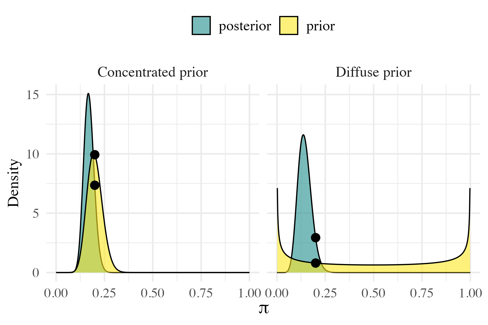
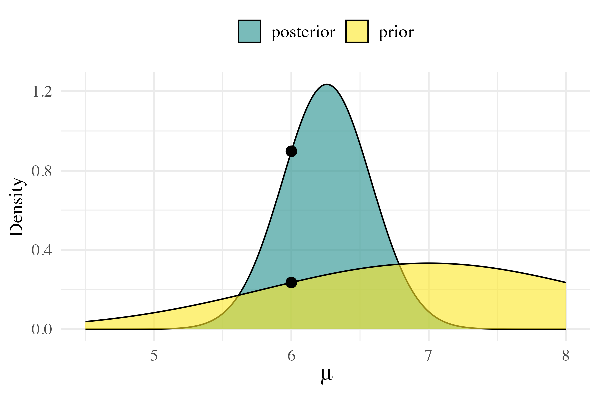

```{r, include=FALSE}
knitr::opts_chunk$set(
  echo = TRUE,
  include = !knitr::is_latex_output()
)
```

# Chapter 8 &nbsp; Posterior Inference & Prediction
```{=latex}
\authorline
```
This additional material is **not part of the official Bayes Rules! book**, but was developed specifically for the Bayesian Statistics course in the Bachelor of Psychology program at the University of Amsterdam. It is intended as a supplement to Chapter 8. 

Instructors interested in adapting this addendum for their own courses are encouraged to contact [Maarten Marsman](mailto:m.marsman@uva.nl). Please attribute when using or modifying this material.

This material is licensed under [CC BY 4.0](https://creativecommons.org/licenses/by/4.0/).


## 8.8 &nbsp; Testing Point Hypotheses


In Sections 8.2.1 and 8.2.2, we focused on testing **interval hypotheses** using posterior tail probabilities. For instance, a researcher might ask whether the proportion of Gen X or younger artists in U.S. modern art museums is less than 0.5. But what if we want to assess the evidence for a **specific value** of that proportion?

Let’s return to the modern art example from earlier in this chapter. Let $\pi$ denote the proportion of Gen X or younger artists represented in U.S. modern art museums. Suppose museum administrators have set a specific benchmark: they aim for a representation rate of 20% of their artists to be from Gen X or younger generations. Does the observed data support this benchmark? That is, does the data support the hypothesis $\pi = 0.2$? In a random sample of 100 artists, 14 were Gen X or younger. Using a $\text{Beta}(4, 6)$ prior on $\pi$, we update to a $\text{Beta}(18, 92)$ posterior. While this gives us a full distribution for $\pi$, we now want to assess the evidence for a specific value within that distribution: $H_0\text{:}~\pi = 0.2$. This is a **point null hypothesis**, and in this section, we’ll explore how to evaluate such hypotheses using a Bayesian approach.

```{=latex}
\begin{tcolorbox}[title=Interval and point hypotheses,bookgraybox]
An \textbf{interval hypothesis} asserts that a parameter falls within a range of values (e.g., $\pi < 0.5$ or $0.3 < \pi < 0.7$). A \textbf{point hypothesis} asserts that the parameter equals a single value (e.g., $\pi = 0.2$).
\end{tcolorbox}
```

<!-- ```{=html} -->
<!-- <div class="describe" markdown="1"> -->
<!-- <strong>Interval and point hypotheses</strong> -->

<!-- An <strong>interval hypothesis</strong> asserts that a parameter falls within a range of values (e.g., $\pi < 0.5$ or $0.3 < \pi < 0.7$). A <strong>point hypothesis</strong> asserts that the parameter equals a single value (e.g., $\pi = 0.2$). -->
<!-- </div> -->
<!-- ``` -->

In earlier sections, we described our uncertainty about $\pi$ using its posterior distribution. This is great for estimating $\pi$ or for assessing interval hypotheses like $\pi < 0.5$. But this approach breaks down when testing a point hypothesis such as $H_0\text{:}~\pi = 0.2$. Under a continuous prior, the posterior probability that $\pi$ equals exactly 0.2 is zero, so we can’t directly assess this hypothesis using posterior probabilities alone.

Instead, we reframe the problem as a comparison between two competing models: $H_0$, in which $\pi$ is fixed at 0.2, and $H_1$, in which $\pi$ is unknown and assigned a prior distribution such as $\text{Beta}(a, b)$. This marks an important shift; in earlier chapters, we compared possible values of $\pi$ within a single model. Now, we are comparing two different models for how the data might have arisen.

To do this, we’ll once again use the **Bayes factor**[^oddsformulation], which quantifies how well each model predicts the observed data:
$$
BF_{01} = \frac{f(y \mid H_0)}{f(y \mid H_1)}.
$$

When comparing models, the Bayes factor is the ratio of their **marginal likelihoods**: how well each model predicts the observed data, averaging over any uncertainty in parameters. Under $H_0$, where $\pi$ is fixed at 0.2, the marginal likelihood is simply the binomial likelihood evaluated at that value:
$$
f(y \mid H_0) = \binom{n}{y} \, 0.2^y \, (1 - 0.2)^{n - y}.
$$
Under $H_1$, where $\pi$ is unknown and modeled with a prior, the marginal likelihood averages the binomial likelihood across all possible values of $\pi$, weighted by their prior plausibility. If $\pi \sim \text{Beta}(\alpha, \beta)$, then, just as we saw in Chapter 3, this integral has a closed-form solution:
$$
f(y \mid H_1) = \int_0^1 f(y \mid \pi) \, f(\pi) \, d\pi = \binom{n}{y} \, \frac{B(y + \alpha, n - y + \beta)}{B(\alpha, \beta)}.
$$

```{=latex}
\begin{tcolorbox}[title=From parameters to models,bookgraybox]
In Section 8.2, we evaluated hypotheses by examining the posterior distribution of a parameter. For example, we might ask whether most of the posterior mass falls below a certain threshold. But a \textbf{point hypothesis} like $\pi = 0.2$ can’t be assessed this way: a continuous distribution assigns zero probability to any exact value.

Instead, we now treat each hypothesis as a separate \textbf{model}: one that fixes $\pi$ at a specific value, and one that assigns a prior distribution to $\pi$. This leads to a new perspective: we use the \textbf{Bayes factor} to compare how well each model predicts the observed data by contrasting their \textbf{marginal likelihoods}:
$$
BF_{01} = \frac{f(y\mid H_0)}{f(y \mid H_1)}.
$$
The marginal likelihood $f(y \mid H_i)$ captures how well model $H_i$ anticipated the observed data. Under $H_0$, where $\pi$ is fixed, this is simply the likelihood evaluated at that value. Under $H_1$, where $\pi$ is unknown, it’s the average of the likelihood across all possible values of $\pi$, weighted by the prior.
\end{tcolorbox}
```

<!-- ```{=html} -->
<!-- <div class="bookgraybox"> -->
<!--   <div class="title">From parameters to models</div> -->
<!-- In Section 8.2, we evaluated hypotheses by examining the posterior distribution of a parameter. For example, we might ask whether most of the posterior mass falls below a certain threshold. But a <strong>point hypothesis</strong> like $\pi = 0.2$ can’t be assessed this way: a continuous distribution assigns zero probability to any exact value. -->

<!-- Instead, we now treat each hypothesis as a separate <strong>model</strong>: one that fixes $\pi$ at a specific value, and one that assigns a prior distribution to $\pi$. This leads to a new perspective: we use the <strong>Bayes factor</strong> to compare how well each model predicts the observed data by contrasting their <strong>marginal likelihoods</strong>: -->
<!-- $$ -->
<!-- BF_{01} = \frac{f(y \mid H_0)}{f(y \mid H_1)}. -->
<!-- $$ -->
<!-- The marginal likelihood $f(y \mid H_i)$ captures how well model $H_i$ anticipated the observed data. Under $H_0$, where $\pi$ is fixed, this is simply the likelihood evaluated at that value. Under $H_1$, where $\pi$ is unknown, it’s the average of the likelihood across all possible values of $\pi$, weighted by the prior.</p> -->
<!-- </div> -->
<!-- ``` -->

We can compute this Bayes factor in R. Both marginal likelihoods have closed-form expressions: under $H_0$, where $\pi$ is fixed, and under $H_1$, where $\pi$ is unknown. This allows us to calculate them directly:
```{=latex}
\begin{lstlisting}
# Specify data, prior, and posterior
y ±<-± §14§
n ±<-± §100§
alpha ±<-± §4§
beta ±<-± §6§
alpha_post ±<-± alpha + y
beta_post ±<-± beta + n - y

# Compute marginal likelihoods
marg_like_H0 ±<-± dbinom(y, @size =@ n, @prob =@ §0.2§)
marg_like_H1 ±<-± choose(n, y) * @§beta@§(alpha_post, beta_post) / @§beta@§(alpha, beta)

# Compute Bayes factor in favor of H0
BF_01 ±<-± marg_like_H0 / marg_like_H1
\end{lstlisting}
```
<!-- ```{r} -->
<!-- # Specify observed data and prior -->
<!-- y <- 14 -->
<!-- n <- 100 -->
<!-- alpha <- 4 -->
<!-- beta <- 6 -->
<!-- alpha_post <- alpha + y -->
<!-- beta_post <- beta + n - y -->

<!-- # Compute marginal likelihoods -->
<!-- marg_like_H0 <- dbinom(y, size = n, prob = 0.2) -->
<!-- marg_like_H1 <- choose(n, y) * beta(alpha_post, beta_post) / beta(alpha, beta) -->

<!-- # Compute Bayes factor in favor of H0 -->
<!-- BF_01 <- marg_like_H0 / marg_like_H1 -->
<!-- ``` -->
This result indicates that the observed data are about 4.5 times more likely under $H_0$ than under $H_1$.

```{=latex}
\begin{tcolorbox}[title=Interpreting the Bayes Factor,bookgraybox]
Bayes factors offer a continuous measure of evidence and have an inherently contextual interpretation. However, a commonly used rule of thumb offers some general guidance. The table below reflects thresholds that are commonly referenced in the literature.

\begin{center}
\begin{tabular}{ll}
\toprule
Bayes Factor $\text{BF}_{10}$ & Evidence for $H_1$ over $H_0$ \\
\midrule
$< 1/10$ & Strong evidence for $H_0$ \\
$1/10$ to $1/3$ & Moderate evidence for $H_0$ \\
$1/3$ to $1$ & Anecdotal evidence for $H_0$ \\
$1$ & No evidence (neutral) \\
$1$ to $3$ & Anecdotal evidence for $H_1$ \\
$3$ to $10$ & Moderate evidence for $H_1$ \\
$> 10$ & Strong evidence for $H_1$ \\
\bottomrule
\end{tabular}
\end{center}
\end{tcolorbox}
```

<!-- ::: {.content-visible when-format="html"} -->

<!-- ```{=html} -->
<!-- <div class="bookgraybox"> -->
<!--   <div class="title">Interpreting the Bayes Factor</div> -->
<!--   <p>Bayes factors offer a continuous measure of evidence and have an inherently contextual interpretation. However, a commonly used rule of thumb offers some general guidance. The table below reflects thresholds that are commonly referenced in the literature.</p> -->
<!--   <table> -->
<!--     <thead> -->
<!--       <tr><th>Bayes Factor $\text{BF}_{10}$</th><th>Evidence for $H_1$ over $H_0$</th></tr> -->
<!--     </thead> -->
<!--     <tbody> -->
<!--       <tr><td>$< 1/10$</td><td>Strong evidence for $H_0$</td></tr> -->
<!--       <tr><td>$1/10$ to $1/3$</td><td>Moderate evidence for $H_0$</td></tr> -->
<!--       <tr><td>$1/3$ to $1$</td><td>Anecdotal evidence for $H_0$</td></tr> -->
<!--       <tr><td>$1$</td><td>No evidence (neutral)</td></tr> -->
<!--       <tr><td>$1$ to $3$</td><td>Anecdotal evidence for $H_1$</td></tr> -->
<!--       <tr><td>$3$ to $10$</td><td>Moderate evidence for $H_1$</td></tr> -->
<!--       <tr><td>$> 10$</td><td>Strong evidence for $H_1$</td></tr> -->
<!--     </tbody> -->
<!--   </table> -->
<!-- </div> -->
<!-- ``` -->

<!-- ::: -->

Now that we’ve interpreted the result, let’s return to how we calculated it. In this example, we were able to compute both marginal likelihoods directly. Under $H_0$, it’s just the binomial likelihood at $\pi = 0.2$. Under $H_1$, it’s the marginal likelihood from a beta-binomial model, which has a convenient closed-form solution. This gave us everything we needed to compute the Bayes factor directly. But there’s an even easier option. In the next section, we’ll introduce the **Savage–Dickey density ratio**, originally proposed by @dickey1970weighted. It’s a clever shortcut that lets us compute the Bayes factor without evaluating both marginal likelihoods. This can be especially helpful when the integrals are messy or when we just don’t feel like doing all the algebra.

### 8.8.1 &nbsp; The Savage–Dickey Density Ratio

When testing a point hypothesis like $H_0\text{:}~\pi = 0.2$ against a model that treats $\pi$ as unknown, we’re comparing two models: one that fixes $\pi$ at a specific value, and one that assigns it a prior distribution. If the null model $H_0$ is **nested** within the alternative $H_1$, meaning that $H_0$ represents a special case of the same model, and if the value $\pi = 0.2$ lies within the support of the prior used under $H_1$, we can use a shortcut known as the **Savage–Dickey density ratio**:
$$
BF_{01} = \frac{f(\pi = 0.2 \mid y)}{f(\pi = 0.2)}
$$
In words, the Bayes factor is the **posterior density** at the null value of $\pi$ divided by the **prior density** at that same value. This shortcut avoids the need to compute either marginal likelihood directly, while still capturing how the data have shifted our beliefs about $\pi = 0.2$.

Let’s apply the Savage–Dickey density ratio to our modern art example. Recall that we observed 14 Gen X or younger artists in a sample of 100, and used a $\text{Beta}(4, 6)$ prior for $\pi$. This updated to a $\text{Beta}(18, 92)$ posterior. According to the Savage–Dickey shortcut, the Bayes factor in favor of $H_0\text{:}~\pi = 0.2$ is equal to the ratio of the posterior to the prior density at $\pi = 0.2$.
```{=latex}
\begin{lstlisting}
# Densities at the point of interest
pi0 ±<-± §0.2§
prior_density ±<-± dbeta(pi0, alpha, beta)
posterior_density ±<-± dbeta(pi0, alpha_post, beta_post)

# Compute Bayes factor using Savage-Dickey ratio
BF_01_savage_dickey ±<-± posterior_density / prior_density
\end{lstlisting}
```
<!-- ```{r} -->
<!-- # Densities at the point of interest -->
<!-- pi0 <- 0.2 -->
<!-- prior_density <- dbeta(pi0, alpha, beta) -->
<!-- posterior_density <- dbeta(pi0, alpha_post, beta_post) -->

<!-- # Compute Bayes factor using Savage-Dickey ratio -->
<!-- BF_01_savage_dickey <- posterior_density / prior_density -->
<!-- ``` -->
Not surprisingly, this gives us the same Bayes factor of approximately 4.5. This suggests moderate evidence in favor of the null model $H_0\text{:}~\pi = 0.2$.

The Savage–Dickey density ratio also offers an intuitive lens for understanding Bayes factors. It focuses directly on how our beliefs about a specific value (here, $\pi = 0.2$) shift from prior to posterior. If the posterior density at $\pi = 0.2$ is substantially higher than the prior density, then the data have increased our confidence in that value, and the Bayes factor reflects that support for $H_0$. If the posterior and prior densities are similar, the data haven't swayed our beliefs much, and the Bayes factor will stay close to 1. If the posterior is lower than the prior at $\pi = 0.2$, the data have pulled us away from $H_0$, and the Bayes factor will favor the alternative.

To make this idea more concrete, let’s return to the modern art example. We observed $y = 14$ Gen X or younger artists in a sample of $n = 100$, and want to assess the point hypothesis $H_0\text{:}~\pi = 0.2$. Using the Savage–Dickey approach, we’ll compute the Bayes factor under two different priors:

- A diffuse prior, $\text{Beta}(0.5, 0.5)$, which reflects little prior knowledge about $\pi$.
- A concentrated prior, $\text{Beta}(20, 80)$, which encodes strong prior belief that $\pi$ is close to 0.2.

The code below computes the prior and posterior densities at $\pi = 0.2$ under each prior, then uses their ratio to obtain the Bayes factor.
```{=latex}
\begin{lstlisting}
library(tidyverse)

# Observed data
y <- §14§
n <- §100§
pi0 <- §0.2§

# Case 1: Diffuse prior Beta(0.5, 0.5)
alpha1 <- §0.5§; beta1 <- §0.5§
alpha1_post <- alpha1 + y
beta1_post <- beta1 + n - y
prior1 <- dbeta(pi0, alpha1, beta1)
post1 <- dbeta(pi0, alpha1_post, beta1_post)
BF1 <- post1 / prior1

# Case 2: Concentrated prior Beta(20, 80)
alpha2 <- §20§; beta2 <- §80§
alpha2_post <- alpha2 + y
beta2_post <- beta2 + n - y
prior2 <- dbeta(pi0, alpha2, beta2)
post2 <- dbeta(pi0, alpha2_post, beta2_post)
BF2 <- post2 / prior2

# Compare results
tibble(
  @Prior =@ c("Beta(0.5,0.5)", "Beta(20,80)"),
  @Prior_Density =@ c(prior1, prior2),
  @Posterior_Density =@ c(post1, post2),
  @Bayes_Factor =@ c(BF1, BF2)
)

# A tibble: 2 × 4
#   Prior        Prior_Density Posterior_Density Bayes_Factor
#   <chr>                <dbl>             <dbl>        <dbl>
# 1 Beta(0.5,0.5)        0.796             2.94          3.69
# 2 Beta(20,80)          9.93              7.36          0.741
\end{lstlisting}
```

<!-- ```{r} -->
<!-- library(tidyverse) -->

<!-- # Observed data -->
<!-- y <- 14 -->
<!-- n <- 100 -->
<!-- pi0 <- 0.2 -->

<!-- # Case 1: Diffuse prior Beta(0.5, 0.5) -->
<!-- alpha1 <- 0.5; beta1 <- 0.5 -->
<!-- alpha1_post <- alpha1 + y -->
<!-- beta1_post <- beta1 + n - y -->
<!-- prior1 <- dbeta(pi0, alpha1, beta1) -->
<!-- post1 <- dbeta(pi0, alpha1_post, beta1_post) -->
<!-- BF1 <- post1 / prior1 -->

<!-- # Case 2: Concentrated prior Beta(20, 80) -->
<!-- alpha2 <- 20; beta2 <- 80 -->
<!-- alpha2_post <- alpha2 + y -->
<!-- beta2_post <- beta2 + n - y -->
<!-- prior2 <- dbeta(pi0, alpha2, beta2) -->
<!-- post2 <- dbeta(pi0, alpha2_post, beta2_post) -->
<!-- BF2 <- post2 / prior2 -->

<!-- # Compare results -->
<!-- tibble( -->
<!--   Prior = c("Beta(0.5,0.5)", "Beta(20,80)"), -->
<!--   Prior_Density = c(prior1, prior2), -->
<!--   Posterior_Density = c(post1, post2), -->
<!--   Bayes_Factor = c(BF1, BF2) -->
<!-- ) -->
<!-- ``` -->

In this example, the diffuse prior yields a moderate Bayes factor in favor of $H_0$, because the data substantially increase the plausibility of $\pi = 0.2$. The concentrated prior, by contrast, yields a much weaker Bayes factor. Since it already favored $\pi = 0.2$, the data provided little new information, and the resulting Bayes factor even shows a slight preference for $H_1$.

This illustrates a key idea: the Bayes factor measures the data’s impact on our beliefs. If a prior already leans heavily toward $H_0$, then even supportive data won’t change our beliefs much, and the Bayes factor may remain close to 1.

This becomes even clearer when we visualize both the prior and posterior densities of $\pi$, marking the null value $\pi = 0.2$. This visual perspective highlights how the choice of prior shapes the posterior, and how the Savage–Dickey ratio captures the contrast between them. Figure 1 compares the two scenarios.

```{r, include=FALSE}
library(tidyverse)

# Data and null value
x <- 14
n <- 100
pi0 <- 0.2

# Two priors: diffuse and concentrated
priors <- tribble(
  ~label, ~a, ~b,
  "Diffuse prior", 0.5, 0.5,
  "Concentrated prior", 20, 80
)

# Expand grid of pi values
pi_vals <- tibble(pi = seq(0, 1, length.out = 500)) %>%
  crossing(priors) %>%
  mutate(
    a_post = a + x,
    b_post = b + n - x,
    prior = dbeta(pi, a, b),
    posterior = dbeta(pi, a_post, b_post)
  ) %>%
  pivot_longer(cols = c(prior, posterior),
               names_to = "distribution",
               values_to = "density")

# Highlight densities at pi = 0.2
points <- priors %>%
  mutate(
    a_post = a + x,
    b_post = b + n - x,
    prior = dbeta(pi0, a, b),
    posterior = dbeta(pi0, a_post, b_post)
  ) %>%
  pivot_longer(cols = c(prior, posterior),
               names_to = "distribution",
               values_to = "density") %>%
  mutate(pi = pi0)

# Plot
p <- ggplot(pi_vals, aes(x = pi, y = density, fill = distribution)) +
  geom_area(alpha = 0.6, position = "identity", color = "black") +
  geom_point(data = points,
             aes(x = pi, y = density),
             shape = 21,
             fill = "black",
             color = "black",
             size = 3.5,
             stroke = 0.3,
             show.legend = FALSE) +
  facet_wrap(~ label, ncol = 2) +
  scale_fill_manual(values = c("prior" = "#FDE725FF",
                               "posterior" = "#21908CFF")) +
  labs(x = expression(paste("\u03c0")), y = "Density") +
  theme_minimal(base_size = 14, base_family = "Times") +
  theme(
    legend.title = element_blank(),
    legend.position = "top",
    legend.text = element_text(size = 13),
    axis.title = element_text(size = 14),
    axis.title.x = element_text(size = 16),
    axis.text = element_text(size = 12),
    strip.text = element_text(size = 13)
  )

# Save as PDF and PNG
ggsave("savage_dickey_plot.pdf", plot = p, width = 6, height = 4, device = cairo_pdf)
ggsave("savage_dickey_plot.png", plot = p, width = 6, height = 4, dpi = 300)
```

```{=latex}
\begin{figure}[H]
  \centering
  \includegraphics[width=0.8\textwidth]{savage_dickey_plot.pdf}
  \caption{Prior and posterior densities for $\pi$ under two different priors: a diffuse $\text{Beta}(0.5, 0.5)$ and a concentrated $\text{Beta}(20, 80)$. The Bayes factor is the ratio of the posterior to prior density at $\pi = 0.2$, marked by the black dot.}
\end{figure}
```

<!-- ```{=html} -->
<!-- <div style="text-align: center;"> -->
<!--    -->
<!-- </div> -->
<!-- <p style="text-align: center;"><em>Figure 1: Prior and posterior densities for $\pi$ under two different priors: a diffuse $\text{Beta}(0.5, 0.5)$ and a concentrated $\text{Beta}(20, 80)$. The Bayes factor is the ratio of the posterior to prior density at $\pi = 0.2$, marked by the black dot.</em></p> -->
<!-- ``` -->

```{=latex}
\begin{tcolorbox}[title=The Savage–Dickey Density Ratio,bookgraybox]
The Savage–Dickey density ratio offers a shortcut for comparing point hypotheses. The Bayes factor is simply the ratio of posterior to prior density at the value of interest. This method is especially convenient when:

\begin{itemize}[noitemsep, topsep=0pt]
\item The null hypothesis is a point value nested within the alternative.
\item The prior is continuous at that value.
\item We can evaluate (or approximate) the posterior density at that point.
\end{itemize}

Even when marginal likelihoods are difficult to compute, the Savage–Dickey approach provides an intuitive and accessible way to assess how the data have shifted our beliefs.
\end{tcolorbox}
```

<!-- ```{=html} -->
<!-- <div class="bookgraybox"> -->
<!--   <div class="title">The Savage–Dickey Density Ratio</div> -->
<!--   <p>The Savage–Dickey density ratio offers a shortcut for comparing point hypotheses. The Bayes factor is simply the ratio of posterior to prior density at the value of interest. This method is especially convenient when:</p> -->
<!--   <ul> -->
<!--     <li>The null hypothesis is a point value nested within the alternative.</li> -->
<!--     <li>The prior is continuous at that value.</li> -->
<!--     <li>We can evaluate (or approximate) the posterior density at that point.</li> -->
<!--   </ul> -->
<!--   <p>Even when marginal likelihoods are difficult to compute, the Savage–Dickey approach provides an intuitive and accessible way to assess how the data have shifted our beliefs.</p> -->
<!-- </div> -->
<!-- ``` -->

### 8.8.2 &nbsp; Savage–Dickey for the Normal–Normal Model

In the modern art example, we were able to compute the Bayes factor analytically because both marginal likelihoods had closed-form expressions. But what if the marginal likelihood under the alternative model isn’t so easy to compute? This is where the **Savage–Dickey density ratio** really shines. It allows us to compute the Bayes factor for a **point null hypothesis** without explicitly evaluating either model’s marginal likelihood, as long as the null is nested within the alternative and we can evaluate the prior at the null value of the parameter. To illustrate this, consider a **Normal–Normal model**. Suppose we’re studying a process where recent data trends suggest the average value of some quantity has increased to around 6.5. However, there’s continued interest in whether the true mean might still be 6, perhaps because of a historical standard, regulatory threshold, or scientific benchmark. We’ll reflect our current belief using a Normal prior centered at 6.5, and model the data using a Normal likelihood with known standard deviation. Our goal is to test the **point hypothesis** $H_0\text{: } \mu = 6$.

The model setup is as follows:
$$
\begin{aligned}
\bar{y} &= 5.735, \quad n = 25\\
\sigma &= 0.5\\
\mu &\sim N(6.5,\ 0.4^2)\\
H_0 &: \mu = 6
\end{aligned}
$$

```{=latex}
\begin{lstlisting}
# Prior parameters
theta <- §6.5§
tau <- §0.4§

# Data
ybar <- §5.735§
n <- §25§
sigma <- §0.5§

# Posterior parameters
mu_post <- (theta * sigma^§2§ + ybar * n * tau^§2§) / (sigma^§2§ + n * tau^§2§)
var_post <- (tau^§2§ * sigma^§2§) / (sigma^§2§ + n * tau^§2§)
sd_post <- @§sqrt@§(var_post)

# Densities at mu = 6
prior_density <- @§dnorm@§(§6§, @mean =@ theta, @sd =@ tau)
posterior_density <- @§dnorm@§(§6§, @mean =@ mu_post, @sd =@ sd_post)

# Bayes factor
BF_01 <- posterior_density / prior_density
BF_01
\end{lstlisting}
```

<!-- ```{r} -->
<!-- # Prior parameters -->
<!-- theta <- 6.5 -->
<!-- tau <- 0.4 -->

<!-- # Data -->
<!-- ybar <- 5.735 -->
<!-- n <- 25 -->
<!-- sigma <- 0.5 -->

<!-- # Posterior parameters -->
<!-- mu_post <- (theta * sigma^2 + ybar * n * tau^2) / (sigma^2 + n * tau^2) -->
<!-- var_post <- (tau^2 * sigma^2) / (sigma^2 + n * tau^2) -->
<!-- sd_post <- sqrt(var_post) -->

<!-- # Densities at mu = 6 -->
<!-- prior_density <- dnorm(6, mean = theta, sd = tau) -->
<!-- posterior_density <- dnorm(6, mean = mu_post, sd = sd_post) -->

<!-- # Bayes factor -->
<!-- BF_01 <- posterior_density / prior_density -->
<!-- BF_01 -->
<!-- ``` -->

In this example, the Bayes factor turns out to be a little less than 1, indicating anecdotal evidence **against** the point hypothesis $H_0\text{: } \mu = 6$. Although $\mu = 6$ isn’t far from the prior mean of 6.5, the observed data ($\bar{y} = 5.735$) pull the posterior away from that value enough to substantially reduce the density at $\mu = 6$.

This highlights a key strength of the Savage–Dickey method: even when marginal likelihoods are difficult to compute, we can still assess evidence using familiar prior and posterior distributions. The only requirement is that we can evaluate their densities at the null value (a much simpler task in many common models). The figure below shows both distributions and marks $\mu = 6$, the point at which the Bayes factor is computed. When the posterior density at this point is higher than the prior, the Bayes factor favors $H_0$; when it’s lower, it favors $H_1$.

```{r, include=FALSE}
library(tidyverse)

# Data: Normal likelihood with known sigma
xbar <- 6.2
n <- 20
sigma <- 1.5
mu0 <- 6  # Null value

# Prior: Normal
mu_prior <- 7
tau <- 1.2

# Posterior: derived from Normal-Normal conjugacy
mu_post <- (mu_prior / tau^2 + n * xbar / sigma^2) / (1 / tau^2 + n / sigma^2)
tau_post <- sqrt(1 / (1 / tau^2 + n / sigma^2))

# Densities at mu0
dens_prior <- dnorm(mu0, mean = mu_prior, sd = tau)
dens_post  <- dnorm(mu0, mean = mu_post, sd = tau_post)

# Data for prior and posterior curves
mu_vals <- tibble(mu = seq(4.5, 8, length.out = 500)) %>%
  mutate(
    prior = dnorm(mu, mu_prior, tau),
    posterior = dnorm(mu, mu_post, tau_post)
  ) %>%
  pivot_longer(cols = c(prior, posterior),
               names_to = "distribution",
               values_to = "density")

# Point at mu0
point <- tibble(
  mu = mu0,
  density = c(dens_prior, dens_post),
  distribution = c("prior", "posterior")
)

# Plot
p <- ggplot(mu_vals, aes(x = mu, y = density, fill = distribution)) +
  geom_area(alpha = 0.6, position = "identity", color = "black") +
  geom_point(data = point,
             aes(x = mu, y = density),
             shape = 21,
             fill = "black",
             color = "black",
             size = 3.5,
             stroke = 0.3,
             show.legend = FALSE) +
  scale_fill_manual(values = c("prior" = "#FDE725FF",
                               "posterior" = "#21908CFF")) +
  labs(x = expression(paste("\u03bc")), y = "Density") +
  theme_minimal(base_size = 14, base_family = "Times") +
  theme(
    legend.title = element_blank(),
    legend.position = "top",
    legend.text = element_text(size = 13),
    axis.title = element_text(size = 14),
    axis.title.x = element_text(size = 16),
    axis.text = element_text(size = 12)
  )

# Save
ggsave("savage_dickey_normal.pdf", plot = p, width = 6, height = 4, device = cairo_pdf)
ggsave("savage_dickey_normal.png", plot = p, width = 6, height = 4, dpi = 300)
```

```{=latex}
\begin{figure}[htb]
  \centering
  \includegraphics[width=0.7\textwidth]{savage_dickey_normal.pdf}
  \caption{Prior and posterior distributions for $\mu$, with the null value $\mu = 6$ marked. The Savage--Dickey Bayes factor is the ratio of posterior to prior density at this point.}
\end{figure}
```

<!-- ```{=html} -->
<!-- <div style="text-align: center;"> -->
<!--    -->
<!-- </div> -->
<!-- <p style="text-align: center;"><em>Figure: Prior and posterior densities for $\mu$, with the null value $\mu = 6$ marked. The Savage–Dickey Bayes factor is the ratio of posterior to prior density at this point.</em></p> -->
<!-- ``` -->

While the **Savage–Dickey method** offers an elegant shortcut in conjugate settings like the Normal–Normal model, its usefulness extends further, especially in more advanced models where closed-form solutions aren’t available. In more complex models, where posteriors or marginal likelihoods lack closed-form expressions, we can still apply Savage–Dickey if we can **estimate the posterior density at the null value** using simulation.

As seen in **Chapters 6 and 7**, grid approximation and MCMC methods allow us to sample from posterior distributions even when they don’t have analytical solutions. By combining these samples with **density estimation techniques** (such as kernel density estimation using `density()` or `logspline()` in R) we can estimate the posterior density at the point null. If the **prior density is available analytically**, the Bayes factor follows as a simple ratio. This preserves the spirit of the Savage–Dickey approach, even in simulation-based scenarios.

### Summary

In this section, we explored **Bayesian methods for testing point hypotheses**, focusing on situations where we want to assess whether a parameter equals a specific value, such as $\pi = 0.2$ or $\mu = 6$. Unlike interval hypotheses, point hypotheses require a shift in perspective: rather than calculating the posterior probability of a range, we compare **two competing models**: one that fixes the parameter at a point value ($H_0$), and one that treats it as unknown ($H_1$).

To compare these models, we introduced the **Bayes factor**:

- A ratio of **marginal likelihoods** that measures how well each model predicts the observed data
- Computable directly when closed-form expressions are available (e.g., in beta-binomial or normal–normal models)

We then introduced the **Savage–Dickey density ratio**, a shortcut for computing Bayes factors when:

- The null hypothesis $H_0$ is **nested** within $H_1$
- We can compute or estimate the **prior and posterior densities** at the null value

This method simplifies computation, especially in conjugate models, and also provides an **intuitive interpretation** of the Bayes factor: a direct comparison of how much support the null value gains or loses after seeing the data.

Finally, we discussed how the Savage–Dickey method extends to **simulation-based settings**, such as those in Chapters 6 and 7, where we can estimate posterior densities from MCMC or grid-based samples and combine them with known priors.

In summary:

- **Bayes factors** allow us to formally compare models representing point hypotheses
- The **Savage–Dickey method** offers a convenient and interpretable way to compute Bayes factors when applicable
- The choice of **prior** can strongly influence the Bayes factor, highlighting the role of prior assumptions in hypothesis testing

[^oddsformulation]: In Section 8.2, we introduced the Bayes factor as the ratio of **posterior odds to prior odds**. This is the same quantity as the marginal likelihood ratio presented in this chapter: the Bayes factor can be understood either as the shift in odds between hypotheses or as a comparison of how well each model predicts the observed data.

```{=html}
<div id="refs" class="unnumbered">
  <h2>References</h2>
</div>
``` 


## 8.9 &nbsp; Exercises

::: {.exercise}
**Exercise 8.25 (Bayes Factor Revisited)**  
Answer more questions about Bayes Factors from your friend Enrique, who now has even more questions after completing Exercise 8.4.

a. What is a *point hypothesis*? Can we calculate its posterior probability?
b. What is an *interval hypothesis*? How do we evaluate support for it?
c. What is a *marginal likelihood* and how is it used in hypothesis testing?
d. What is the *Savage-Dickey density ratio* and when can we use it?
:::

\bigskip

::: {.exercise}
**Exercise 8.26 (Hypothesis tests: Part III)**  
Recall Exercise 8.10, in which you had a $N(10, 10^2)$ prior and a $N(5, 3^2)$ posterior. There, you tested the one-sided hypothesis $H_0\text{: } \mu \geq 5.2$ versus $H_1\text{: } \mu < 5.2$. Suppose that this time we wish to test the **point hypothesis** $H_0\text{: } \mu = 5.2$ against the alternative $H_1\text{: } \mu \neq 5.2$.  

a. Compute the Bayes Factor in favor of $H_0$ using the **Savage-Dickey density ratio**.
b. Based on your calculation, do the data support the point hypothesis $H_0\text{: } \mu = 5.2$? Explain your conclusion in the context of the Bayes Factor.
:::

\bigskip

::: {.exercise}
**Exercise 8.27 (Climate change: Point hypothesis testing)**  
In Exercise 8.15, you tested the hypothesis $H_0\text{: } \pi \leq 0.1$ versus $H_1\text{: } \pi > 0.1$ using a Beta-Binomial model and survey data on climate change beliefs. Suppose that this time you're interested in testing the **point hypothesis** $H_0\text{: } \pi = 0.1$ against the alternative $H_1\text{: } \pi \neq 0.1$.  

a. Compute the Bayes Factor in favor of $H_0$ using **marginal likelihoods** under the Beta-Binomial model.
b. Compute the Bayes Factor in support of $H_0$ using the **Savage-Dickey density ratio**.
c. Compare your answers in parts a and b. Are they close? Why might they differ slightly?
d. Based on your result, what do you conclude about the point hypothesis $H_0\text{: } \pi = 0.1$? Explain your reasoning in the context of the Bayes Factor.
:::

