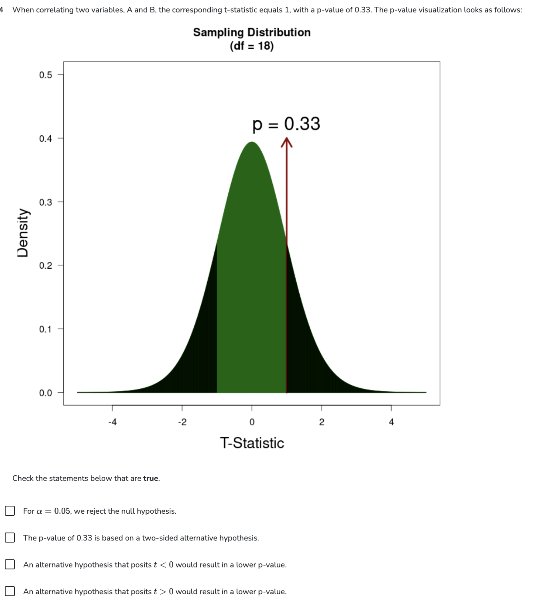
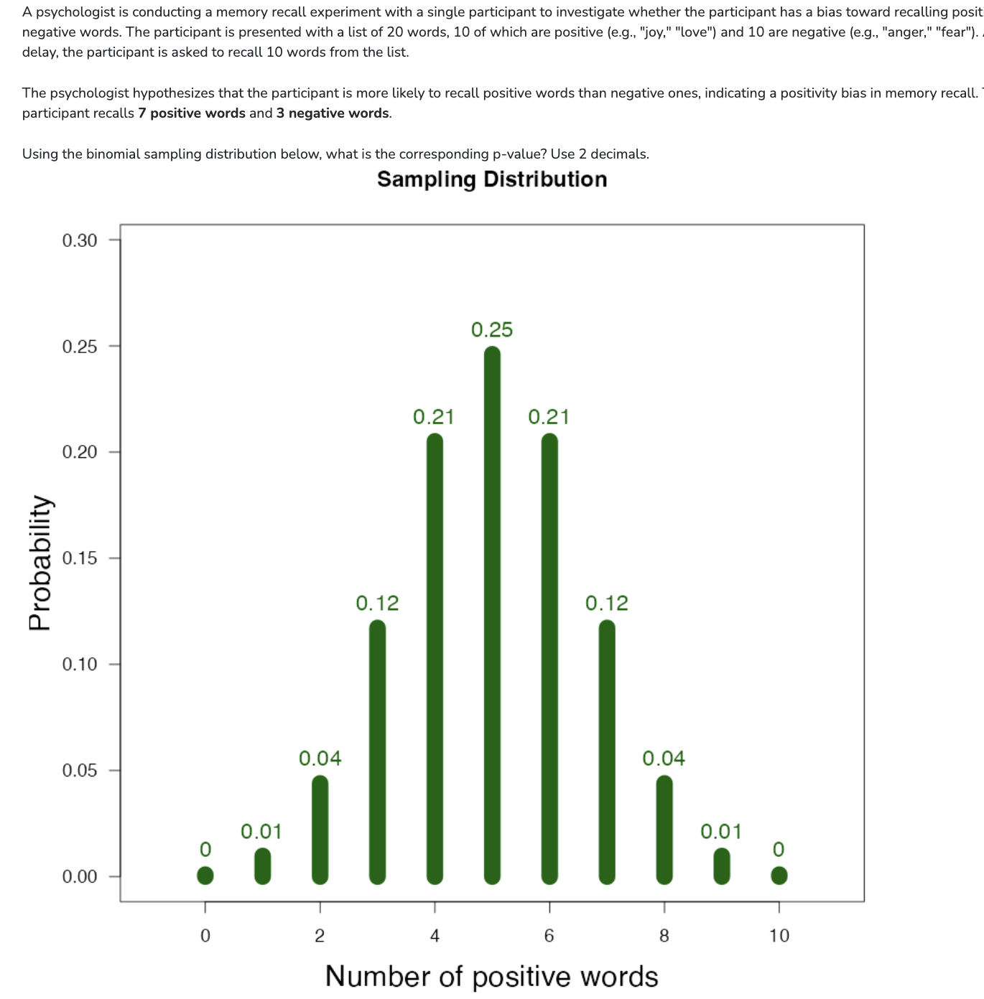

<!-- Deliberately bare: white ground, the two screenshots, nothing else.
     embed-resources inlines the PNGs, so the rendered .html is self-contained
     and can be sent on by itself without the ssr/images/ folder. -->

  
  

