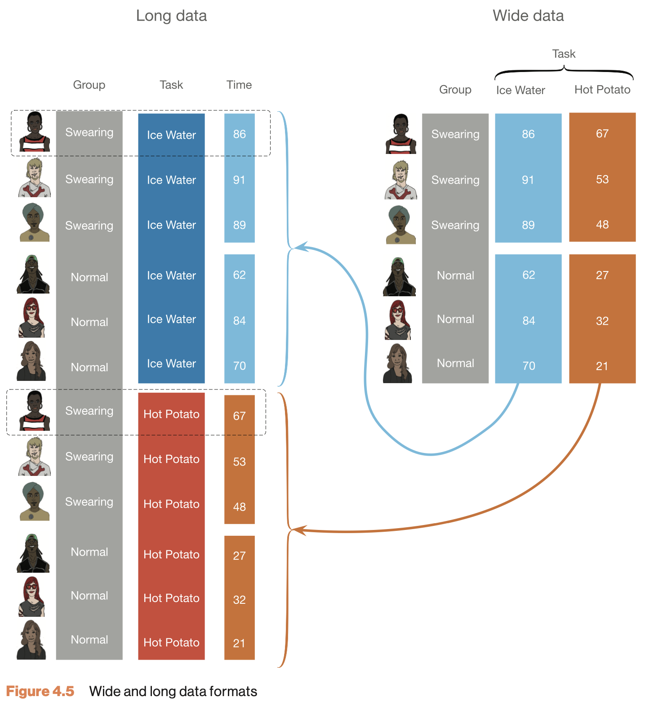

# Paired-samples t-test {.section}

Compare 2 dependent/paired group means

## Paired-samples t-test

In the Paired samples t-test the deviation ($D$) for each pair is calculated and the mean of these deviations ($\bar{D}$) is tested against the null hypothesis where $\mu = 0$.

$$t_{n-1} = \frac{\bar{D} - \mu}{ {SE}_D }$$
Where $n$ (the number of cases) minus $1$, are the degrees of freedom $df = n - 1$ and $SE_D$ is the standard error of $D$, defined as $s_D/\sqrt{n}$.

## Hypothesis

$$\LARGE{
  \begin{aligned}
  H_0 &: \bar{D} = \mu_D \\
  H_A &: \bar{D} \neq \mu_D \\
  H_A &: \bar{D} > \mu_D \\
  H_A &: \bar{D} < \mu_D \\
  \end{aligned}}$$

## Assumptions

* Normally distributed residuals (i.e., model errors)
* Random samples

## Wide data structure

index | k1 | k2
------|----|--
1     | x  | x
2     | x  | x
3     | x  | x
4     | x  | x

Where $k$ is the level of the categorical predictor variable and $x$ is the value of the outcome/dependent variable.


## Long vs. wide format



## Data example

We are going to use the IQ estimates we collected. You had to guess your neighbor's IQ and your own IQ.

Let's take a look at the data.

## IQ estimates

```{r paired-load-iq-data, echo=FALSE, warning=FALSE, message=FALSE, eval=TRUE}
source("../../_setup.R")
iqThisYear     <- iqYear()
data           <- loadIQData(iqThisYear)
IQ.next.to.you <- data$nextIQ
IQ.you         <- data$ownIQ
```


```{r paired-iq-estimates-table, echo=FALSE}
ssrTable(data)
```

## Calculate $D$ {.smaller .subsection}

```{r paired-calculate-difference-scores, echo=TRUE}
diffScores <- IQ.next.to.you - IQ.you
```


```{r paired-difference-scores-table, echo=FALSE}
data$diffScores <- diffScores
ssrTable(data, height = 315)
```

## Calculate $\bar{D}$

```{r paired-calculate-mean-difference, echo=TRUE}
diffScores      <- na.omit(diffScores) # get rid of all missing values
diffMean        <- mean(diffScores)
diffMean
```

And we also need n.

```{r paired-calculate-n, echo=TRUE}
n <- length(diffScores)
n
```

## Calculate t-value {.subsection}

$$t_{n-1} = \frac{\bar{D} - \mu}{ {SE}_D }$$

```{r paired-calculate-t-value, echo=TRUE}
mu <- 0                # Define mu

diffSD <- sd(diffScores)   # Calculate standard deviation
diffSE <- diffSD / sqrt(n) # Calculate standard error

df   <- n - 1          # Calculate degrees of freedom

# Calculate t
tStat <- ( diffMean - mu ) / diffSE
tStat
```

## Test for significance {.subsection}

$$ \mathcal{H}_A: \mu_D \neq 0 \rightarrow t \neq 0 $$ 

```{r paired-test-for-significance, echo=FALSE, fig.align = 'center'}
plotTstatSamplingDistribution(tVal = tStat, myDF = df, yAxisMod = 1.5)
```

## Effect-size $d$ {.subsection}

$$d = \frac{t}{\sqrt{n}}$$

```{r paired-effect-size-d, echo=TRUE}
d <- tStat/(sqrt(n))
d
```