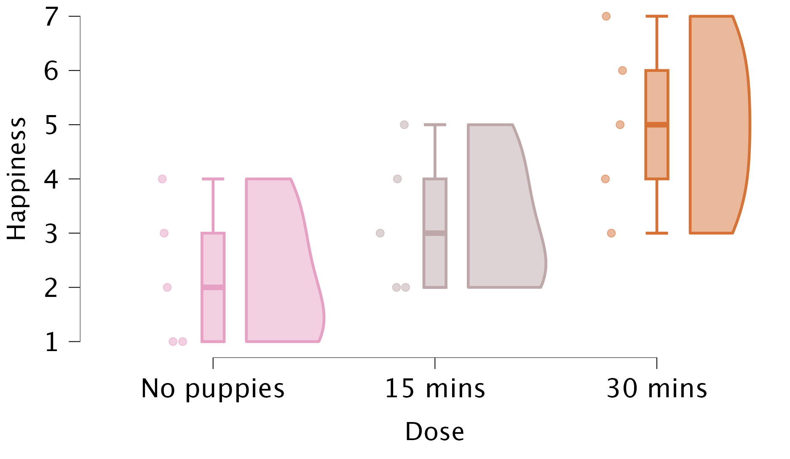
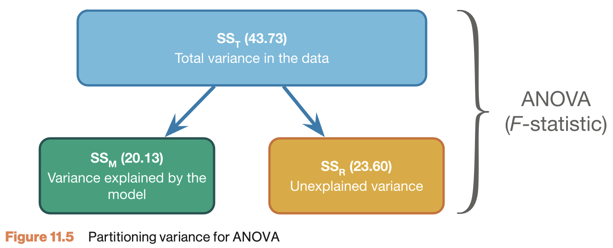
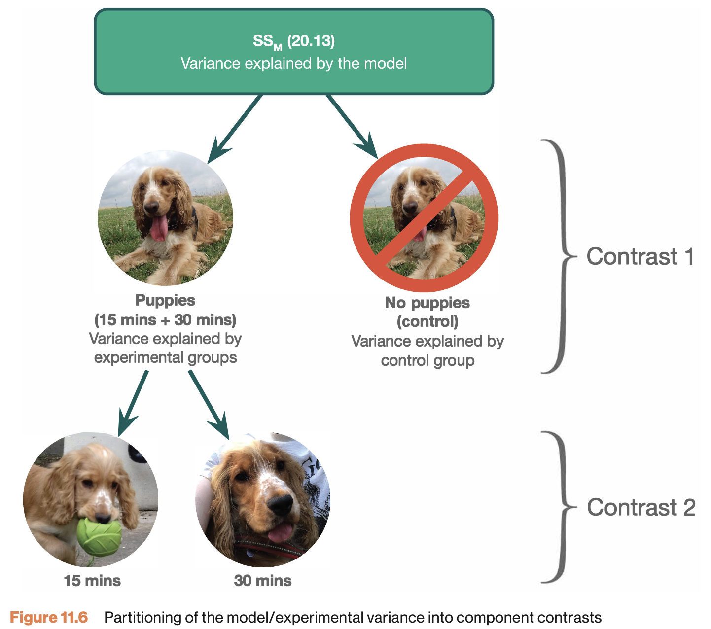

# One-way independent ANOVA {.section}

Compare 2 or more independent groups.

## Applet

[Link](https://jvd-ssr-oneway-anova.share.connect.posit.cloud/)

## Assumptions {.smaller}

Assuming the $H_0$ hypothesis to be true, the following should hold:

* Continuous variable
* Random sample
* Normally distributed residuals
    * Q-Q plots (or Shapiro-Wilk)
* Equal variance within groups (i.e., *Homogeneity of variances*)
    * Ratio of variances/sd (or Levene's test)
* For examples of violations, see [here](https://johnnydoorn.github.io/teaching-statistics/extra-texts/violating-assumptions-anova.html)

## Puppies!

We would like to contribute to the literature on animal-assisted therapy, and study the effect of puppy therapy. We divide 15 people over 3 conditions ($n_1 = n_2 = n_3 = 5$):

* Control condition (no puppies)
* Short exposure (15 minutes of puppies)
* Long exposure (30 minutes of puppies)

```{r anova-load-puppies-data, echo=FALSE}
rm(list=ls())
source("../../_setup.R")
data <- read.csv(datasetsPath("puppies.csv"))
x <- data$Happiness
data$Dose <- factor(data$Dose, levels = c("No puppies", "15 mins", "30 mins"))
plotData <- data
data <- data[, -1]
x.c <- x[data$Dose == "No puppies"] # Control 
x.k <- x[data$Dose == "15 mins"] # Knees
x.e <- x[data$Dose == "30 mins"] # Eyes
```

## The data {.smaller .scrollable}

```{r anova-the-data, echo=FALSE}
ssrTable(data)

```

[puppies.jasp](https://discoverjasp.com/repository/dsj1_data/data/puppies.jasp)

## The means

```{r anova-the-means, echo=FALSE}
tapply(data$Happiness, data$Dose, mean)
```

## Visualizing data




## Define the model {.subsection}

$$\hat{Happiness} = {Puppy dose} + {Error}$$

Regression model:

$$\hat{y} = b_0 + b_1 {dummy}_1 + b_2 {dummy}_2$$


## Define the dummies

$$\hat{y} = b_0 + b_1 {dummy}_1 + b_2 {dummy}_2$$

- ${dummy}_1 =$ 1 if participant received 15 minutes, 0 otherwise
- ${dummy}_2 =$: 1 if participant received 30 minutes, 0 otherwise

## Model predictions {.smaller}

$$\hat{y} = b_0 + b_1 {dummy}_1 + b_2 {dummy}_2$$

- If 0 puppies: we predict $b_0 + 0 + 0$
  - $b_0 =$  the mean of the control group
- If 15 min puppies: we predict $b_0 + b_1 + 0$
  - $b_1 =$ difference between control and 15 minute group
- If 30 min puppies: we predict $b_0 + 0 + b_2$
  - $b_2 =$ difference between control and 30 minute group

[Additional rambling here](https://johnnydoorn.github.io/teaching-statistics/extra-texts/predicting-with-dummies-1-variable.html)

## Data + predictions (i.e., group means) {.smaller .scrollable}

```{r anova-data-and-predictions, echo=FALSE}
data$Predictions <- tapply(data$Happiness, data$Dose, mean)[data$Dose]
ssrTable(data)
```


## Variance components {.smaller}

Variance | Sum of Squares | DF | Mean Squares | F-ratio
---------|----------------|----|--------------|---------
Model    | ${SS}_{model} = \sum n_k(\bar{X}_k - \bar{X})^2$ | $k-1$ | $\frac{{SS}_{model}}{{df}_{model}}$ | $\frac{{MS}_{model}}{{MS}_{residual}}$
Residual | ${SS}_{residual} = \sum s_k^2 (n_k - 1)$            | $N-k$ | $\frac{{SS}_{residual}}{{df}_{residual}}$ | 
Total    | ${SS}_{total} = {SS}_{model} + {SS}_{residual}$     | $N-1$ | $\frac{{SS}_{total}}{{df}_{total}}$ | 

Where $N$ is the total sample size, $n_k$ is the sample size per category and $k$ is the number of categories. Finally $s_k^2$ is the variance per category.

## Variance questions {.smaller}

- How much total variance is there in the dependent variable?
  - Total variance = distance between observations and grand mean

- How much of this variance can we explain by looking at the group means?
  - Model variance = distance between group means and grand mean
- How much of this variance is **not** explained by the group means?
  - Residual variance = distance between group means and observations

> DV = Model + Error

## Total variance {.smaller}

$${SS}_{total} = \sum(x - \bar{x})^2$$

```{r anova-total-variance, echo=TRUE}
N <- length(x)

ss.t <- sum( (x - mean(x))^2 )
ss.t

ss.t / (N-1) # ms.t
```


$${MS}_{total} = \frac{SS_{total}}{N-1} = s_x^2$$

```{r anova-total-variance-result, echo=FALSE}
ms.t <- var(x)
```


## Visual ${SS}_{total}  = `r round(ss.t, 3)`$

```{r anova-visual-ss-total, echo=FALSE}
colnames(plotData) <- c("pp", "group", "dv")
plotData$pp <- 1:nrow(data)
plotData$group <- as.factor(plotData$group)
plotSumSquares(data = plotData, whatPred = "Mean", myLimY = c(0, 10), whatDisplay = c("Segments", "Sums"))

# plotData <- data
# plotData$pp <- 1:nrow(data)
# colnames(plotData) <- c("dv", "group", "pp")
# plotSumSquares(data = plotData, whatPred = "Mean", myLimY = c(-3, 3), whatDisplay = "Segments")
```

## Model variance

$${MS}_{model} = \frac{{SS}_{model}}{{df}_{model}} \\ {df}_{model} = k - 1$$

Where $k$ is the number of independent groups and

$${SS}_{model} = \sum_{k} n_k (\bar{X}_k - \bar{X})^2$$

```{r anova-model-variance, echo=FALSE}
k   <- 3
n.c <- length(x.c)
n.k <- length(x.k)
n.e <- length(x.e)
```

--------

```{r anova-model-variance-result, echo=FALSE}
ss.m.c <- n.c * (mean(x.c) - mean(x))^2
ss.m.k <- n.k * (mean(x.k) - mean(x))^2
ss.m.e <- n.e * (mean(x.e) - mean(x))^2

ss.m <- sum(ss.m.c, ss.m.k, ss.m.e)
df.m <- (k - 1)
ms.m <- ss.m / df.m
```

## Visual ${SS}_{model} = `r round(ss.m, 3)`$

```{r anova-visual-ss-model, echo=FALSE}
plotSumSquares(data = plotData, sumSq = "Model", whatPred = "Group means", myLimY = c(0, 10), whatDisplay = c("Segments"))
```

## Residual variance {.smaller}

$${MS}_{residual} = \frac{{SS}_{residual}}{{df}_{residual}} \\ {df}_{residual} = N - k$$

where

$${SS}_{residual} = \sum_{k} s_k^2 (n_k - 1) = \sum_{k} \frac{\sum (x_{ik} - \bar{x}_k)^2}{(n_k - 1)} (n_k - 1)$$

```{r anova-error-variance, echo=FALSE}
ss.e.c <- var(x.c) * (n.c - 1)
ss.e.k <- var(x.k) * (n.k - 1)
ss.e.e <- var(x.e) * (n.e - 1)
ss.e   <- sum(ss.e.c, ss.e.k, ss.e.e)
```


$${MS}_{residual} = \frac{{SS}_{residual}}{{df}_{residual}} \\ {df}_{residual} = N - k$$

```{r anova-error-variance-result, echo=FALSE}
df.e <- (N - k)
ms.e <- ss.e / df.e
# ; ms.e
```

## Visual ${SS}_{residual}  = `r round(ss.e, 3)`$

```{r anova-visual-ss-error, echo=FALSE}
plotSumSquares(data = plotData, sumSq = "Error", whatPred = "Group means", myLimY = c(0, 10), whatDisplay = c("Segments"))
```

## Variance components {.subsection .smaller}

$${SS}_{total} = {SS}_{model} + {SS}_{residual}$$
$$`r round(ss.t, 3)` = `r round(ss.m, 3)` + `r round(ss.e, 3)`$$

$${MS}_{total} = \frac{{SS}_{total}}{{df}_{total}}= `r round(ms.t, 3)`$$
$${MS}_{model} = \frac{{SS}_{model}}{{df}_{model}}= `r round(ms.m, 3)`$$
$${MS}_{residual} = \frac{{SS}_{residual}}{{df}_{residual}} = `r round(ms.e, 3)`$$

## F-ratio {.subsection}



---

### F-ratio {.subsection}

$$F = \frac{{MS}_{model}}{{MS}_{residual}} = \frac{{SIGNAL}}{{NOISE}}$$

```{r anova-f-ratio, echo=TRUE}
fStat <- ms.m / ms.e; fStat
```

## Reject $H_0$?

```{r anova-reject-h0, echo=FALSE}
# Set up the plot for the F-distribution
curve(df(x, df.m, df.e), from = 0, to = 10, n = 1000, bty = "n", las = 1,
      xlab = "F-value", ylab = "Density", main = "F-distribution with P-value Region")

# Shade the upper tail (p-value region) using polygon
# Define the region to fill (upper tail, greater than fStat)
x_vals <- seq(fStat, 10, length.out = 100)
y_vals <- df(x_vals, df.m, df.e)

# Draw the polygon to fill the area under the curve
polygon(c(fStat, x_vals, 10), c(0, y_vals, 0), col = "lightblue", border = NA)

# Optionally, add a vertical line at the F-statistic
arrows(x0 = fStat, x1 = fStat, y0 = 0 , y1 = 0.6, col = "darkred", lwd = 2)
text(x = fStat, y = 0.8, paste("F =", round(fStat, 2)), cex = 1.2)
text(x = fStat, y = 0.7, paste("p-val =", format(round(pf(fStat, df.m, df.e, lower.tail = FALSE), 4), scientific = FALSE, digits = 5)), cex = 1.2)
```

## Contrasts

Planned comparisons

* Exploring differences of theoretical interest
* Higher precision
* Higher power

## Contrasts

* Values add up to 0
* Careful with specifying too many contrasts (Section 11.5.2 vs. section 11.5.3)

##




## Post-hoc tests

Unplanned comparisons

* Exploring all pairwise differences
* Adjust p-value for inflated type 1 error
    * [Why?](https://xkcd.com/882/)
    * Different procedures exist (e.g., Tukey, Bonferroni)
    * Bonferroni most conservative, Tukey more permissive 
* Same procedure as contrasts, but: **exploratory vs. confirmatory research**


## Effect size $\omega^2$

The least bias estimate of explained variance in ANOVA is omega squared $\omega^2$:

$$\omega^2 = \frac{{SS}_{model} - ({df}_{model}){MS}_{residual}}{{SS}_{total}+{MS}_{residual}}$$
But what does it say?

## Effect size $d$

A more interpretable effect size measure is $d_{Contrast}$. Which gives Cohen's $d$ for a specific contrast.

$$d_{Contrast} = \frac{2t}{\sqrt{n_1 + n_2}}$$

## $t$-test = ANOVA = regression {.smaller}

Two groups: your guess of your neighbor's IQ, 2025 vs. 2026 ([iq-estimates-2025-vs-2026.jasp](https://johnnydoorn.github.io/teaching-statistics/datasets/2026/iq-estimates-2025-vs-2026.jasp))

```{r anova-t-test-anova-regression, echo=FALSE}
# The JASP demo from the 2026 lecture as a slide: one question, three analyses,
# the same p. Reads the published long-format file from lecture 11; datasetsPath()
# comes from the _setup.R sourced in anova-load-puppies-data above.
iq      <- read.csv(datasetsPath("2026", "iq-estimates-2025-vs-2026.csv"), check.names = FALSE)
iq$year <- factor(iq$year)
iq.t    <- t.test(iq$`neighbor-iq`[iq$year == "2026"], iq$`neighbor-iq`[iq$year == "2025"], var.equal = TRUE)
iq.fit  <- lm(`neighbor-iq` ~ year, data = iq)
iq.aov  <- anova(iq.fit)
iq.b    <- summary(iq.fit)$coefficients["year2026", ]
knitr::kable(data.frame(
  Analysis  = c("Independent $t$-test (2026 - 2025)", "One-way ANOVA", "Regression, dummy for 2026"),
  Statistic = c(sprintf("$t(%d) = %.2f$", iq.t$parameter, iq.t$statistic),
                sprintf("$F(1, %d) = %.2f$", iq.aov$Df[2], iq.aov$`F value`[1]),
                sprintf("$b = %.2f$, $t(%d) = %.2f$", iq.b[1], iq.fit$df.residual, iq.b[3])),
  `$p$`     = sprintf("%.3f", c(iq.t$p.value, iq.aov$`Pr(>F)`[1], iq.b[4])),
  check.names = FALSE))
```

- Same question: do the two group means differ?
- Same $p$-value, and $F = t^2$: $`r sprintf("(%.2f)^2 = %.2f", iq.t$statistic, iq.t$statistic^2)`$
- $b$ = difference between the two group means
