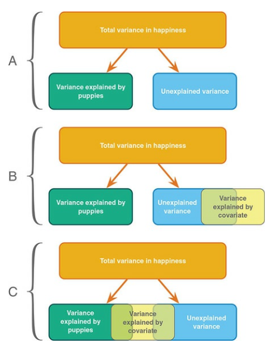
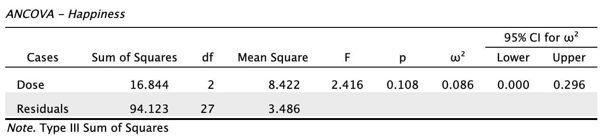
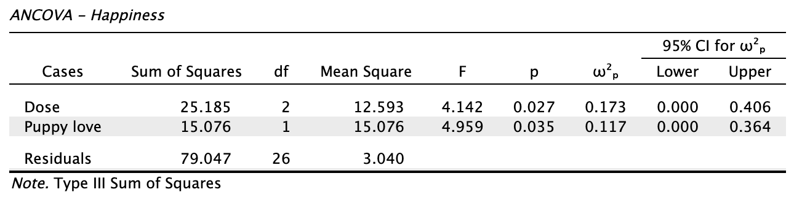
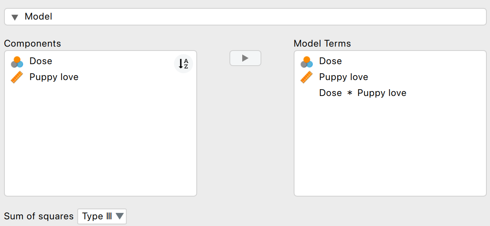
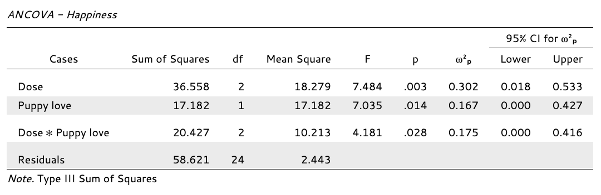

# ANCOVA

```{r puppylove-load-data, echo=FALSE}
# Clear memory
rm(list=ls())
source("../../_setup.R")

# Field's puppy love data (DSUJ Chapter 12, Table 12.1): the puppy therapy study of
# lecture 12, now with each person's love of puppies (0-7) as covariate. Mirrored
# from discoverjasp's puppy_love.jasp into datasets/ (one copy, like puppies.csv).
# Group sizes are unequal (9, 8, 13), so df come from n, never from n per group.
raw       <- read.csv(datasetsPath("puppy-love.csv"), check.names = FALSE)
dose      <- factor(raw$dose, levels = c("No puppies", "15 mins", "30 mins"))
happiness <- raw$happiness
puppylove <- raw[["puppy-love"]]
k         <- nlevels(dose)

# Create dummy variables
dummy.1 <- ifelse(dose == "15 mins", 1, 0)
dummy.2 <- ifelse(dose == "30 mins", 1, 0)
```

## ANCOVA {.section}

Determine main effect while accounting for covariate

* 1 dependent variable
* 1 or more independent variables
* 1 or more covariates

A covariate is a variable that can influence the DV. By adding a covariate, we reduce error/residual in the model.

## Applet

[Link](https://jvd-ssr-ancova.share.connect.posit.cloud/)

## Set $\alpha$ before the data

* $\alpha = 0.005$

> "We propose to change the default P-value threshold for statistical significance from 0.05 to 0.005 for claims of new discoveries."

[Benjamin et al. (2018)](https://doi.org/10.1038/s41562-017-0189-z): *Redefine statistical significance*, 72 authors

## Data example

Puppy therapy again (lecture 12), but now we also measured how much each person loves puppies.

* Dependent variable: Happiness
* Independent variable: Dose (#groups $= k = 3$)
    + No puppies ($n = `r sum(dose == "No puppies")`$)
    + 15 mins ($n = `r sum(dose == "15 mins")`$)
    + 30 mins ($n = `r sum(dose == "30 mins")`$)
* Covariate: Puppy love (0–7)


## Define the model {.subsection}

$${happiness} = {model} + {error}$$

${model} = {independent} + {covariate}$
$\color{white}{model} = {dose} + {puppy \; love}$

$\color{white}{model}$


Linear model with $k-1$ dummy variables:

$$\hat{y} = b_0 + b_1 {dummy}_1 + b_2 {dummy}_2 + b_3 covar$$

## The data {.smaller}

```{r puppylove-the-data, echo=FALSE}
n <- seq_along(happiness)

dummies <- data.frame(dose, dummy.1, dummy.2, puppylove, happiness)
# put data in data frame (already ordered by group)
data <- data.frame(n, dose, puppylove, happiness)
plotData <- data
ssrTable(data, height = 300,
          extensions = 'Buttons',
          options    = list(dom       = 'Bfrtip',
                            buttons   = c('csv')))
```

[puppy_love.jasp](https://discoverjasp.com/repository/dsj1_data/data/puppy_love.jasp)

## Dummies {.smaller}

```{r puppylove-dummies, echo=FALSE}
ssrTable(dummies)
```

## Observed group means {.subsection}

```{r puppylove-observed-group-means, echo=TRUE}
aggregate(happiness ~ dose, data, mean)
```

## Model fit without covariate {.smaller}

What are the beta coefficients when we fit a model that only has `dose` as a predictor variable?

```{r puppylove-fit-group-only, echo=TRUE}
fit.group <- lm(happiness ~ dose, data); fit.group$coefficients
```

- $b_{0} = `r round(fit.group$coefficients[1], 2)`$

- $b_{15min} = `r round(fit.group$coefficients[2], 2)`$

    - Prediction for 15 mins: `r round(fit.group$coefficients[1], 2)` + `r round(fit.group$coefficients[2], 2)` = `r round(round(fit.group$coefficients[1], 2) + round(fit.group$coefficients[2], 2), 2)`

- $b_{30min} = `r round(fit.group$coefficients[3], 2)`$

    - Prediction for 30 mins: `r round(fit.group$coefficients[1], 2)` + `r round(fit.group$coefficients[3], 2)` = `r round(round(fit.group$coefficients[1], 2) + round(fit.group$coefficients[3], 2), 2)`

## Model fit with only covariate {.smaller}

What are the beta coefficients when we fit a model that only has `puppylove` as predictor variable?

```{r puppylove-fit-covariate-only, echo=TRUE}
fit.covar <- lm(happiness ~ puppylove, data); fit.covar$coefficients
```

$b_{0} = `r round(fit.covar$coefficients[1], 2)`$

$b_{love} = `r round(fit.covar$coefficients[2], 2)`$


## Model fit with all predictor variables (factor + covariate) {.smaller}

What are the beta coefficients when we fit the full model (i.e., with both predictor variables)?

```{r puppylove-fit-full-model, echo=TRUE}
fit <- lm(happiness ~ dose + puppylove, data); fit$coefficients
```

$b_{0} = `r round(fit$coefficients[1], 2)`$

$b_{15min} = `r round(fit$coefficients[2], 2)`$

$b_{30min} = `r round(fit$coefficients[3], 2)`$

$b_{love} = `r round(fit$coefficients[4], 2)`$

## Predictions of the full model {.smaller}

For someone in the 15 mins group with a score of 4 on puppy love:

```{r puppylove-predictions-full-model, echo=TRUE}
fit <- lm(happiness ~ dose + puppylove, data); fit$coefficients
```
- $b_{0} = `r round(fit$coefficients[1], 2)`$
- $b_{15min} = `r round(fit$coefficients[2], 2)`$
- $b_{love} = `r round(fit$coefficients[4], 2)`$

    - Prediction for 15 mins: `r round(fit$coefficients[1], 2)` + `r round(fit$coefficients[2], 2)` + 4 * `r round(fit$coefficients[4], 2)` = `r round(round(fit$coefficients[1], 2) + round(fit$coefficients[2], 2) + 4 * round(fit$coefficients[4], 2), 2)`

How about someone in the 30 mins group with a score of 1 on puppy love?

```{r puppylove-add-grand-mean, echo=FALSE}
# Add grand mean to data frame
data$grand.mean <- mean(data$happiness)
```

## Visual ${SS}_{total}$ {.subsection}

```{r puppylove-visual-total-variance, echo=FALSE}
colnames(plotData) <- c("pp", "group", "cov", "dv")
plotData$group <- as.factor(plotData$group)
plotSumSquaresCov(data = plotData, whatPred = "Mean", myLimY = c(0, 10), whatDisplay = c("Segments", "Sums"), myLabY = "Happiness")
```

## Explained by group model {.smaller}

The model that predicts only using group means:

$\hat{y} = b_0 + b_1 {dummy}_1 + b_2 {dummy}_2$

$\hat{y} = `r round(fit.group$coefficients[1], 2)` + `r round(fit.group$coefficients[2], 2)` \times {dummy}_1 + `r round(fit.group$coefficients[3], 2)` \times {dummy}_2$

## Visual ${SS}_{model}$: group {.subsection}

```{r puppylove-visual-explained-by-group, echo=FALSE}
data$model.group <- fit.group$fitted.values
data$model.covar <- fit.covar$fitted.values
plotSumSquaresCov(data = plotData, sumSq = "Model", whatPred = "Group means", myLimY = c(0, 10), whatDisplay = c("Segments", "Sums"), myLabY = "Happiness")
```

## Explained by covariate model {.subsection}

The model that predicts only using puppy love:

$\hat{y} = b_0 + b_3 covar$

$\hat{y} = `r round(fit.covar$coefficients[1], 2)` + `r round(fit.covar$coefficients[2], 2)` \times {Puppy \; love}$


## Visual ${SS}_{model}$: covariate {.subsection}

```{r puppylove-visual-explained-by-covariate, echo=FALSE}
plotSumSquaresCov(data = plotData, sumSq = "Model", whatPred = "Cov", myLimY = c(0, 10), whatDisplay = c("Segments", "Sums"), myLabY = "Happiness")
```

## Explained by full model {.smaller}

```{r puppylove-explained-by-full-model, echo=FALSE}
data$model <- fit$fitted.values
```

The model that predicts with group and covariate:

$\hat{y} = b_0 + b_1 {dummy}_1 + b_2 {dummy}_2 + b_3 covar$

$\hat{y} = `r round(fit$coefficients[1], 2)` + `r round(fit$coefficients[2], 2)` \times {dummy}_1 + `r round(fit$coefficients[3], 2)` \times {dummy}_2  + `r round(fit$coefficients[4], 2)` \times {Puppy \; love}$

## Visual ${SS}_{model}$: group + covariate {.subsection}

```{r puppylove-visual-explained-by-full-model, echo=FALSE}
plotSumSquaresCov(data = plotData, sumSq = "Model", whatPred = "Group means + cov", myLimY = c(0, 10), whatDisplay = c("Segments", "Sums"), myLabY = "Happiness")
```

## Visual ${SS}_{residual}$: group + covariate {.subsection}

```{r puppylove-unexplained-variance, echo=FALSE}
plotSumSquaresCov(data = plotData, sumSq = "Error", whatPred = "Group means + cov", myLimY = c(0, 10), whatDisplay = c("Segments", "Sums"), myLabY = "Happiness")
```

## Divide model sum of squares {.subsection}



---

## Divide model sum of squares {.smaller}

Model SS of full model:

```{r puppylove-divide-model-sum-of-squares, echo=FALSE}
SS.model <- with(data, sum((model - grand.mean)^2))
SS.error <- with(data, sum((happiness - model)^2))

# Sums of squares for individual effects
SS.model.group <- with(data, sum((model.group - grand.mean)^2))
SS.model.covar <- with(data, sum((model.covar - grand.mean)^2))
```

```{r puppylove-ss-model, echo=TRUE}
SS.model
```

To see what is explained by group, we subtract the Model SS of the covariate model:

```{r puppylove-ss-group-corrected, echo=TRUE}
SS.group <- SS.model - SS.model.covar; SS.group ## SS.group corrected for covar
```

To see what is explained by covariate, we subtract the Model SS of the group model:

```{r puppylove-ss-covariate-corrected, echo=TRUE}
SS.covar <- SS.model - SS.model.group; SS.covar ## SS.covar corrected for group
```

## F-ratio {.subsection}

```{r puppylove-f-ratio, echo=FALSE}
n <- nrow(data)
df.model <- k - 1
df.error <- n - k - 1

MS.model <- SS.group / df.model
MS.error <- SS.error / df.error

fStat <- MS.model / MS.error
```

$MS_{model-group} =  \frac{`r round(SS.group, 3)`}{`r df.model`} = `r round(MS.model, 3)`$

$F = \frac{{MS}_{model-group}}{{MS}_{residual}} = \frac{{SIGNAL}}{{NOISE}} =  \frac{`r round(MS.model, 3)`}{`r round(MS.error, 3)`} = `r round(fStat, 2)`$

## $p$-value

```{r puppylove-p-value, echo=FALSE}
# Set up the plot for the F-distribution
curve(df(x, df.model, df.error), from = 0, to = 25, n = 1000, bty = "n", las = 1,
      xlab = "F-value", ylab = "Density", main = "F-distribution with P-value Region")

# Shade the upper tail (p-value region) using polygon
x_vals <- seq(fStat, 10, length.out = 100)
y_vals <- df(x_vals, df.model, df.error)
polygon(c(fStat, x_vals, 10), c(0, y_vals, 0), col = "lightblue", border = NA)

# Vertical line at the F-statistic
arrows(x0 = fStat, x1 = fStat, y0 = 0 , y1 = 0.6, col = "darkred", lwd = 2)
text(x = fStat, y = 0.8, paste("F =", round(fStat, 2)), cex = 1.2)
text(x = fStat, y = 0.7, paste("p-val =", round(pf(fStat, df.model, df.error, lower.tail = FALSE), 4)), cex = 1.2)
```

## What if we ignore puppy love? {.smaller}

```{r puppylove-without-covariate, echo=FALSE}
# Same numbers as the two JASP tables below (DSUJ Outputs 12.4 and 12.5)
anova.group <- anova(fit.group)
p.group     <- anova.group[["Pr(>F)"]][1]
p.ancova    <- pf(fStat, df.model, df.error, lower.tail = FALSE)
```

Without puppy love (Output 12.4):

{width="58%"}

With puppy love (Output 12.5):

{width="58%"}

* ${SS}_{residual}$: `r round(anova.group[["Sum Sq"]][2], 2)` → `r round(SS.error, 2)`; effect of dose: $p$ = `r sprintf("%.3f", p.group)` → $p$ = `r sprintf("%.3f", p.ancova)` (§12.7)

## Alpha & Power {.smaller}
Power becomes quite abstract when we increase the complexity (i.e., number of predictors) of our models. We can make an F-distribution that symbolizes the alternative distribution by shifting the distribution more to the right (although the interpretability becomes pretty murky..)

```{r puppylove-alpha-and-power, echo=FALSE}
fValues <- seq(0, 30, .01)

curve(df(x, df.model, df.error), from = 0, to = 25, n = 1000, bty = "n", las = 1,
      xlab = "F-value", ylab = "Density", main =  "H0 and HA F-distribution")

critical.value = qf(.95, df.model, df.error)

critical.range = seq(critical.value, 30, .01)

polygon(c(critical.range,rev(critical.range)),
        c(critical.range*0, rev(df(critical.range, df.model, df.error, ncp = 15))), col = "darkgreen")

lines(fValues, df(fValues, df.model, df.error, ncp = 15))

polygon(c(critical.range,rev(critical.range)),
        c(critical.range*0, rev(df(critical.range, df.model, df.error))), col = "purple")
```


## Adjusted/marginal means

Marginal means are estimated group means, while keeping the covariate equal across the groups

> What are happiness averages in each group, if they would all score the same on puppy love?

See also [this blogpost](https://jasp-stats.org/2020/04/14/the-wonderful-world-of-marginal-means/)


## Adjusted/marginal means

Adjusted:

```{r puppylove-adjusted-marginal-means, echo=FALSE}
# b coefficients
b.cov <- fit$coefficients["puppylove"];   b.int = fit$coefficients["(Intercept)"]
b.2   <- fit$coefficients["dose15 mins"]; b.3   = fit$coefficients["dose30 mins"]

# Adjustment factor for the means of the independent variable
data$mean.adj <- with(data, b.int + b.cov * mean(puppylove) + b.2 * (dose == "15 mins") + b.3 * (dose == "30 mins"))

aggregate(mean.adj ~ dose, data, mean)
```

Observed:

```{r puppylove-adjustment-factor, echo=FALSE}
aggregate(happiness ~ dose, data, mean)
```

## Assumptions

* Same as ANOVA
* Independence of the covariate and treatment effect §12.5.1.
    * No difference on ANOVA with covar and independent variable
    * Matching experimental groups on the covariate
* Homogeneity of regression slopes §12.5.2.
    * Visual: scatterplot dep var * covar per condition
    * Testing: interaction indep. var * covar

## Independence of the covariate and treatment effect (Fig 12.2)


## Independence of the covariate {.smaller}

* Groups should not differ on the covariate (§12.5.1)
* Otherwise: covariate and group share variance (Fig 12.2C)
    * Associated predictors can inflate/deflate the group effect (F, adjusted means)
    * Does not "control for" the group difference
    * Interpretation problem, not a statistical requirement (Jane Superbrain Box 12.1)
* Risk mostly without random assignment
* Assess: ANOVA with covariate as dependent variable (§12.6.3)

```{r puppylove-independence-covariate-test, echo=FALSE}
# Output 12.3 is JASP's ANOVA of the same data; computed here so the caption
# cannot drift from the data.
covTest <- anova(lm(puppylove ~ dose, data))
covText <- sprintf("ANOVA on puppy love: F(%d, %d) = %.2f, p = %.3f",
                   covTest$Df[1], covTest$Df[2], covTest[["F value"]][1], covTest[["Pr(>F)"]][1])
```

{width="65%"}

## Homogeneity of regression slopes {.smaller}

::: {.columns}

::: {.column width="60%"}

* One slope for the covariate: parallel lines (§12.5.2)
* Assumes the same covariate-DV relation in every group
* Unequal slopes:
    * Interpretation: effect of dose depends on puppy love (§12.8)
    * Inflated Type I error (Jane Superbrain Box 12.2)
* Assess: add the interaction dose * puppy love to the model (§12.8)
    * Descriptives plot: are the lines per group roughly parallel?

:::

::: {.column width="40%"}

```{r puppylove-homogeneity-slopes-test, echo=FALSE}
# Figure 12.9 is JASP's descriptives plot of the same data, one regression line
# per dose; the interaction test (Output 12.9) is computed here.
slopesTest <- anova(lm(happiness ~ dose + puppylove, data),
                    lm(happiness ~ dose * puppylove, data))
slopesText <- sprintf("Interaction: F(%d, %d) = %.2f, p = %.3f",
                      slopesTest$Df[2], slopesTest$Res.Df[2], slopesTest$F[2], slopesTest[["Pr(>F)"]][2])
```


:::

:::

## Puppy love: slopes not parallel {.smaller}

::: {.columns}

::: {.column width="40%"}

* 30 mins: slightly negative slope; other groups positive (§12.5.2)
* Model → Model Terms: add Dose * Puppy love (§12.8)
* Field ($\alpha$ = .05): interaction significant, so interpret this model instead (§12.8)
* Our $\alpha$ = .005: $p$ = .028 is not

:::

::: {.column width="60%"}



{width="78%"}

:::

:::

## Significant at $\alpha = 0.005$? {.smaller}

```{r puppylove-dose-in-interaction-model, echo=FALSE}
# Type III tests as JASP reports them (Output 12.9; dose sum-to-zero coded).
# With the interaction in the model, the dose test compares the groups where the
# covariate is 0; centring puppy love moves that comparison to average love.
fit.int   <- lm(happiness ~ dose * puppylove, data, contrasts = list(dose = "contr.sum"))
fit.intC  <- lm(happiness ~ dose * I(puppylove - mean(puppylove)), data, contrasts = list(dose = "contr.sum"))
p.dose.0  <- car::Anova(fit.int,  type = 3)["dose", "Pr(>F)"]
p.dose.av <- car::Anova(fit.intC, type = 3)["dose", "Pr(>F)"]
# Partial omega squared with a two-sided 95% CI: effectsize reproduces JASP's
# effect sizes exactly (checked against Outputs 12.5 and 12.9).
om <- suppressMessages(suppressWarnings(effectsize::omega_squared(
  car::Anova(fit.int, type = 3), partial = TRUE, alternative = "two.sided")))
om <- om[om$Parameter == "dose", ]
omText <- sprintf("%.2f, 95%% CI [%.2f, %.2f]", om$Omega2_partial, om$CI_low, om$CI_high)
```

{width="80%"}

* Dose: $p$ = `r sprintf("%.3f", p.dose.0)` < $\alpha$ = 0.005
* But partial $\omega^2$ = `r omText`

## What does "dose" mean here? {.smaller}

```{r puppylove-dose-depends-on-love, echo=FALSE}
# With the interaction in the model there is no single dose effect: each dose has
# its own slope, so the group differences change with puppy love. JASP's "Dose" row
# (Output 12.9) is the test at puppy love = 0; centring the covariate at a value
# moves the test to that value.
doseAt <- function(v) {
  data$lc <- data$puppylove - v
  m <- lm(happiness ~ dose * lc, data, contrasts = list(dose = "contr.sum"))
  car::Anova(m, type = 3)["dose", "Pr(>F)"]
}
loveAt <- c(0, mean(data$puppylove), 5)
pred <- sapply(loveAt, function(v) predict(fit.int, data.frame(dose = levels(data$dose), puppylove = v)))
tab <- data.frame(c("0", sprintf("%.2f (average)", loveAt[2]), "5"),
                  t(round(pred, 2)), sprintf("%.3f", sapply(loveAt, doseAt)))
names(tab) <- c("Puppy love", levels(data$dose), "Dose: p")
knitr::kable(tab, align = "lrrrr")
```

* Each dose has its own slope, so the dose effect depends on puppy love
* Output 12.9's "Dose" compares the groups at puppy love = 0
* Interaction present: little value in interpreting the main effect (p. 568)

## JASP

{width="300px"}
