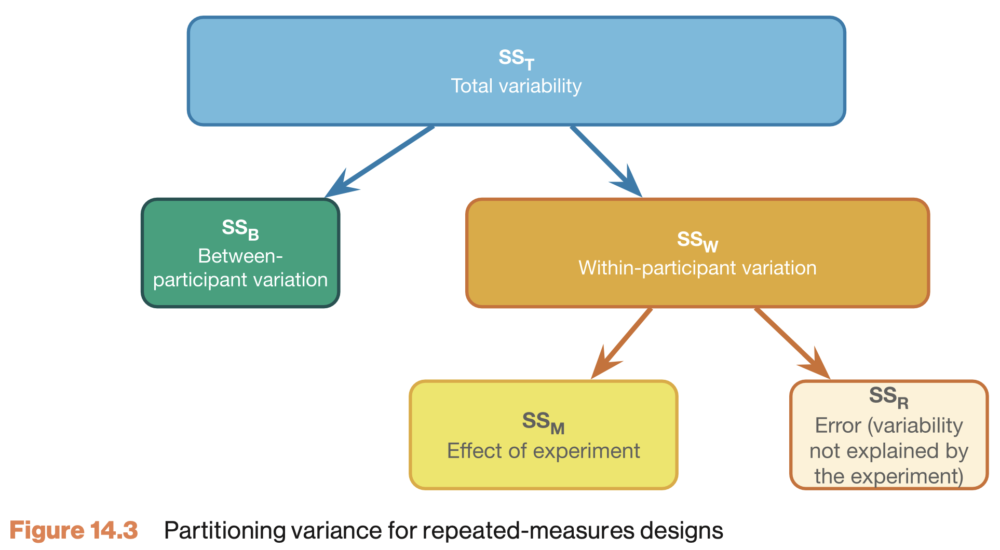

# ANOVA<br>One-way repeated

```{r rm-anova-br-one-way-repeated, echo=FALSE}
rm(list=ls())
source("../../_setup.R")
```

## One-way repeated measures ANOVA {.section}

The one-way repeated measures ANOVA analyses the variance of the model while reducing the error by the within person variance.

* 1 dependent/outcome variable
* 1 independent/predictor variable
    * 2 or more levels
* All with same subjects

## Assumptions {.smaller}

* Continuous dependent variable
* Normally distributed
    * Q-Q plots (or Shapiro-Wilk)

* Equality of variance of the within-group differences
    * Mauchly's test of Sphericity
    * Same caution as Levene's test (see also Misconception Mutt 14.1)
    * Plus caution as with any p-value (black-and-white decision making)
    * Robust version: Greenhouse-Geisser correction
    * See Field 14.5, table 14.2, Jane Superbrain boxes 14.2 and 14.3
    * Always met when having only 2 levels


## Formulas {.smaller .subsection .scrollable}

Variance | Sum of Squares | df | Mean Squares | F-ratio
---------|----------------|----|--------------|---------
Between  | ${SS}_{{between}} = {SS}_{{total}} - {SS}_{{within}}$ | ${df}_{{total}}-{df}_{{within}}$ | $\frac{{SS}_{{between}}}{{df}_{{between}}}$ | &nbsp;
Within  | ${SS}_{{within}} = \sum{s_i^2(n_i-1)}$ | $(n_i-1)n$ | $\frac{{SS}_{{within}}}{{df}_{{within}}}$ | &nbsp;
• Model | ${SS}_{{model}} = \sum{n_k(\bar{X}_k-\bar{X})^2}$ | $k-1$ | $\frac{{SS}_{{model}}}{{df}_{{model}}}$ | $\frac{{MS}_{{model}}}{{MS}_{{residual}}}$ | &nbsp;
• Residual | ${SS}_{{residual}} = {SS}_{{within}} - {SS}_{{model}}$ | $(n-1)(k-1)$ | $\frac{{SS}_{{residual}}}{{df}_{{residual}}}$ | &nbsp;
Total | ${SS}_{{total}} = s_{grand}^2(N-1)$ | $N-1$ | $\frac{{SS}_{{total}}}{{df}_{{total}}}$ | &nbsp;

Where $n_i$ is the number of observations per person and $k$ is the number of conditions. These two are equal for a one-way repeated ANOVA. Furthermore $n$ is the number of subjects per condition and $N$ is the total number of data points $n \times k$.

## Example

Measure driving ability in a driving simulator. Test in three consecutive conditions where participants come back to attend the next condition.

* Alcohol none
* Alcohol some
* Alcohol much

## The data {.smaller}

```{r rm-the-data, echo=FALSE}
nSample <- 5
data <- read.csv(datasetsPath("RM_ANOVA_Alcohol.csv"))[1:nSample, ]
longdata <- read.csv(datasetsPath("RM_ANOVA_Alcohol_LONG.csv"))
longdata <- longdata[longdata$pp <= nSample, ]
longdata <- longdata[order(longdata$pp), ]
ssrTable(data, rownames = FALSE)
```
## Wide vs. long data formats


## General flow RM ANOVA {.smaller}

- We look at total variance
- We divide it:
  - Within subject variance
  - Between subject variance

>How much of the within subject variance can we explain by looking at alcohol condition?

{width="300px"}

<!-- ## MS total -->

```{r rm-general-flow-rm-anova, echo=FALSE}
# Assign to individual variables
none_alc <- data$none_alc
some_alc <- data$some_alc
much_alc <- data$much_alc
total    <- c(none_alc,some_alc,much_alc)
```

<!-- ${MS}_{total} = \frac{{SS}_{{total}}}{{DF}_{{total}}} = s_{grand}^2$ -->

```{r rm-ms-total, echo=FALSE}
MS_total <- var(total)#; MS_total
```

<!-- ## Total variance (SS total) -->

<!-- ${DF_{total}} = N-1$ -->

<!-- ${SS}_{{total}} = s_{grand}^2(N-1)$ -->

```{r rm-ss-total, echo=FALSE}
N <- length(total)
DF_total <- N - 1
SS_total <- MS_total * DF_total#; SS_total

# sum((total - mean(total))^2)
```

## Total variance (SS total) - visual {.smaller}

```{r rm-ss-total-visual, echo=FALSE}
input <- list()
input$whatPred <- "Alcohol + ID"
input$whatDisplay <- c("Segments", "Sums")
    plotSumSquaresRM(longdata, input = input, sumSq = "Total", myMain = "",
                   alcColors = palette.colors(n = 3, palette = "Okabe-Ito"),
                   speedSymbols = c(21, 22, 23)) 
```


<!-- ## MS within -->

<!-- ${MS}_{within} = \frac{{SS}_{{within}}}{{DF}_{{within}}}$ -->

<!-- ${DF}_{within} = (n_i-1)n$ -->

```{r rm-df-within, echo=FALSE}
n.i <- length(unique(longdata$alcohol))  # Number of mesurements per individual (none, some, much)
n   <- length(unique(longdata$pp)) # Number of mesurements per group

DF_within <- (n.i - 1) * n
# DF_within
```

## Within subject variance  ($SS_{within}$)

${SS}_{{within}} = \sum{s_i^2(n_i-1)}$

```{r rm-within-subject-variance, echo=FALSE}
var_pp <- apply(cbind(none_alc, some_alc, much_alc),1,var)
ss_pp  <- var_pp * (n.i - 1)

SS_within <- sum(ss_pp); SS_within

mean_pp <- apply(cbind(none_alc, some_alc, much_alc),1,mean)

# sum(c((none_alc - mean_pp)^2, 
#       (some_alc - mean_pp)^2,
#       (much_alc - mean_pp)^2))
```

## Within subject variance ($SS_{within}$) - visual

```{r rm-within-subject-variance-visual, echo=FALSE}
input <- list()
input$whatPred <- "ID"
input$whatDisplay <- c("Segments", "Sums")
    plotSumSquaresRM(longdata, input = input, sumSq = "Error", myMain = "Full Model SS Error",
                   alcColors = palette.colors(n = 3, palette = "Okabe-Ito"),
                   speedSymbols = c(21, 22, 23)) 
```


## Within subject variance ($SS_{within}$) - data {.smaller .scrollable}

```{r rm-within-subject-table, echo=FALSE}
data$mean_pp <- round(mean_pp,3)
data$ss_pp <- round(ss_pp, 3)
ssrTable(data, rownames = FALSE)
```


<!-- ## MS between -->

```{r rm-ss-between, echo=FALSE}
SS_between <- SS_total - SS_within
# SS_between

DF_between <- DF_total - DF_within
# DF_between
```

<!-- ## MS model -->

<!-- ${MS}_{model} = \frac{{SS}_{{model}}}{{DF}_{{model}}}$ -->

<!-- ${DF}_{model} = k-1$ -->

```{r rm-df-between, echo=FALSE}
k <- 3
DF_model <- k - 1
# DF_model
```

## Alcohol model SS ($SS_{model}$)

${SS}_{model} = \sum{n_k(\bar{X}_k-\bar{X})^2}$

```{r rm-alcohol-model-ss, echo=FALSE}
# SS model
n_k1 <- length(none_alc)
n_k2 <- length(some_alc)
n_k3 <- length(much_alc)

# Calculate sums of squares for the model
SS_k1 <- n_k1 * (mean(none_alc) - mean(total))^2
SS_k2 <- n_k2 * (mean(some_alc) - mean(total))^2
SS_k3 <- n_k3 * (mean(much_alc) - mean(total))^2

SS_model <- sum(SS_k1, SS_k2, SS_k3)
SS_model
```


## Alcohol model SS visual

```{r rm-alcohol-model-ss-visual, eval=TRUE,echo=FALSE}
input <- list()
input$whatPred <- "Alcohol"
input$whatDisplay <- c("Segments", "Sums")
    plotSumSquaresRM(longdata, input = input, sumSq = "Model", myMain = "Full Model SS Error",
                   alcColors = palette.colors(n = 3, palette = "Okabe-Ito"),
                   speedSymbols = c(21, 22, 23)) 
```


## Full model SS visual

```{r rm-full-model-ss-visual, eval=TRUE,echo=FALSE}
input <- list()
input$whatPred <- "Alcohol + ID"
input$whatDisplay <- c("Segments", "Sums")
    plotSumSquaresRM(longdata, input = input, sumSq = "Model", myMain = "Full Model SS Error",
                   alcColors = palette.colors(n = 3, palette = "Okabe-Ito"),
                   speedSymbols = c(21, 22, 23)) 
```

## Full model residual SS visual ($SS_{residual}$)

```{r rm-full-model-error-ss-visual, eval=TRUE,echo=FALSE}
input <- list()
input$whatPred <- "Alcohol + ID"
input$whatDisplay <- c("Segments", "Sums")
    plotSumSquaresRM(longdata, input = input, sumSq = "Error", myMain = "Full Model SS Error",
                   alcColors = palette.colors(n = 3, palette = "Okabe-Ito"),
                   speedSymbols = c(21, 22, 23)) 
```

## We use full model residual to compute F for alcohol

```{r rm-f-for-alcohol-visual, eval=TRUE,echo=FALSE}
input <- list()
input$whatPred <- "Alcohol"
input$whatDisplay <- c("Segments", "Sums", "F-stat")
    plotSumSquaresRM(longdata, input = input, sumSq = "Model", myMain = "Full Model SS Error",
                   alcColors = palette.colors(n = 3, palette = "Okabe-Ito"),
                   speedSymbols = c(21, 22, 23)) 
```


<!-- ## MS error -->

<!-- $\frac{{SS}_{error}}{{DF}_{error}}$ -->

<!-- ${DF}_{error} = (n-1)(k-1)$ -->

```{r rm-compute-df-error, echo=FALSE}
DF_error <- DF_within - DF_model
# DF_error
```


<!-- ## SS error -->

<!-- ${SS}_{error} = {SS}_{within} - {SS}_{model}$ -->

```{r rm-df-error, echo=FALSE}
SS_error <- SS_within - SS_model
# SS_error
```

## F ratio

$F = \frac{{MS}_{{model}}}{{MS}_{{residual}}}$

```{r rm-f-ratio, echo=FALSE}
# Calculate mean squares
MS_model <- SS_model / DF_model
MS_error <- SS_error / DF_error
# MS_model; MS_error
```

```{r rm-ms-model-ms-error, echo=TRUE}
# Calculate F statistic
fStat <- MS_model / MS_error
fStat
```


## P-value

```{r rm-p-value, echo=FALSE}
# Set up the plot for the F-distribution
curve(df(x, DF_model, DF_error), from = 0, to = 25, n = 1000, bty = "n", las = 1,
      xlab = "F-value", ylab = "Density", main = "F-distribution with P-value Region")

# Shade the upper tail (p-value region) using polygon
# Define the region to fill (upper tail, greater than fStat)
x_vals <- seq(fStat, 10, length.out = 100)
y_vals <- df(x_vals, DF_model, DF_error)

# Draw the polygon to fill the area under the curve
polygon(c(fStat, x_vals, 10), c(0, y_vals, 0), col = "lightblue", border = NA)

# Optionally, add a vertical line at the F-statistic
arrows(x0 = fStat, x1 = fStat, y0 = 0 , y1 = 0.6, col = "darkred", lwd = 2)
text(x = fStat, y = 0.8, paste("F =", round(fStat, 2)), cex = 1.2)
text(x = fStat, y = 0.7, paste("p-val < 0.001"), cex = 1.2)
```

## Contrast

Planned comparisons

* Exploring differences of theoretical interest
* Higher precision
* Higher power

## Post-Hoc

Unplanned comparisons

* Exploring all possible differences
* Adjust p-value for inflated type 1 error

<!-- ## Effect size in RM ANOVA {.smaller} -->

<!-- General effect size measure: Partial omega squared $\omega_p^2$ -->

<!-- How to interpret?  -->

<!-- | $\omega^2$ and $\omega_p^2$ | Magnitude of Effect | Interpretation | -->
<!-- |---------------------|--------------------|----------------| -->
<!-- | 0.00–0.009          | Very small         | Trivial practical importance | -->
<!-- | 0.01–0.05           | Small              | Small but meaningful variance explained | -->
<!-- | 0.06–0.13           | Medium             | Moderate variance explained | -->
<!-- | ≥ 0.14              | Large              | Substantial variance explained | -->

<!-- ## Effect size in follow-up tests {.smaller} -->

<!-- Effect sizes of contrasts or post-hoc comparisons: Cohen's $d$  -->

<!-- How to interpret?  -->

<!-- | Cohen’s *d* | Magnitude of Effect | Interpretation | -->
<!-- |--------------|--------------------|----------------| -->
<!-- | 0.00–0.19    | Very small         | Likely negligible in most contexts | -->
<!-- | 0.20–0.49    | Small              | Noticeable but modest difference | -->
<!-- | 0.50–0.79    | Medium             | Moderate, practically meaningful difference | -->
<!-- | ≥ 0.80       | Large              | Substantial, easily noticeable difference | -->
    
    
## JASP

{width="300px"}
