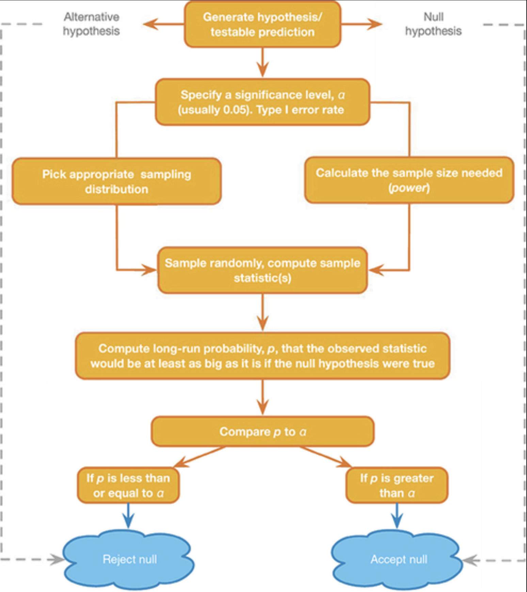

<!-- Restructured version of NHST_2.qmd: the physics-expert experiment drives the
narrative, and standard error / confidence intervals have moved to the
t-distribution half of the lecture (standard-error-ci.qmd). -->

# Null Hypothesis<br>Significance Testing {.section}

## Are you a physics expert? {.smaller}

Before we do any theory, let's collect some data. Take the test:


::: {style="text-align:center;"}


<p style="font-size: 30px;">edu.nl/fn3r3</p>
:::

## Measurement Tool {.section}
-   Multiple choice test true/false
    -   Q1: The vacuum state in quantum field theory is not actually empty but contains fluctuations of virtual particles.
- 10 items/questions
- When do we decide someone is an expert?

## Empirical Cycle {.section}

-   **Observation** Someone seems to be very knowledgeable on physics
-   **Induction** They could be an expert in the field
-   **Deduction** $H_0$: P: $\theta = 0.5$ → C: I was guessing
-   **Deduction** $H_A$: P: $\theta > 0.5$ → C: I have knowledge
-   **Deduction** $H_A$: P: data $\neq$ EV → C: candidate is expert
-   **Testing** Choose $\alpha$ and Power
-   **Evaluation** Make a decision

## Two hypotheses

::: columns
::: column
$H_0$

-   Skeptical point of view
-   No effect
-   No preference
-   No correlation
-   No difference
:::

::: column
$H_A$

-   Refute Skepticism
-   Effect
-   Preference
-   Correlation
-   Difference
:::
:::

# What if they were just guessing? {.section}

## What happens if they are guessing?

## Your scores {.subsection}

Let's analyse the null distribution of the results.

<iframe style="height:400px; width:100%;" src="https://docs.google.com/spreadsheets/d/e/2PACX-1vRQKRokJO9sF_AaCx_4oJhuI7mSzkRpksqTYmlR1UbCYDhejFfUIC4WRnUmywnNrNyv7cEgCHP-Zw9O/pubhtml?gid=1921457865&single=true">

</iframe>

</iframe>

<!-- [Google sheet](https://docs.google.com/spreadsheets/d/150iSLUXqZbsetzDMjYlY5CAcjIzTanTm2tOFfn_ConA/edit?usp=sharing) -->

[Google sheet](https://docs.google.com/spreadsheets/d/1BXVnt8yRDvzzzAsP1RkaTgPrwWkBTAQE16U1nD2nuNg/edit?usp=sharing)

```{=html}
<!--


-->
```

## The scores in this room {.smaller}

```{r, warning=FALSE, message=FALSE,echo=FALSE}
# install.packages("curl")
library("curl")

url = "https://docs.google.com/spreadsheets/d/e/2PACX-1vRQKRokJO9sF_AaCx_4oJhuI7mSzkRpksqTYmlR1UbCYDhejFfUIC4WRnUmywnNrNyv7cEgCHP-Zw9O/pub?gid=1921457865&single=true&output=csv"

data <- tryCatch(read.csv(curl(url)), error = function(e) NULL)
```

```{r, echo=FALSE}
if (is.null(data)) {
  plot.new(); text(.5, .5, "Scores will appear here once the sheet is filled in")
} else {
  scores <- as.numeric(sub(" /.*", "", data$Score))
  barplot(table(sort(scores)), las = 1, xlab = "Number correct", ylab = "Students")
}
```

## Binomial distribution

$$P(k \text{ success out of } n \text{ trials} \mid \text{probability } p) = {n\choose k}p^k(1-p)^{n-k}$$ where $$ {n\choose k} = \frac{n!}{k!(n-k)!} $$

With values:

```{r, echo=TRUE}
n <- 10   # Sample size
k <- 0:10 # Discrete probability space (numbers 0, 1, ..., 9, 10)
p <- .5   # Probability of correct guess
```

## The null distribution

```{r, echo=FALSE}
munt = 0:1

# alle_mogelijkheden = expand.grid(munt,munt,munt,munt,munt,munt,munt,munt,munt,munt)
# 
# sommen = rowSums(alle_mogelijkheden)

# table(sommen)

permutations = factorial(n) / ( factorial(k) * factorial(n-k) )
# permutations

p_k  = p^k * (1-p)^(n-k)  # Probability of single event
p_kp = p_k * permutations # Probability of event times 
                          # the occurrence of that event
# sample = 90
# freq_munt = round(p_kp*sample)
# cbind(k,permutations,p_k,p_kp,freq_munt)

title = "Binomial Null Distribution"

col=c(rep("red",2),rep("white",7),rep("red",2))

barplot( p_kp, 
         main=title, 
         names.arg=0:10, 
         xlab="# Heads", 
         ylab="P(%)", 
         col='darkgreen',
         las = 1,
         ylim=c(0,.3) )

text(.6:10.6*1.2,p_kp,round(p_kp,3),pos=3,cex=.5)
```

## What we just did has a name {.smaller}

The number of correct answers is a **test statistic**.

> A statistic that summarizes the data and is used for hypothesis testing, because we know how it's distributed under different hypotheses

Common test statistics:

-   Number of heads
-   Sum of dice
-   $t$-statistic
-   $F$-statistic
-   $\chi^2$-statistic
-   etc...

## What do those bar heights mean? {.smaller}

-   Objective Probability
-   Relative frequency in the long run

# How surprising is the data? {.section}

## Testing

The candidate had 8 items correct. Can we conclude they are a physics expert?

-   As you can see from the distribution of novice scores, we cannot conclude that by definition.
-   What we can do is indicate how rare 8 is in a novice.

## Testing {.smaller}

<small>

> -   Based on the null distribution we can see that the expected value (EV) is 5
> -   We can now define the $H_0$ hypothesis: $H_0: EV = 5$
> -   What is the alternative hypothesis?
> -   The alternative hypothesis describes a situation where the candidate is expert
> -   We could say that the alternative hypothesis is not 5
>     -   $H_A: EV \ne 5$
> -   We could also formulate our $H_0$ and $H_A$ more abstract:
>     -   $H_0:$ the candidate is novice
>     -   $H_A:$ the candidate is expert
> -   What criterion should we use to conclude that one would be expert?
> -   In the social sciences this $\alpha$ criteria is often 5%.
> -   Candidate scored 8 items correct. That is more frequent than 5%.
> -   Therefore, we conclude that our candidate is probably novice but we can never be sure.

</small>

## P-value

> Conditional probability of the observed test statistic or more extreme assuming the null hypothesis is true.

Reject $H_0$ when:

-   $p$-value $\leq$ $\alpha$

## P-value in $H_{0}$ distribution

```{r, echo=FALSE}

n <- 10   # Sample size
k <- 0:10 # Discrete probability space
p <- .5   # Probability of head

p_k  <- p^k * (1-p)^(n-k)  # Probability of single event
p_kp <- p_k * permutations # Probability of event times 
# the occurrence of that event
# sample = 90
# freq_munt = round(p_kp*sample)
# cbind(k,permutations,p_k,p_kp,freq_munt)

title <- "Binomial Null distribution"

col <- c(rep("blue",3),rep("beige",5),rep("blue",2))

barplot( p_kp, 
         main=title, 
         names.arg=0:10, 
         xlab="number of heads", 
         ylab="P(%)", 
         col=col,
         ylim=c(0,.3) )

abline(v = c(2.5,10.9), lty=2, col='red')

text(.6:10.6*1.2,p_kp,round(p_kp,3),pos=3,cex=.5)
```

## P-value and $\alpha$

Alpha determines how willingly we reject the null hypothesis:

- Increase $\alpha$ = reject null hypothesis more often
  - Increases Type I error rate
  - Decreases Type II error rate
- Historically set to 0.05, but widely criticized (see Jane Superbrain 3.1)

> No scientific worker has a fixed level of significance at which from year to year, and in all
circumstances, he rejects hypotheses; he rather gives his mind to each particular case in the
light of his evidence and his ideas. (Fisher, 1956)

## Misconceptions about the p-value

- A significant result means that the effect is important
  - Significance = effect size + sample size
- A non-significant result means that the null hypothesis is true 
- A significant result means that the null hypothesis is false

# What can go wrong? {.section}

## Neyman-Pearson Paradigm

<div style="display: flex; justify-content: center; gap: 2em;">

<div>

[Neyman](https://en.wikipedia.org/wiki/Jerzy_Neyman)
</div>

<div>

[Pearson](https://en.wikipedia.org/wiki/Egon_Pearson)
</div>

</div>

Fisher asked *how surprising is this data?* Neyman and Pearson asked a different question:
*which mistakes am I willing to make, and how often?*

## Alternative Distribution {.smaller .build .subsection}

But we have no clue what this distribution could look like.

For now let's assume the probability of answering an item correctly is .75

```{r, echo=FALSE}

# n = 10   # Sample size
# k = 0:10 # Discrete probability space
p = .75   # Probability of head

permutations = factorial(n) / ( factorial(k) * factorial(n-k) )

p_k2  = p^k  * (1-p)^(n-k)  # Probability of single event
p_kp2 = p_k2 * permutations # Probability of event times 
                            # the occurrence of that event

title = "Binomial Alternative Distribution"

col=c(rep("red",2),rep("white",7),rep("red",2))

barplot( p_kp2, 
         main=title, 
         names.arg=0:10, 
         xlab="# Heads", 
         ylab="P(%)", 
         beside=TRUE,
         col="darkorange",
         las = 1,
         ylim=c(0,.3) 
         )

text(.6:10.6*1.2,p_kp2,round(p_kp2,3),pos=3,cex=.5)

abline(v =  c(2.5,10.9), col="red", lwd=3, lty="dotted")
```

## Both distributions at once {.smaller}

```{r, echo=FALSE}

title = "Both Distributions"

colh0 = 'darkgreen'
colha = 'darkorange'

barplot( rbind(p_kp,p_kp2), 
         main=title, 
         names.arg=0:10, 
         xlab="# Heads", 
         ylab="P(%)", 
         ylim = c(0, 0.3),
         col = rbind(colh0,colha),
         las = 1,
         beside=TRUE
         #legend.text = c("H0", "HA")
         )

legend("topright", legend=c("H0","HA"), fill=c("darkgreen","darkorange"))

abline(v = c(6.5,27.4), col="red", lwd=3, lty="dotted")

```

Everything that can go wrong lives in the **overlap**.

## Decision table

::: {.content-visible when-format="revealjs"}
```{=html}
<style>
#dectable > svg { transform: scale(1.4);}
</style>
```
:::

::: {#dectable .r-stack .r-stretch}
```{r child="../../images/decision_table.svg"}
```
:::

## Alpha $\alpha$

::: columns
::: {.column width="40%"}
-   Incorrectly reject $H_0$
-   Type I error
-   False Positive
-   Threshold for "significance"
-   Criteria often 5% but heavily criticized
:::

::: {#alpha .column width="60%"}
```{=html}
<style>
#alpha .alpha { stroke: black;}
#alpha > svg { transform: scale(.8);}
</style>
```
```{r child="../../images/decision_table.svg"}
```
:::
:::

## Power

::: columns
::: {.column width="40%"}
-   Correctly reject $H_0$
-   True positive
-   Power equal to: 1 - Beta
-   Beta is Type II error
-   Criteria often 80%
-   Depends on sample size
:::

::: {#power .column width="60%"}
```{=html}
<style>
#power .power { stroke: black; }
#power > svg { transform: scale(.8);}
</style>
```
```{r child="../../images/decision_table.svg"}
```
:::
:::

## One minus alpha

::: columns
::: {.column width="40%"}
-   Correctly accept $H_0$
-   True negative
:::

::: {#oneminalpha .column width="60%"}
```{=html}
<style>
#oneminalpha .oneminalpha { stroke: black; }
#oneminalpha > svg { transform: scale(.8);}
</style>
```
```{r child="../../images/decision_table.svg"}
```
:::
:::

## Beta

::: columns
::: {.column width="40%"}
-   Incorrectly accept $H_0$
-   Type II error
-   False Negative
-   Criteria often 20%
-   Distribution depends on sample size
:::

::: {#beta .column width="60%"}
```{=html}
<style>
#beta .beta { stroke: black; }
#beta > svg { transform: scale(.8);}
</style>
```
```{r child="../../images/decision_table.svg"}
```
:::
:::

## Play with it {.flexbox .vcenter .smaller}

[Play around with this app to get an idea of the probabilities](https://statisticalreasoning-uva.shinyapps.io/NHST_Binomial/)

## NHST Reasoning Scheme {.subsection .flexbox .vcenter}



<!-- ## R\<-PSYCHOLOGIST {.smaller} -->


<!-- [Interactive distributions app by Kristoffer Magnusson](http://rpsychologist.com/d3/NHST/){preview-link="false"} -->

## Up next: three distributions {.smaller}

What is the difference between

-   Population distribution
-   Sample distribution
-   Sampling distribution


