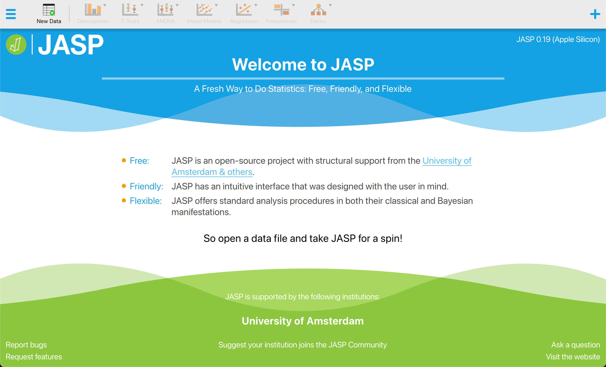
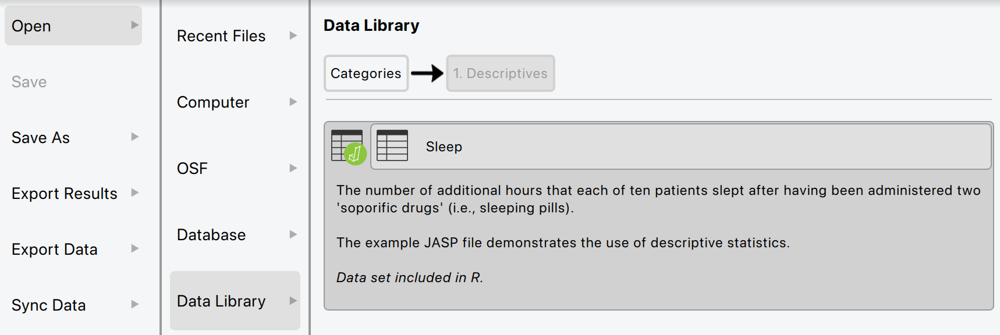
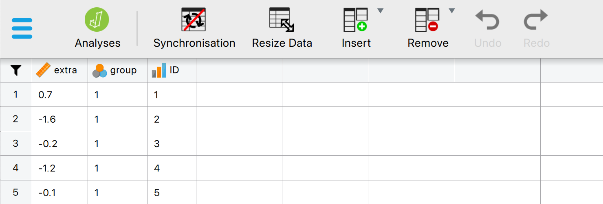
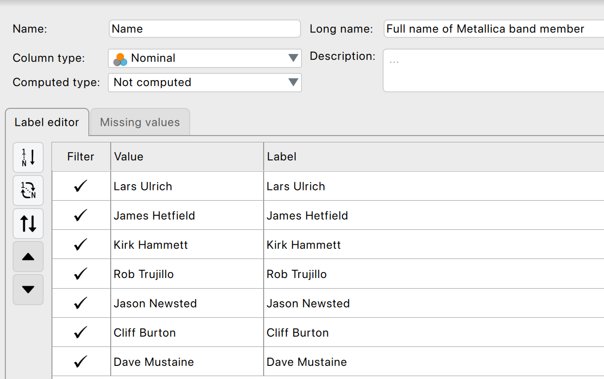
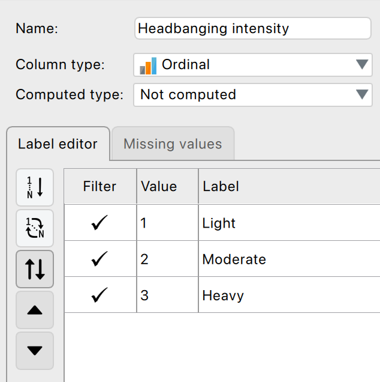
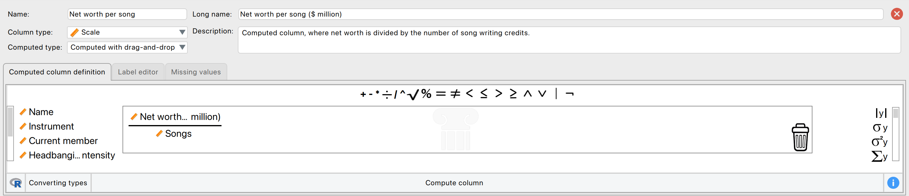
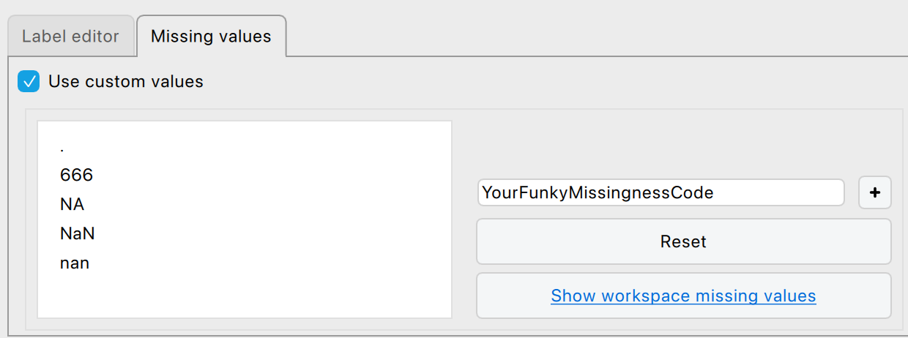
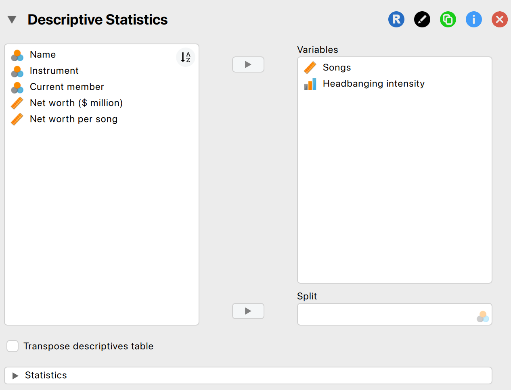
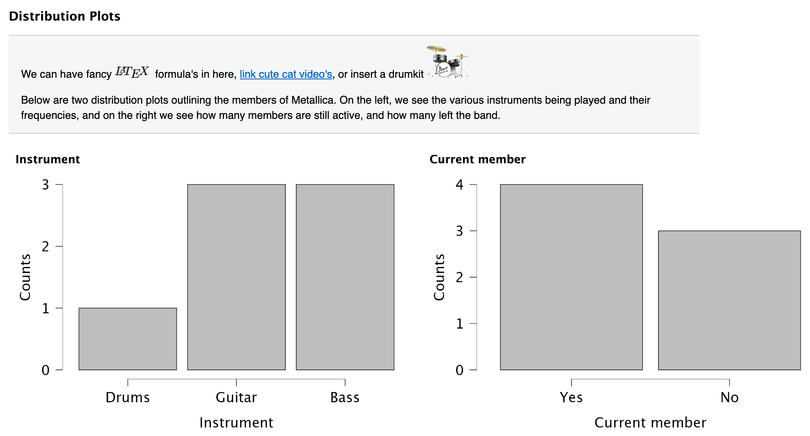

# JASP {.section}

```{r, eval=FALSE, echo=FALSE}
# Remove all objects from workspace
rm(list=ls())
```


## Why JASP?


- User-friendly, intuitive interface
- Open-source (free)
- Reproducible analyses (easy to share)
- Better than IBM's SPSS for transparency and workflow
- Integrates with R for advanced users

<div style="text-align: center;">
{height="100"}
</div>

---

### Absolutely no Bayesians inside {.smaller}

{height="330"}

<small>Artwork by [Viktor Beekman](https://www.instagram.com/viktordepictor), via [Bayesian Spectacles](https://www.bayesianspectacles.org/)</small>
---


## Getting Started with JASP


1. Download from [jasp-stats.org](https://jasp-stats.org)
2. Open JASP, load your dataset (.jasp, .csv, .sav, etc.)
3. Familiarize with the interface: Data view, Input panel, Output panel

Two modes: data editor (view and edit) and analysis mode.

---

### The start-up window

{height="330"}

---

### Two buttons

The hamburger button {height="25"}:

- Open files (from computer, [the Open Science Framework](https://osf.io), or the [JASP data library](https://jasp-stats.github.io/jasp-data-library/))
- Adjust settings (e.g., dark mode, language, how to display results)
- Save/export data/results

The module button {height="25"}:

- Add modules to the top ribbon bar
- Update modules 

### The data library

{height="330"}

---


## Loading Data in JASP


- Click Open > select your file
- Data appears in spreadsheet view

{height="300"}

---

### Two file formats {.smaller}

::: columns
::: {.column width="50%"}
**`.csv`**

A lightweight file format that contains only the raw data.

Opens in virtually anything: Excel, R, SPSS
:::

::: {.column width="50%"}
**`.jasp`**

Contains the original data, the results, and the settings that created them.

Ideal for sharing your research.
:::
:::

Sometimes you'll see a `.sav` file, previously used in SPSS. 
---

### Variable settings {.smaller}

Doubleclick a column name to open its settings. The measurement level you set here decides how JASP treats your variable.

{height="280"}

---

### Ordinal variables

{height="330"}

---

### Computing a new variable

Drag and drop, no syntax required.

{height="300"}

---

### Missing values

{height="300"}

---


## Descriptive Statistics in JASP


- Go to Descriptives > select variables
- Options: mean, median, SD, min, max, quartiles
- Output updates instantly

{height="300"}


## The output window {.smaller}

- Updates in real time
- Tables already in APA format, so publication ready
- ▼ dropdown: copy to Word/PowerPoint, save a plot, open the plot editor
- Annotate your own output


---

### Annotated output

{height="330"}

---

## Saving and exporting {.smaller}

- Save (`Ctrl/Cmd + S`) writes a `.jasp` file: data, output and settings
- Export Data writes a plain `.csv`
- Export Results writes `.html` or `.pdf`, which anyone can open without JASP

See [discoverjasp.com](https://discoverjasp.com/pages/data) for examples.

## Filtering your data {.smaller}

Two routes to using only part of your data.

::: columns
::: {.column width="50%"}
Using the filter

- Funnel icon above the row numbers
- Drag variables and operators into the box
- [Scale data](https://jasp-stats.github.io/jasp-video-library/assets/videos/Getting-Started/Getting_Started_07_Filter-Drag-and-Drop-Scale.mp4)
- [Categorical data](https://jasp-stats.github.io/jasp-video-library/assets/videos/Getting-Started/Getting_Started_07_Filter-Drag-and-Drop-Categorical.mp4)
:::

::: {.column width="50%"}
Using variable settings

- Doubleclick the column name
- Untick values to leave out
- [Filter by group](https://jasp-stats.github.io/jasp-video-library/assets/videos/Getting-Started/Getting_Started_06_Filter-by-Group.mp4)
:::
:::

- Filtered rows struck through, analyses update immediately
- Nothing is deleted

---


## Getting help

- [JASP Video Library](https://jasp-stats.github.io/jasp-video-library/)
- The book
- {height="40"}


---