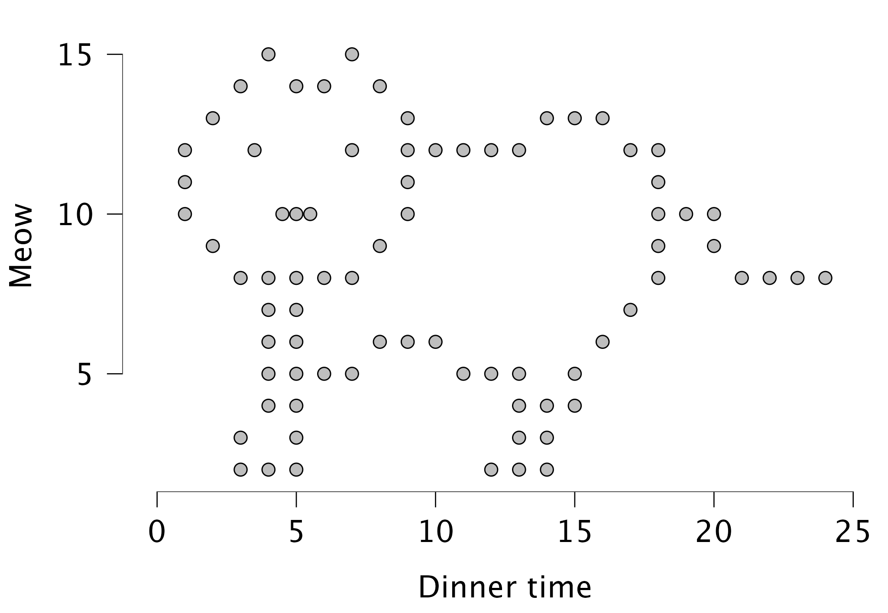
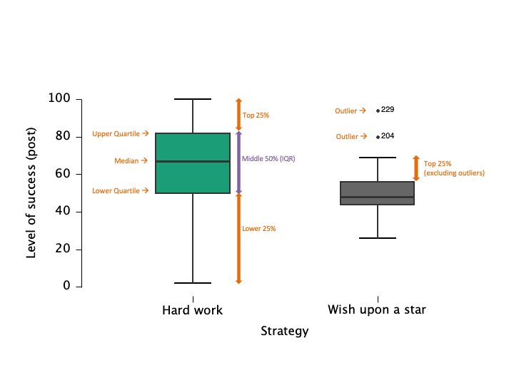
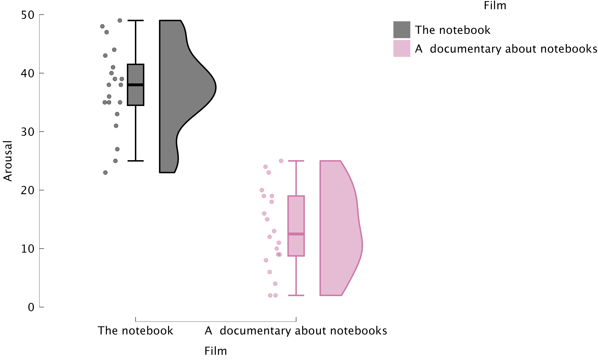

# Visualization {.section}

```{r, eval=FALSE, echo=FALSE}
# Remove all objects from workspace
rm(list=ls())
```


## Why Visualize Data?

- Quick overview of the data
- Spot patterns, outliers, or errors
- Invite the reader


### Why Visualize Data?

 

---

## Scutari, 1854 {.smaller}

::: columns
::: {.column width="38%"}
{height="260"}

[Florence Nightingale](https://en.wikipedia.org/wiki/Florence_Nightingale)
:::

::: {.column width="62%"}
- Military hospital, Crimean War
- Recorded every death and its cause
- Two years of counting:

```{r, echo=FALSE}
data(Nightingale, package = "HistData")
knitr::kable(data.frame(
  Cause  = c("Preventable disease", "Wounds", "Other"),
  Deaths = c(sum(Nightingale$Disease), sum(Nightingale$Wounds), sum(Nightingale$Other))
))
```

- Infection killed far more than the enemy did
- Sanitary Commission arrived March 1855
- Later the first woman elected to the Statistical Society
:::
:::

---

### The diagram {.smaller}

```{r, echo=FALSE, fig.width=11, fig.height=5.6}
N    <- Nightingale
cols <- c(Disease = "#7BA7BC", Wounds = "#C1483A", Other = "#4A4A4A")

# Area is proportional to the death rate, so the radius is its square root.
# Both years share one scale, otherwise the drop between them disappears.
rmax <- sqrt(max(N[, c("Disease.rate", "Wounds.rate", "Other.rate")]))

coxcomb <- function(d, title) {
  plot(NA, xlim = c(-rmax, rmax) * 1.2, ylim = c(-rmax, rmax) * 1.2, asp = 1,
       axes = FALSE, xlab = "", ylab = "", main = title, cex.main = 1.1)
  wedge <- function(i, r, col) {
    a <- seq((i - 1) * pi/6, i * pi/6, length.out = 30) - pi/2
    polygon(c(0, r * cos(a)), c(0, r * sin(a)), col = col, border = "white", lwd = .5)
  }
  # largest area first, so the smaller ones stay visible on top
  for (i in 1:12) wedge(i, sqrt(d$Disease.rate[i]), cols["Disease"])
  for (i in 1:12) wedge(i, sqrt(d$Other.rate[i]),   cols["Other"])
  for (i in 1:12) wedge(i, sqrt(d$Wounds.rate[i]),  cols["Wounds"])
  for (i in 1:12) {
    a <- (i - 0.5) * pi/6 - pi/2
    text(rmax * 1.1 * cos(a), rmax * 1.1 * sin(a), d$Month[i], cex = .7, col = "grey30")
  }
}

layout(matrix(c(1, 2, 3, 3), 2, 2, byrow = TRUE), heights = c(5, 0.8))
par(mar = c(1, 1, 3, 1))
coxcomb(N[1:12, ],  "Before: April 1854 - March 1855")
coxcomb(N[13:24, ], "After: April 1855 - March 1856")
par(mar = c(0, 0, 0, 0)); plot.new()
legend("center", horiz = TRUE, bty = "n", cex = 1.3, pt.cex = 2.4, pch = 15,
       col = cols, legend = c("Preventable disease", "Wounds", "Other causes"))
```

Each wedge is a month; its area is the death rate.

<!-- --- -->

<!-- ### What the picture says {.smaller} -->

<!-- ::: {.incremental} -->
<!-- - Blue dwarfs red: disease, not wounds -->
<!-- - Same scale for both years, so the second rose being so much smaller *is* the finding -->
<!-- - The panels split at March 1855, when the sanitary reforms began -->
<!-- - Drawn in 1858, two years after the war: evidence, not a plea for rescue -->
<!-- - Her case: the deaths were preventable, sanitation proved it, so reform army health permanently -->
<!-- ::: -->


---


## Different types of graphs in JASP
- Distribution plots (basic plots)
  - Frequency plot when nominal
  - Histogram when scale/ordinal

- Correlation plots (basic plots)
- Scatter plots (customizable plots)
- Raincloud plots


---

## Boxplots: Visualizing Spread and Outliers {.smaller}

- Shows median, quartiles, and outliers
- Useful for comparing groups

 

## Raincloud plots: Boxplots + Raw Data {.smaller}

 

---

## Best Practices in Data Visualization

- Use clear labels and titles
- Avoid unnecessary 3D effects
- Choose appropriate scales
- Check for misleading representations


---


## Critically Assess Graphs

- Are axes labelled (variable, units)?
- Are axes broken/equally spaced?
- Are error bars (e.g., confidence intervals) included where relevant?

---

### Critically Assess Graphs
```{r, echo=FALSE}
set.seed(123)

A <- rnorm(10, mean = 5, sd = 3)
B <- rnorm(10, mean = 7, sd = 3)
means <- c(mean(A), mean(B))
ses   <- c(sd(A)/sqrt(length(A)), sd(B)/sqrt(length(B)))
tcrit <- qt(0.975, df = c(length(A)-1, length(B)-1))

# Bad: no axis labels
bp <- barplot(means, names.arg = c("SPSS", "JASP"),
              ylab = "Exam performance",
              col = c("skyblue", "orange"), ylim = c(0, 10), axes = FALSE)
```


## Scale Matters
```{r, echo=FALSE}

# Bad: no axis labels
par(mfrow = c(1, 2))
bp <- barplot(means, names.arg = c("SPSS", "JASP"),
              ylab = "Grade (0-10)",
              col = c("skyblue", "orange"), ylim = c(0, 10), axes = FALSE)
axis(2)

bp <- barplot(means, names.arg = c("SPSS", "JASP"),
              ylab = "Grade (0-100)",
              col = c("skyblue", "orange"), ylim = c(0, 10), axes = FALSE)
# Add error bars
# arrows(x0 = bp, y0 = means - ses, x1 = bp, y1 = means + ses,
#        angle = 90, code = 3, length = 0.06, lwd = 1.5)
axis(2, labels = seq(90, 100, 2), at = seq(0, 10, by =2))
```


## Error Bars!
```{r, echo=FALSE}

# Bad: no axis labels
bp <- barplot(means, names.arg = c("SPSS", "JASP"),
              ylab = "Grade (0-10)",
              col = c("skyblue", "orange"), ylim = c(0, 10), axes = FALSE)
axis(2)
arrows(x0 = bp, y0 = means - ses*tcrit, x1 = bp, y1 = means + ses*tcrit,
        angle = 90, code = 3, length = 0.06, lwd = 1.5)

```


# Leaving Data Out {.section}

## 28 January 1986 {.smaller}

- Night before the *Challenger* launch
- Would the cold damage the O-ring seals?
- Evidence: damage on previous flights, by launch temperature

Tomorrow's forecast: -0.5°C. Should they launch?

## The evidence they reviewed {.smaller}

```{r, echo=FALSE}
source("../../_setup.R")
challenger <- read.csv(datasetsPath("2026/Challenger.csv"))
damaged    <- subset(challenger, Any_Damage == "Yes")

par(cex = 1.0, cex.lab = 1.1)
plot(damaged$Temperature_C, damaged$Damaged_ORings,
     pch = 19, cex = 2, col = "darkred", las = 1, bty = "n",
     xlab = "Temperature at launch (°C)", ylab = "Damaged O-rings",
     xlim = c(-5, 30), ylim = c(0, 6),
     main = "Flights that suffered O-ring damage")
```

## The flights that were excluded {.smaller}

```{r, echo=FALSE}
par(cex = 1.0, cex.lab = 1.1)
cols <- ifelse(challenger$Any_Damage == "Yes", "darkred", "darkgreen")

plot(challenger$Temperature_C, challenger$Damaged_ORings,
     pch = 19, cex = 2, col = cols, las = 1, bty = "n",
     xlab = "Temperature at launch (°C)", ylab = "Damaged O-rings",
     xlim = c(-5, 30), ylim = c(0, 6),
     main = "All 23 previous flights")

abline(v = -0.5, lwd = 3, lty = 2, col = "darkred")
text(-0.5, 4.5, "launch day\n-0.5°C", pos = 4, col = "darkred", cex = 0.85)

legend("topright", legend = c("damage", "no damage"),
       pch = 19, col = c("darkred", "darkgreen"), bty = "n", cex = 0.9)
```


## What the plot could not say {.smaller}

::: {.incremental}
- 7 damaged flights only: $r = -0.58$, $p = .17$
- All 23 flights: $r = -0.64$, $p = .001$
- Launch day: 12°C colder than any data point, so can you realistically extrapolate??
:::
