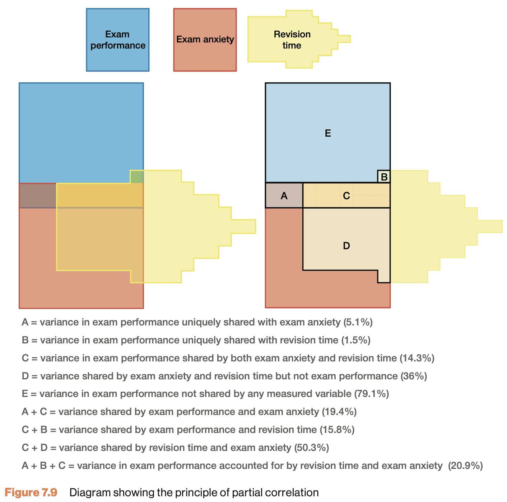

# Partial correlation {.section}

```{r, echo=FALSE, warning=FALSE, message=FALSE, prompt=FALSE}
source("../../_setup.R")
data <- read.csv(datasetsPath("2026/exam-anxiety.csv"), check.names = FALSE)
exam_grade <- data$`Exam performance`
anxiety    <- data$`Exam anxiety`
revise     <- data$`Time spent revising`
N          <- length(exam_grade)
```

## A third variable {.smaller}

All three are related:

- Performance and anxiety: $r = `r sprintf("%.2f", cor(exam_grade, anxiety))`$
- Performance and revision: $r = `r sprintf("%.2f", cor(exam_grade, revise))`$
- Anxiety and revision: $r = `r sprintf("%.2f", cor(anxiety, revise))`$

How much of the association is unique to anxiety and performance?

## Shared variance {.smaller}

{height="380"}


## Partial correlation {.smaller}


$$\LARGE{r_{xy \cdot z} = \frac{r_{xy} - r_{xz} r_{yz}}{\sqrt{(1 - r_{xz}^2)(1 - r_{yz}^2)}}}$$

Or do anxious students simply revise less?

```{r, echo=TRUE}
cor.exam.anxiety    <- cor(exam_grade, anxiety)
cor.exam.revise     <- cor(exam_grade, revise)
cor.anxiety.revise  <- cor(anxiety,    revise)

data.frame(cor.exam.anxiety, cor.exam.revise, cor.anxiety.revise)
```

------

```{r, echo=TRUE}
numerator   <- cor.exam.anxiety - (cor.exam.revise * cor.anxiety.revise)
denominator <- sqrt( (1-cor.exam.revise^2)*(1-cor.anxiety.revise^2) )

partial.correlation <- numerator / denominator

partial.correlation
```

Holding revision constant, the link shrinks.

## Significance of partial correlation {.subsection}

Locate in t-distribution

```{r, echo=TRUE}
df <- N - 3

t.pr <- ( partial.correlation*sqrt(df) ) / sqrt(1-partial.correlation^2)
t.pr
```

## p-value
```{r, echo=FALSE}
# Set up the plot for the F-distribution
curve(dt(x, df), from = -8, to = 8, n = 1000, bty = "n", las = 1,
      xlab = "t-value", ylab = "Density", main = "t-distribution with P-value Region")

# Shade the upper tail (p-value region) using polygon
# Define the region to fill (upper tail, greater than fStat)
x_vals <- seq(t.pr, 10, length.out = 100)
y_vals <- dt(x_vals, df)

# Draw the polygon to fill the area under the curve
polygon(c(t.pr, x_vals, 10), c(0, y_vals, 0), col = "lightblue", border = NA)

# Optionally, add a vertical line at the F-statistic
arrows(x0 = t.pr, x1 = t.pr, y0 = 0 , y1 = 0.25, col = "darkred", lwd = 2)
text(x = t.pr, y = 0.3, paste("t =", round(t.pr, 2)), cex = 1.2)
text(x = t.pr, y = 0.35, paste("p-val =", round(1 - pt(t.pr, df), 3)), cex = 1.2)
```

## JASP

{width="300px"}
