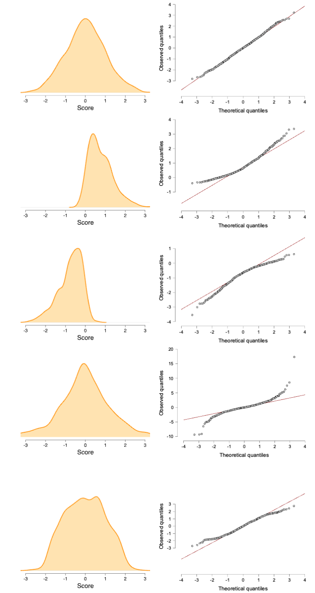
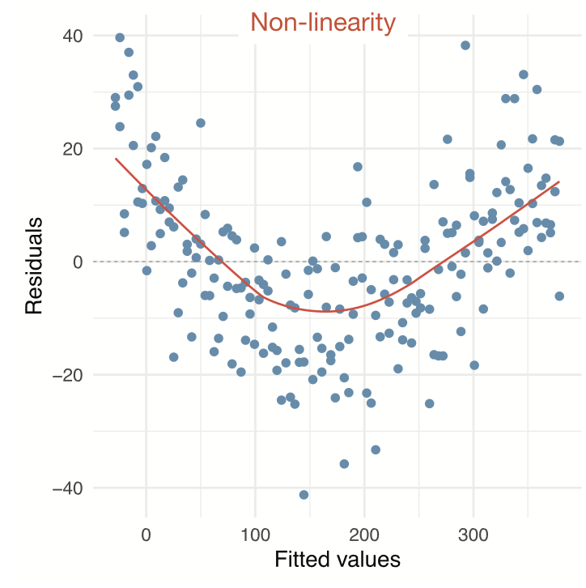

# Regression<br>(one predictor) {.section}

```{r, echo=FALSE}
source("../../_setup.R")
# Field's album sales data, mirrored from discoverjasp into datasets/2026/, so
# the coefficients on these slides are the book's own and match the results file
# students can download. Adverts in GBP 1,000s, sales in 1,000s of copies: no rescaling.
data <- read.csv(datasetsPath("2026/album_sales.csv"))[, c("Adverts", "Sales")]
```

## Regression {.smaller}

$$\LARGE{\text{outcome} = \text{model prediction} + \text{error}}$$

In statistics, linear regression is a linear approach for modeling the relationship between a scalar dependent variable y and one or more explanatory variables denoted X. The case of one explanatory variable is called simple linear regression.

$$\LARGE{Y_i = \beta_0 + \beta_1 X_i + \epsilon_i}$$

In linear regression, the relationships are modeled using linear predictor functions whose unknown model parameters are estimated from the data.

Source: [wikipedia](https://en.wikipedia.org/wiki/Linear_regression)


## Assumptions of the Linear Model {.smaller}

A selection from Field (Section 8.4.1):

* Sensitivity (Section 6.4)
  * Are there outliers?
* Normality (Section 6.7)
  * Are the model errors non-normally distributed?
* Linearity (Section 6.6)
  * Is the association non-linear? 
* Homoscedasticity (Section 6.7)
  * Is there systematic model error?
  
> The greater the assumption violation, the less reliable your results are

--- 

## Sensitivity

Outliers

* Extreme residuals (e.g., > 3)
* Cook's distance (e.g., > 1)
* Check Q-Q, residuals plots, casewise diagnostics

--- 

### Sensitivity

```{r, fig.align='center', fig.width=10, fig.height=5, echo=FALSE}
n <- 20
# x = 
set.seed(124)
x <- rnorm(n)
y <- rnorm(n, x)
x[1] <-  2
y[1] <- -2
r   <- round(cor(x,y), 2)
r.2 <- round(r^2, 2)
par(mfrow = c(1, 2))
plot(x,y, 
     las  = 1, 
     pch = 21,
     bg = c("orange", rep("purple", n-1)),
     cex = 1.2,
     ylab = "y", 
     xlab = "x", 
     main = "Correlation with outlier", 
     ylim = c(-2,2), 
     xlim = c(-2,2))
fit2 <- lm(y ~ x)
abline(fit2, col = "blue")
text(0.5, y[1], bquote("r ="~ .(r) ~ "," ~ r^2 ~ " = " ~ .(r.2)), pos = 2, col = "blue")

xr <- x[-1]
yr <- y[-1]
r   = round(cor(xr,yr), 2)
r.2 = round(r^2, 2)
plot(xr,yr, 
     cex = 1.2,
     pch = 21,
     bg = "purple",
     las  = 1, 
     ylab = "y", 
     xlab = "x", 
     main = "Correlation without outlier", 
     ylim = c(-2,2), 
     xlim = c(-2,2))
fit2 <- lm(yr ~ xr)
abline(fit2, col = "blue")
text(0.5, y[1], bquote("r ="~ .(r) ~ "," ~ r^2 ~ " = " ~ .(r.2)), pos = 2, col = "blue")
```

<!-- ## Normality -->

<!-- ::: {.columns} -->

<!-- ::: {.column} -->

<!-- * Residuals should be normally distributed -->
<!-- * Look at Q-Q plot standardized residuals. Most points should be on the diagonal -->
<!-- * After the analysis is complete because it's based on the residuals -->
<!-- * See figure 6.26 -->
<!-- ::: -->

<!-- ::: {.column} -->

<!-- ```{r, fig.align='center', fig.width=5, fig.height=5, echo=FALSE} -->
<!-- # Example vector of errors -->
<!-- set.seed(123) -->
<!-- errors <- rnorm(100, mean = 0, sd = 1)  # replace with your residuals -->

<!-- # QQ plot -->
<!-- qqnorm(errors, -->
<!--        main = "QQ Plot of Residuals", -->
<!--        xlab = "Theoretical Quantiles", -->
<!--        ylab = "Sample Quantiles", -->
<!--        pch = 21, bg = "orange", col ="black", cex = 1.2, bty = "n", las = 1) -->

<!-- # Add reference line (uses same vector as qqnorm) -->
<!-- qqline(errors, col = "darkred", lwd = 2) -->


<!-- ``` -->
<!-- ::: -->

<!-- ::: -->


## Normality {.smaller}

::: {.columns}

::: {.column}

* Residuals should be normally distributed
* Look at Q-Q plot standardized residuals. Most points should be on the diagonal
* After the analysis is complete because it's based on the residuals
* See figure 6.25
:::

::: {.column}

:::

:::


## Linearity {.smaller}

::: {.columns}

::: {.column}

* The relationship between predictors and the outcome should be linear
* Inspect using plots:
    * Scatter plots (or partial plots) of predictors vs. outcome
    * Residuals vs. predicted
* See figure 6.28
:::

::: {.column}

:::

:::


## Homoscedasticity

::: {.columns}

::: {.column}

* Variance of residuals should be equal across all expected values
* Look at scatterplot of residuals vs. predicted values. Ideally it's an uncorrelated, round cloud
* For examples of violations, see [here](https://johnnydoorn.github.io/teaching-statistics/extra-texts/heteroscedasticity.html)
* After the analysis is complete because it's based on the residuals
:::

::: {.column}

```{r, fig.align='center', fig.width=5, fig.height=5, echo=FALSE}
fit <- lm(Sales ~ Adverts, data = data)
z.pred  = scale(fit$fitted.values) # convert model predictions to z-scores
z.resid = scale(fit$residuals)     # convert model residuals to z-scores

plot(z.pred, z.resid, xlim = c(-2, 2), ylim = c(-2, 2), xlab = "z-score prediction", ylab = "z-score residual")
abline(h = 0, v = 0, lwd=2)

#install.packages("plotrix")
draw.circle(0,0,1.7,col=rgb(1,0,0,.5))
```
:::

:::

## The data {.smaller}

> Predict album sales (x 1,000 copies) based on the advertising budget (x £1,000).

```{r, echo=FALSE}
n <- nrow(data)
ssrTable(data)
```

--- 

### The data {.smaller}
```{r, fig.align='center', fig.width=8, fig.height=6, echo=FALSE}
plot(data$Adverts, data$Sales, las = 1, xlab = "Adverts (x £1,000)", ylab = "Sales (x 1,000)",
     xlim=c(0, 2300), ylim=c(0,400), cex= 1.2,
     bty = "n",
     pch = 21,
     bg = "purple")
text(1750, 50, bquote("cor = " ~.(round(cor(data$Adverts, data$Sales), 3))), cex = 1.4)
```

## Calculate regression parameters {.subsection}

$${sales}_i = b_0 + b_1 {adverts}_i + \epsilon_i$$

```{r, eval=TRUE}
adverts  <- data$Adverts
sales    <- data$Sales
```

## Calculate $b_1$ {.subsection}

$$b_1 = r_{xy} \frac{s_y}{s_x}$$

```{r, echo=TRUE}
# Calculate b1

cor.sales.adverts <- cor(sales,adverts)
sd.sales          <- sd(sales)
sd.adverts        <- sd(adverts)

b1 <- cor.sales.adverts * ( sd.sales / sd.adverts )
b1
```

## Calculate $b_0$ {.subsection}

$$b_0 = \bar{y} - b_1 \bar{x}$$

```{r, echo=TRUE}
mean.sales    <- mean(sales)
mean.adverts  <- mean(adverts)

b0 <- mean.sales - b1 * mean.adverts
b0
```

## The slope

```{r, fig.align='center', fig.width=8, fig.height=6, echo=FALSE}
# Extra

plot(adverts,sales, las = 1, 
     xlim=c(0, 2300), ylim=c(0,400),
     bty = "n",  cex= 1.2,
     pch = 21,
     bg = "purple")
abline(lm(sales~adverts), lwd = 2)
text(1750, 50, bquote(beta[1] ~ " = " ~ .(round(b1, 3))))
```

--- 

### The slope

```{r, fig.align='center', fig.width=8, fig.height=6, echo=FALSE}
# Extra

runFrom <- 1000   # a GBP 1,000,000 run, so the rise is visible at full scale
runTo   <- 2000

plot(adverts,sales, las = 1, 
     xlim=c(0, 2300), ylim=c(0,400),
     bty = "n",  cex= 1.2,
     pch = 21,
     bg = "purple")
abline(lm(sales~adverts))
abline(v=c(runFrom, runTo),col='red')
abline(h=b0 + b1 * c(runFrom, runTo),col='red')
text(1750, 50, bquote(beta[1] ~ " = " ~ .(round(b1, 3))))

lines(c(runTo,runTo),c(b0 + b1 * runFrom, b0 + b1 * runTo),col='green',lwd=3)
lines(c(runFrom,runTo), rep(b0 + b1 * runFrom, 2),col='blue',lwd=3)

text(mean(c(runFrom, runTo)), (b0 + b1 * runFrom), runTo - runFrom, pos=1, cex=1)
text(runTo, (b0 + b1 * mean(c(runFrom, runTo))),
     round(b1 * (runTo - runFrom), 2), 
     pos=4, 
     cex=1)
```

## The slope - zoomed in

```{r, echo=FALSE, fig.align='center', fig.width=8, fig.height=6, echo=FALSE}
# Extra
# One unit of Adverts is GBP 1,000, worth 0.096 in sales: only visible once we
# zoom right in on the line, which is the point of this slide.
zoomFrom <- 1000
zoomTo   <- 1001

plot(adverts,sales, las = 1, 
     xlim=c(zoomFrom - 0.5, zoomTo + 1), ylim=c(b0 + b1 * zoomFrom - 0.15, b0 + b1 * zoomTo + 0.15),
     bty = "n", cex= 1.2,
     pch = 21,
     bg = "purple")
abline(lm(sales~adverts))
abline(v=c(zoomFrom, zoomTo),col='red')
abline(h=b0 + b1 * c(zoomFrom, zoomTo),col='red')

lines(c(zoomTo,zoomTo),c(b0 + b1 * zoomFrom, b0 + b1 * zoomTo),col='green',lwd=3)
lines(c(zoomFrom,zoomTo), rep(b0 + b1 * zoomFrom, 2),col='blue',lwd=3)
text(mean(c(zoomFrom, zoomTo)), (b0 + b1 * zoomFrom), zoomTo - zoomFrom, pos=1, cex=1)
text(zoomTo, (b0 + b1 * mean(c(zoomFrom, zoomTo))),
     round(b1 * (zoomTo - zoomFrom), 3), 
     pos=4, 
     cex=1)
```

For every additional £1,000 spent on advertising, we predict sales to increase by `r round(b1, 3)` (x 1,000 copies)

## Define regression equation

$$\widehat{sales} = {\text{model prediction}} = b_0 + b_1 {adverts}$$
$$\widehat{sales} = {\text{model prediction}} = `r round(b0, 2)` + `r round(b1, 3)`\times {adverts}$$

So now we can add the expected sales based on this model

```{r, echo=TRUE}
prediction <- b0 + b1 * adverts
data$prediction <- round(prediction, 2)
```


## Predicted values {.smaller .subsection}

Let's have a look

```{r, echo=FALSE}
ssrTable(data, height = 375)
```

## $y$ vs $\hat{y}$

And lets have a look at this relation between model prediction and observed

```{r, fig.height=5, fig.width=5, fig.align='center', echo=FALSE}

plot(prediction,sales, xlim = c(0,360), ylim = c(0,360),
     xlab = "Predicted Sales", ylab = "Observed Sales",
     las = 1, pch = 21, bg = "lightgreen")
abline(lm(prediction~sales), col = "red")
text(50, 50, bquote("cor = " ~.(round(cor(prediction, sales), 3))))
# lines(c(0,1000), c(0,1000), col='red')
```

## Error {.smaller}

The error (residual) is the difference between the model predictions and observed values

```{r, echo=TRUE}
error <- sales - prediction
data$error <- round(error, 2)
```

```{r, echo=FALSE}
ssrTable(data, height = 300)
```

<!-- ## Homoscedasticity -->

<!-- >Is there any systematic error?  -->

<!-- ```{r, fig.height=5, fig.width=5, fig.align='center', echo=FALSE} -->
<!-- plot(prediction, error, xlim = c(0,360), ylim = c(-200,200), main = "Predictions vs. Residuals", -->
<!--      xlab = "Predicted Sales", ylab = "Model Error (Residuals)", -->
<!--      las = 1, pch = 21, bg = "lightgreen") -->
<!-- abline(lm(error ~ prediction),  -->
<!--        col='darkred') -->
<!-- text(50, -150, bquote("cor = " ~.(round(cor(prediction, error), 5)))) -->
<!-- ``` -->

## Normality of Residuals

> Are the residuals normally distributed?

::: {.columns}

::: {.column}

```{r, fig.height=5, fig.width=5, fig.align='center', echo=FALSE}
qqnorm(error,
       main = "QQ Plot of Residuals",
       xlab = "Theoretical Quantiles",
       ylab = "Sample Quantiles",
       pch = 21, bg = "orange", col ="black", cex = 1.2, bty = "n", las = 1)

# Add reference line
qqline(error, col = "darkred", lwd = 2)
```
:::

::: {.column}

```{r, fig.height=5, fig.width=5, fig.align='center', echo=FALSE}
hist(error,
       main = "Histogram of Residuals",
       xlab = "Residuals",
       freq = FALSE,
       col = rainbow(20), bty = "n", las = 1, breaks = 20, xlim = c(-250, 250))
```
:::

:::


## Model fit {.smaller}

- The fit of the model can be viewed in terms of the correlation ($r$) between the predictions and the observed values: if the predictions are perfect, the correlation will be 1. 
- For simple regression, this is equal to the correlation between adverts and sales. For multiple regression (block 3), these will differ. 

```{r, echo=TRUE}
r <- cor(prediction, sales)
r
```

## Explained variance {.subsection}

Squaring this correlation gives the proportion of variance in sales that is explained by adverts:

```{r, echo=TRUE}
r^2
```

## Explained variance visually ($n = 10$) {.smaller}

```{r, fig.align='center', fig.width=15, fig.height = 7, echo=FALSE}
par(mfrow = c(1, 3), cex = 1.5)
plotN <- 10
# This is all the sales data
plot(sales[1:plotN],xlab='Albums', ylab = "Sales", las = 1,
     bty = "n", pch = 21, bg = "turquoise", main = "Total Variance")
# With the mean
abline(h = mean(sales[1:plotN]), lwd = 2, col = "purple")
# The model predicts the sales scores
# points(1:plotN,prediction[1:10], pch =23, bg='darkred')
# The part of the variation that overlaps is the 'explained' variance. 
segments(1:plotN, sales[1:plotN], 1:plotN, mean(sales[1:plotN]), col='orange', lwd= 2)

legend("topright", c("Observed"),
       bty = "n", fill = c("turquoise"))

# This is all the sales data
plot(sales[1:plotN],xlab='Albums', ylab = "Sales", las = 1,
     bty = "n", pch = 21, bg = "turquoise", main = "Explained Variance")
# With the mean
abline(h = mean(sales[1:plotN]), lwd = 2, col = "purple")
# The blue lines are the total variance, the deviation from the mean.
segments(1:plotN, prediction[1:plotN], 1:plotN, mean(sales[1:plotN]), col='blue', lwd= 2)
# The model predicts the sales scores
points(1:plotN,prediction[1:10], pch =23, bg='darkred')
# The part of the variation that overlaps is the 'explained' variance. 
legend("topright", c("Observed", "Predicted"),
       bty = "n", fill = c("turquoise", "darkred"))

# This is all the sales data
plot(sales[1:plotN],xlab='Albums', ylab = "Sales", las = 1,
     bty = "n", pch = 21, bg = "turquoise", main = "Unexplained Variance")
# With the mean
# abline(h = mean(sales[1:plotN]), lwd = 2, col = "purple")
# The blue lines are the total variance, the deviation from the mean.
segments(1:plotN, prediction[1:plotN], 1:plotN, (sales[1:plotN]), col='red', lwd= 2)
# The model predicts the sales scores
points(1:plotN,prediction[1:10], pch =23, bg='darkred')
# The part of the variation that overlaps is the 'explained' variance. 
legend("topright", c("Observed", "Predicted"),
       bty = "n", fill = c("turquoise", "darkred"))
```
$r^2$ is the proportion of <span style="color: blue;">blue</span> to <span style="color: orange;">orange</span>, while $1 - r^2$ is the proportion of <span style="color: red;">red</span> to <span style="color: orange;">orange</span> 

<!-- ## Test model fit -->

<!-- Compare model to mean Y (sales) as model -->

<!-- $$F = \frac{(n-p-1) r^2}{p (1-r^2)}$$ -->

<!-- Where ${df}_{model} = n - p - 1 = N - K - 1$. -->

<!-- ```{r, echo=TRUE} -->
<!-- p <- 1 -->
<!-- fStat <- ( (n-p-1)*r^2 ) / ( p*(1-r^2) ) -->
<!-- fStat -->
<!-- ``` -->

<!-- ## Signal to noise -->

<!-- Given the description of explained variance, F can again be seen as a proportion of explained to unexplained variance. Also known as a signal to noise ratio. -->

<!-- ```{r, echo=TRUE} -->
<!-- df.model <- p # n = rows, p = predictors -->
<!-- df.error <- n - p - 1 -->

<!-- SS_model <- sum((prediction - mean(sales))^2) -->
<!-- SS_error <- sum((sales - prediction)^2) -->
<!-- MS_model <- SS_model / df.model -->
<!-- MS_error <- SS_error / df.error -->
<!-- fStat <- MS_model / MS_error  -->
<!-- fStat -->
<!-- ``` -->


## Calculate t-values for b's for hypothesis testing

We can also convert each $b$ to a $t$-statistic, since that has a known sampling distribution:

$$\begin{aligned}
t_{n-p-1} &= \frac{b - \mu_b}{{SE}_b} \\
df &= n - p - 1 \\
\end{aligned}$$

Where $b$ is the beta coefficient, ${SE}$ is the standard error of the beta coefficient, $n$ is the number of subjects and $p$ the number of predictors. $\mu_b$ is the null-hypothesized value for $b$ - usually set to 0.

## Converting b to $t$

```{r, echo=TRUE}
# Get Standard error's for b (bonus)
se.b1 <- sqrt((n/(n-2)) * mean(error^2) / (var(adverts) * (n-1))); se.b1
```


```{r, echo=TRUE}
# Calculate t for b1
mu.b1 <- 0
t.b1  <- (b1 - mu.b1) / se.b1; t.b1

n     <- nrow(data) # number of rows
p     <- 1          # number of predictors
df.b1 <- n - p - 1
```


## $p$-value for $b_1$

```{r, echo=FALSE}
library("visualize")
# p-value for b1
# Set up the plot for the F-distribution
curve(dt(x, df.b1), from = -12, to = 12, n = 1000, bty = "n", las = 1,
      xlab = "t-value", ylab = "Density", main = "t-distribution with P-value Region")

# Shade the upper tail (p-value region) using polygon
# Define the region to fill (upper tail, greater than fStat)
x_vals <- seq(t.b1, 10, length.out = 100)
y_vals <- dt(x_vals, df.b1)

# Draw the polygon to fill the area under the curve
polygon(c(t.b1, x_vals, 10), c(0, y_vals, 0), col = "lightblue", border = NA)

# Optionally, add a vertical line at the F-statistic
arrows(x0 = t.b1, x1 = t.b1, y0 = 0 , y1 = 0.25, col = "darkred", lwd = 2)
text(x = t.b1, y = 0.3, paste("t =", round(t.b1, 2)), cex = 1.2)
text(x = t.b1, y = 0.35, paste("p-val < 0.001"), cex = 1.2)
```

<!-- ## Visualize -->

<!-- Instead of obtaining the p-value by locating the t in the t-distribution, we can locate the F in the F-distribution -->

<!-- ```{r, warning=FALSE, echo=FALSE} -->
<!-- curve(df(x, df.model, df.error), from = 0, to = 150, n = 1000, bty = "n", las = 1, -->
<!--       xlab = "F-value", ylab = "Density", main = "F-distribution with P-value Region") -->

<!-- # Shade the upper tail (p-value region) using polygon -->
<!-- # Define the region to fill (upper tail, greater than fStat) -->
<!-- x_vals <- seq(fStat, 10, length.out = 100) -->
<!-- y_vals <- df(x_vals, df.model, df.error) -->

<!-- # Draw the polygon to fill the area under the curve -->
<!-- polygon(c(fStat, x_vals, 10), c(0, y_vals, 0), col = "lightblue", border = NA) -->

<!-- # Optionally, add a vertical line at the F-statistic -->
<!-- arrows(x0 = fStat, x1 = fStat, y0 = 0 , y1 = 0.4, col = "darkred", lwd = 2) -->
<!-- text(x = fStat, y = 0.55, paste("F =", round(fStat, 2)), cex = 1.2) -->
<!-- text(x = fStat, y = 0.7, paste("p-val < 0.001"), cex = 1.2) -->
<!-- ``` -->

<!-- ## It's all the same thing...  -->

<!-- ```{r, echo=TRUE} -->
<!-- fStat -->

<!-- t.b1^2 -->
<!-- ``` -->


## So how many `@!&#$` ways do we have for assessing an association?! {.smaller}

```{r, echo = TRUE}
# the correlation between x and y, standardized (between -1, 1)
cor(sales, adverts) 

# the covariance between x and y, unstandardized 
cov(sales, adverts)

# regression coefficient in linear regression, standardized (not bounded)
# generalizes easily to settings with multiple predictors
b1 # how much does y-prediction increase, if we increase x by 1 unit?

# t-statistic: standardized difference between b1 and 0
t.b1 # used for testing the null hypothesis that b1 = 0

# The metrics below are more indicative of an overall model's performance

# the correlation between y and model prediction, standardized (between -1, 1)
cor(sales, prediction) # can be squared to get proportion explained variance
```
<!-- # F: signal/noise ratio of a model -->
<!-- fStat  -->


## Standardized or not? {.smaller}

Same data, same association, three different numbers:

```{r, echo=TRUE}
cov(sales, adverts)  # in the units we measured
b1                   # extra sales per extra £1,000 spent
cor(sales, adverts)  # unit-free, bounded by -1 and 1
```

* $b_1$ answers *how much*, in the units of the data
* $r$ answers *how strong*, on a scale that never changes

## Standardize, and they meet {.smaller}

Put both variables in z-scores, and the slope becomes the correlation:

```{r, echo=TRUE}
coef(lm(scale(sales) ~ scale(adverts)))[2]

cor(sales, adverts)
```

$$b_1 = r_{xy} \frac{s_y}{s_x}$$

[Move $r$, $s_x$ and $s_y$ around and watch the covariance, the slope and $r$ respond](https://statisticalreasoning-uva-2.shinyapps.io/SimpleRegression/)
